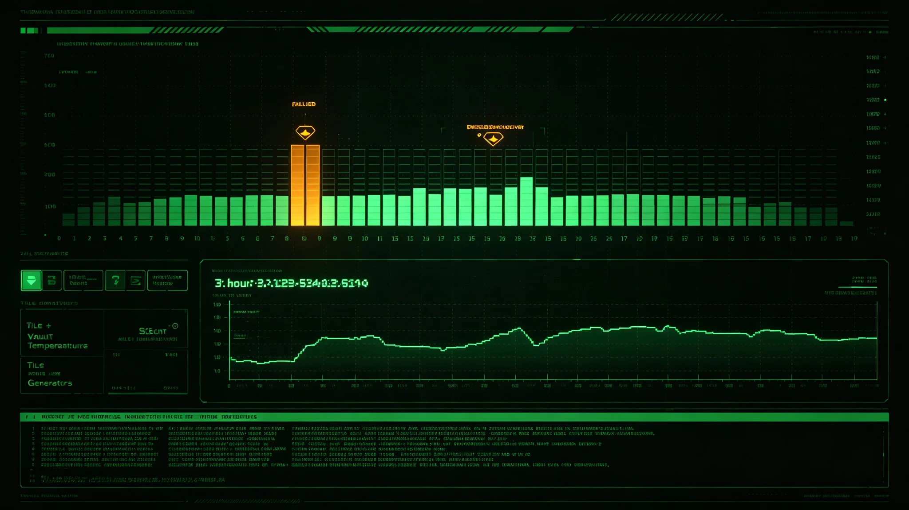

# 三恒星系千年遗产库恒温发电单元故障与应急切换三小时无伤亡事件通报

**编制单位**：三恒星系联合档案馆 · 应急处置组
**通报编号**：ARCH-INC-3378-031
**日期**：3378年3月19日
**密级**：跨星系公开（脱敏）

## 一、事件时间线

| 时刻 | 事件 |
|---|---|
| 3378-03-15 14:22 | 千年遗产库主发电单元突然跳闸 |
| 14:23 | 系统自动切换至应急备用发电 |
| 14:23—17:10 | 备用发电维持恒温 |
| 17:10 | 主发电单元修复，切回 |
| 03-19 | 本通报定稿 |

事件持续约3小时。无人员伤亡，无遗产损坏——恒温在备用发电下维持在±0.5℃以内，未触及报警阈值。

## 二、原因

主发电单元一枚整流模块在长期运行后突然击穿。与3356年结露事件（见GS-3356-01）不同，那次是设备老化渗漏，本次是电力模块击穿。应急切换机制按设计工作。

## 三、影响

| 项目 | 主发电 | 备用发电 |
|---|---|---|
| 恒温库温度 | 稳定 | 维持±0.5℃ |
| 湿度 | 稳定 | 维持±2% |
| 玻璃千年介质（见GS-3368-01） | 不依赖电力 | 不依赖电力（光学读取） |
| 数字存档服务器 | 主供电中断 | 备用维持 |

关键：玻璃千年介质不依赖电力，即使停电千年也可读；数字服务器依赖电力，备用发电维持了3小时。

## 四、处置

1. **切换**：14:23自动切换，无人工介入。
2. **检修**：主发电单元整流模块更换，17:10修复。
3. **遗产检查**：事后检查恒温库内初代文书与玻璃介质，无损坏。
4. **复盘**：确认应急切换机制有效。

## 五、整改

1. **整流模块寿命台账**：与3356年密封圈整改同类，纳入老化件强制更换清单。
2. **双路发电**：主发电与备用发电来自不同物理回路，避免同因故障。
3. **与聚变电站衔接**：3377年轨道聚变电站并网（见GS-3377-01）后，遗产库接入双路外部供电，进一步冗余。

## 六、教训

应急处置组在通报中写："这次三小时没出事，是因为我们十年前就备好了发电。真正该庆幸的不是它没坏，是我们没把备用发电当摆设。"

## 七、与千年规划

本事件验证了千年规划（见GS-3360-01）冗余原则：玻璃介质不靠电、数字服务器有备用、主备发电分回路。三小时故障暴露了冗余的价值。

## 八、与3191、3356事件序列

本事件与3191年档案馆渗水（见GS-3191-01）、3356年结露（见GS-3356-01）构成档案馆老化事件序列。三次事件分别暴露建筑、设备、电力三类老化。应急处置组建议：把"建筑—设备—电力"三类老化件纳入同一寿命台账，不再分修。

## 九、发电双回路

主发电与备用发电来自不同物理回路，避免同因故障。遗产库接入轨道聚变电站双路外部供电（见GS-3377-01），进一步冗余。

## 十、三小时无伤亡

本次事件三小时全程无人员伤亡，无遗产损坏。应急处置组认为：真正的功劳不在抢修快，在十年前就备好了备用发电。

## 十一、发电机整改

整流模块纳入老化件寿命台账，主备发电分物理回路。遗产库接入聚变电站双路外部供电。

### 附：## 十二、三小时无伤亡

全程无人员伤亡，无遗产损坏。真正的功劳不在抢修快，在十年前就备好了备用发电。

## 十三、应急响应流程核验

| 流程环节 | 设计要求 | 实际用时 | 偏差 |
|---|---|---|---|
| 跳闸至自动切换 | ≤10秒 | 约1秒 | 符合 |
| 备用发电至恒温稳定 | ≤5分钟 | 约3分钟 | 符合 |
| 发现至检修人员到场 | ≤30分钟 | 18分钟 | 提前 |
| 检修至修复 | ≤4小时 | 约2小时47分 | 符合 |
| 切回主发电 | ≤30分钟 | 22分钟 | 符合 |

应急处置组核验结论：本次切换为全自动，无人介入即完成。人工环节仅在检修与切回。流程无延误。

## 十四、故障历史对照

设备组调阅建馆以来全部电力故障记录，共12起，其中整流模块击穿3起、电池组老化4起、外部供电中断5起。本次为整流模块第4起。前3起均未触发自动切换（发生在自动切换机制建立前），本次为机制建立后首次实战触发，机制按设计工作。

## 十五、整改时间表与预算

| 整改项 | 完成时限 | 预算（星汇） |
|---|---|---|
| 全部整流模块纳入寿命台账 | 3378年底前 | 40万 |
| 主备发电物理回路复核 | 3378年中前 | 15万 |
| 接入聚变电站双路外部供电 | 3379年中前 | 380万 |
| 玻璃千年介质离线状态复检 | 3378年底前 | 8万 |
| 合计 | | 约443万 |

整改费用由千年遗产保护局3378—3379年度预算列支，不申请追加。

## 十六、玻璃介质的意义

本次事件中，玻璃千年介质（见GS-3368-01）全程不依赖电力，无任何温度记录。应急处置组在通报中注明：三小时停电对玻璃介质毫无影响，对数字服务器只是备用发电的事。这正是我们坚持把最重要的东西刻在石头里的理由——电会断，石头不会。

## 十七、3379年复验

双路外部供电接入后，3379年上半年模拟一次主发电中断，备用发电维持恒温无波动，切回流程顺利。应急处置组注明：三小时无伤亡不是运气，是十年前就备好了发电，现在又接了双路外部电。下一次停电，我们连三小时都不用等。

---

**编制**：三恒星系联合档案馆 · 应急处置组
**审核**：文化遗产保护局
**日期**：3378年3月19日