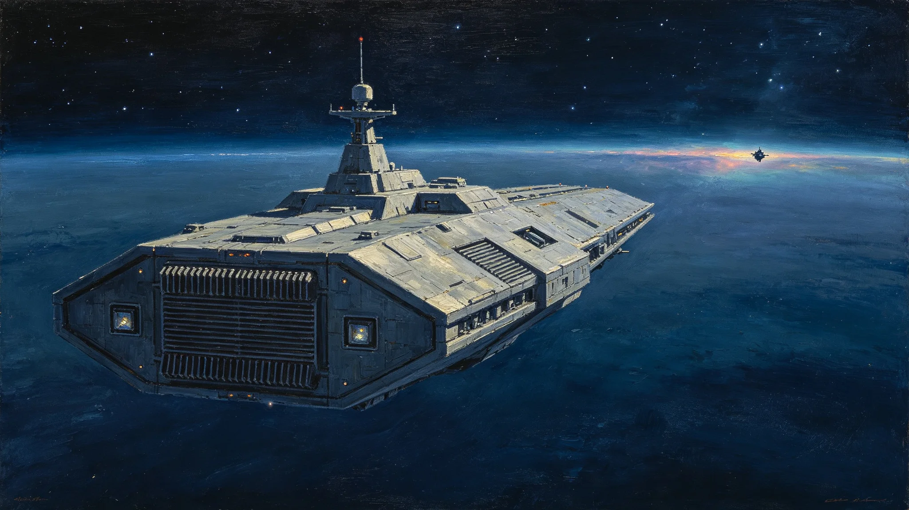

# 第五恒星系方向接触期联合维和前出编队部署与轮换编制公报

**发布机构**：联合体安全协调委员会 · 维和处
**发布日期**：3379年12月1日
**文件等级**：跨星系公开（脱敏）

## 一、部署背景

第五恒星系方向自3301年接触（见GS-3350-01回顾）以来，维和隔离区（见GS-3349-01）已运行约三十年。接触期生物隔离（见GS-3302-01）与贸易交换（见GS-3307-01）常态化。维和处承担前出编队轮换编制。

## 二、现有部署

| 项目 | 配置 |
|---|---|
| 指挥舰 | 1艘，常驻接触区外 |
| 巡逻艇 | 2艘，定期巡航 |
| 对接港 | 1座，中立区，用于交换货物 |
| 人员 | 编制28人，轮换周期6个月 |

## 三、轮换调整

- 指挥舰换装第七代巡逻舰型（见GS-3369-01），能耗降低、住舱改善。
- 巡逻艇维持2艘，不增加。
- 人员轮换周期由6个月延至8个月——减少跨星线调动，降低船员疲劳。
- 不增派武装舰，不靠近第五恒星系方向原生文明定居点。

## 四、纪律

- 前出编队为维和性质，不主动接触原生文明，只维持接触区秩序。
- 不部署在原生文明目视范围内。
- 交换货物（见GS-3370-01样本事件）在中立对接港完成，不由武装舰护航进入。
- 遇可疑情况，先报预警网（见GS-3359-01），不自行处置。

## 五、与安全态势

维和处在公报中说明：第五恒星系方向接触已近八十年，无一次武装冲突。前出编队的存在不是因为有威胁，是因为接触需要一支中立、可见、不惹事的力量在场。

## 六、后续

- 3380年：完成指挥舰换装。
- 3400年：随安全总评估（见GS-3400-01）重新评估前出编队是否还需要。

## 六、人员轮换与心理

前出编队人员轮换周期由6个月延至8个月，以减少跨星线调动。但8个月长期前出，船员心理压力增大。维和处要求：

- 每两周一次远程心理疏导（非强制）；
- 每月一次与母星家属光际通话（经第九代通信，见GS-3354-01）；
- 轮换回来后两周休整。

维和处说明："前出编队的人不是在打仗，是在熬时间。熬时间的人比打仗的人更需要被看见。"

## 七、对接港管理

中立对接港用于交换货物（见GS-3307-01），常驻3人。对接港规则：

- 交换货物在港内完成，不由武装舰护航进入；
- 货物入境检疫按四级隔离（见GS-3302-01）；
- 对接港不允许原生文明人员进入——不是歧视，是生物安全隔离。

## 八、与第五恒星系方向接触期

维和处强调：前出编队不是"占领"，是"在场"。接触期八十年（见GS-3350-01回顾），编队存在的目的是让双方都知道对方在，且不打算动。

## 九、不接触

前出编队不靠近原生文明定居点，不主动接触。交换货物在中立对接港完成。维和处说明："我们在场，不打扰。在场的意义是让对方知道我们在，不是让对方怕我们。"

## 十、前出编队人员

前出编队编制28人，轮换周期8个月。3379年完成指挥舰换装第七代。不增派武装舰，不靠近原生文明定居点。

### 附：## 十一、不武装接触

前出编队为维和性质，不主动接触原生文明，不靠近其定居点。交换货物在中立对接港完成。

## 十二、编制明细

| 岗位 | 人数 | 轮换周期 |
|---|---|---|
| 指挥舰舰长 | 1 | 8个月 |
| 副舰长 | 1 | 8个月 |
| 轮机 | 4 | 8个月 |
| 通信 | 2 | 8个月 |
| 警戒 | 6 | 8个月 |
| 医官 | 2 | 8个月 |
| 对接港常驻 | 3 | 12个月 |
| 后勤 | 9 | 8个月 |
| 合计 | 28 | |

28人中，签字岗位按GS-3367-01伦理制度保留：舰长对前出决定签字，警戒员对可疑目标识别签字。对接港常驻3人不武装，仅做货物交接与检疫协调。

## 十三、八十年接触期数据

| 指标 | 数据 |
|---|---|
| 接触开始 | 3301年 |
| 至3379年 | 78年 |
| 武装冲突 | 0次 |
| 交换货物批次 | 约240批 |
| 样本事故（见GS-3370-01） | 1次（温控坏死） |
| 原生文明人员越界 | 0次 |
| 我方人员越界 | 0次 |

维和处注明：八十年零冲突不是因为我们强，是因为我们不靠近。在场但不打扰，是接触期最难做到的纪律。

## 十四、轮换成本

单轮编队轮换成本约0.4亿星汇，含跨星线舱位、人员休整、家属远程通信。28人轮换周期8个月，年轮换约1.5轮，年成本约0.6亿。维和处注明：这笔钱买的不是武力，是让对方知道我们在。

## 十五、与预警网的边界

前出编队不自行处置可疑情况，先报预警网（见GS-3359-01）。预警网分级后，前出编队只按分级响应，不升级、不越权。维和处说明："我们看得见可疑，不代表我们有权决定可疑是什么。决定在预警网。"

## 十六、3400年再评估

按规程，本前出编队是否还需要，将在3400年四百周年安全总评估（见GS-3400-01）中重新评估。维和处注明："如果八十年后对方已经不需要我们在场，我们就撤。在场是为了双方安心，不是为了占着。"

维和处另注：八十年间，原生文明人员越界次数为零，我方人员越界次数为零。这两个零，比任何巡逻数据都更能说明接触期纪律有效。

维和处最后注明：前出编队28人，8个月一轮，年成本0.6亿。这笔钱买的不是武力，是让对方知道我们在、我们不乱动、我们不靠近。在场但不打扰，是接触期最难做到的纪律。八十年做到了，下一个八十年继续。

---

**发布**：联合体安全协调委员会 · 维和处
**日期**：3379年12月1日