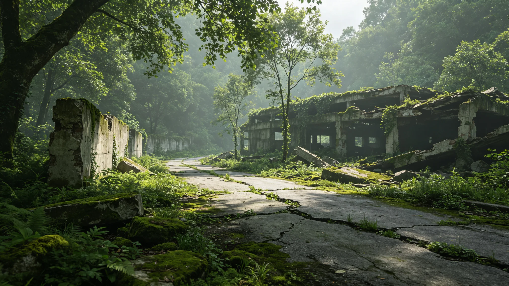

# 老地球野化区"人迹协议"——文明遗址无人化自然覆写两百年监测公报

**发布机构**：内太阳系地球野化监测署 · 生物圈第七科
**发布日期**：3381年5月5日
**文件等级**：跨星系公开

## 一、监测背景

地球自人类主体迁出后转入野化，执行"人迹协议"——不在地表维持常住聚落，不维护旧文明遗址，让自然自行覆写。自3181年协议执行以来，已两百年。第七科对旧文明遗址的自然覆写进度做两百年监测公报。

## 二、覆写进度

| 遗址类型 | 两百年覆写率 | 现状 |
|---|---|---|
| 地表建筑残体 | 约85% | 多数被植被与土层覆盖 |
| 道路路基 | 约90% | 几乎不可辨认 |
| 地下设施入口 | 约40% | 部分仍可见，部分坍塌 |
| 旧港口/码头 | 约70% | 被海岸变迁与植被覆盖 |

关键观察：两百年足以让地表人工痕迹大部分消失，但地下设施因无风化，覆写慢。

## 三、不干预原则

第七科对遗址覆写不干预、不加速、不阻止。不维护、不清理、不重建。遗址按自然节奏被覆盖，若有文化遗产保护局专项批文（见GS-3159-01），个别遗址可保留，但不常规维护。

## 四、与野化区生态关系

植被覆写遗址的过程，与兽类回归（见GS-3352-01）同步。遗址残体成为部分兽类避风雪处，属自然利用。第七科不引导、不禁止。

## 五、问题

1. **个别遗址被游客发现**：偶有跨星系游客通过监测站远距观测发现遗址，要求探访。第七科按人迹协议拒绝实地探访，只提供过境遥感图像。
2. **地下设施残余辐射**：部分旧地下设施有残余低辐射，监测站年度巡检确认不构成地表危害，不清理。
3. **"保护"与"不干预"边界**：哪些遗址该保留、哪些该让它覆写？第七科立场：默认不保留，除非文化遗产保护局批文。

## 六、两百年结论

第七科在公报中总结：地球用两百年，把人留下的大部分痕迹覆盖了。这不是"地球在忘记我们"，是地球在继续自己的事。我们离开后，地球没有等我们，也没有恨我们，它只是在长草。

## 七、下一期

- 3400年：三百年监测。
- 本监测与GS-3352兽类普查、GS-3194火星苔藓扩散互锁，构成"有人居—无人居"对照样本。

## 七、地下设施残余

旧地下设施无风化，覆写慢。两百年后仍可见部分入口。监测站年度巡检确认残余低辐射不构成地表危害，不清理。监测署说明："地下的东西不急着长草，也不用急着拆。它在那儿，我们知道就行。"

## 八、不开发不保护

野化区遗址按"不开发、不保护"原则处理。不开发它的价值，也不保护它的原貌。它爱怎么长怎么长。监测署说明："我们既不是开发商，也不是守陵人，我们只是看。"

## 九、三百年展望

监测署预计三百年（3481年）时，地表人工痕迹覆写率将达95%以上，地下设施仍可见。监测署说明："地上的人走干净了，地下的还要再过几百年才塌。不急。"

## 十、遗址覆写率

两百年地表人工痕迹覆写率约85%，地下设施覆写率约40%。地下无风化，覆写慢。监测署不干预。

### 附：## 十一、不开发不保护

野化区遗址按不开发不保护原则。监测署既不是开发商也不是守陵人，只是看。

## 十二、监测网络布设

两百年监测由生物圈第七科执行，监测网络布设如下：

| 监测点 | 类型 | 巡检频率 | 主要观测 |
|---|---|---|---|
| 原北半球温带遗址群 | 遥感+季度巡检 | 季度 | 植被覆写率 |
| 原北半球寒带遗址群 | 遥感 | 年度 | 冻土与残体 |
| 原北半球城市残迹 | 遥感+季度巡检 | 季度 | 建筑残体 |
| 原南半球港口遗址 | 遥感+半年巡检 | 半年 | 海岸变迁 |
| 原地下设施入口 | 半年巡检 | 半年 | 坍塌与辐射 |
| 合计 | 14处监测点 | | |

14处监测点均无人常驻，由轮换巡检员每季度或半年乘短程舱抵达，不设常住站。监测员不在野化区过夜，当日往返。

## 十三、覆写样本方法

覆写率监测不靠目视估算，而靠遥感光谱比对：每季度对同一遗址拍摄光谱图像，比对植被覆盖面积与人工残体反光特征。两百年累计拍摄遥感图像约5,600张，构成连续序列。第七科注明：我们不进去看，我们在天上看。人迹协议的第一条，就是连监测都尽量少进去。

## 十四、与跨星游客的边界

两百年间，跨星游客通过监测站远距图像发现遗址并要求实地探访的申请累计约47起，全部按人迹协议拒绝。监测站仅提供过境遥感图像，不提供导游、不提供落点坐标、不安排过夜。第七科说明："地球不是景点。它在长草，我们别去踩。"

## 十五、两百年监测投入

两百年间，本监测累计投入约0.3亿星汇，年均约15万。主要用于遥感数据下载与巡检员差旅。第七科注明：这笔钱是所有千年监测中最便宜的——地球自己在干活，我们只负责看。

---

**发布**：内太阳系地球野化监测署 · 生物圈第七科
**日期**：3381年5月5日