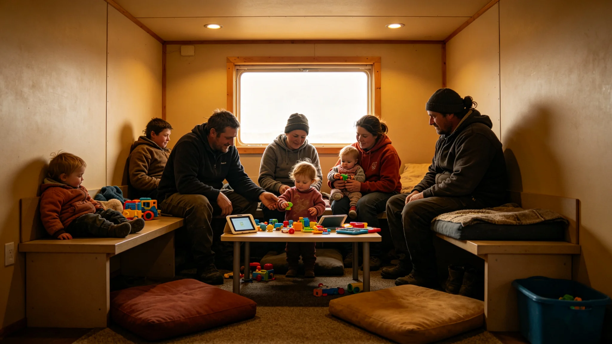

# 跨星系低生育下"代际抚养共同体"制度与跨星系儿童照护互认公约修订公报

**发布机构**：联合体法学派 · 家庭法修订组
**发布日期**：3382年9月9日
**文件等级**：跨星系公开

## 一、修订背景

跨星系家庭法已统一（见GS-3189-01）。随低生育与人口结构倒挂（见GS-3353-01、GS-3372-01陶九章台账），传统核心家庭照护儿童的模式在跨星线迁徙家庭中压力增大：父母跨星线工作，儿童照护空档。修订组建立"代际抚养共同体"制度。

## 二、制度要点

**（一）抚养共同体自愿组合**

- 有照护需求的家庭与有时间、愿意参与照护的长者（不一定亲属），可自愿组成"抚养共同体"。
- 共同体不改变亲子关系，只分担日常照护。
- 组合自愿，解散自由，不登记为家庭，不影响户籍。

**（二）跨星线照护互认**

- 共同体在一个星区形成的照护安排，跨星迁徙后，新定居点承认该共同体照护连续性。
- 儿童照护记录跨星互认，不因迁徙重新排队。

**（三）不强制、不补贴**

- 制度不强制组成共同体，不提供补贴，不排名。
- 它只解决"父母不在时，孩子有人照"的制度空档，不代替父母责任。

## 三、与既有制度衔接

- 与生育意愿登记（见GS-3353-01）衔接：有意愿生育的家庭可查询定居点抚养共同体资源。
- 与跨星系自由迁徙（见GS-3166-01）衔接：迁徙不因照护空档受阻。
- 与家庭法（见GS-3189-01）一致：亲子关系不变，共同体只分担。

## 四、问题

1. **长者资源**：低生育下长者虽多，愿意参与照护的少。修订组不鼓励，只提供平台。
2. **跨星互认**：不同星区照护标准不一，互认需统一最低标准。修订组制定最低照护标准，不追求各星区一致。
3. **法律责任**：共同体照护中儿童受伤，责任如何分？修订组明确：父母责任不变，共同体为志愿协助，不承担法律责任，但有过失的按一般民事处理。

## 五、附则

修订组在公报末写："低生育不是病，是时间的形状。我们不催人生，只在有人愿意生的时候，让老人有空、孩子有人、父母敢走。"

## 七、最低照护标准

跨星互认的最低照护标准由修订组制定：

| 项目 | 最低标准 |
|---|---|
| 儿童食住 | 安全、卫生 |
| 生病 | 24小时内就医 |
| 不虐待 | 零容忍 |
| 上学 | 就近入学 |

各星区可高于此标准，不可低于。互认只认"达到最低"，不比"谁更好"。

## 八、共同体解散

抚养共同体自愿组合，自由解散。解散不影响亲子关系，不影响儿童照护连续性。修订组说明："合得来就合，合不来就散。共同体不是婚姻，是邻居。"

## 九、典型案例

3382年试点首季，某跨星线迁徙家庭父母双方被调往不同星区工作，其八岁儿童随祖父母留在原定居点。抚养共同体由原定居点三名退休邻居志愿组成，分担放学后照护。三个月后父母一方调回，共同体自然解散。修订组以此案例作为制度范本，不公开家庭信息。

### 附：## 十、跨星互认

抚养共同体在一个星区形成的照护安排，跨星迁徙后新定居点承认连续性。儿童照护记录跨星互认，不因迁徙重排队。

## 十一、试点数据

3382年制度试点首年，三系母星区试点情况如下：

| 星区 | 试点共同体数 | 参与儿童数 | 参与长者数 |
|---|---|---|---|
| 比邻星b方向 | 31 | 58 | 74 |
| 太阳系方向 | 22 | 41 | 52 |
| 鲸鱼座τ方向 | 14 | 26 | 31 |
| 第四恒星系方向 | 6 | 11 | 14 |
| 合计 | 73 | 136 | 171 |

试点首年无共同体照护事故，无儿童受伤事件。修订组注明：73个共同体是试点，不是推广。一年之后我们才知道这制度站不站得住。

## 十二、最低照护标准执行

跨星互认的最低照护标准已在第七节列明。试点期间，73个共同体全部达到最低标准，无一例被新定居点拒认。修订组抽查12个共同体，食住安全、就医24小时、上学就近三项均达标，无虐待报告。

修订组注明：最低标准是底线，不是目标。各共同体可做得更好，但互认只看底线。

## 十三、法律责任边界

制度实施前，修订组就此征询过联合体仲裁庭意见。仲裁庭书面意见：

1. 儿童在共同体照护中受伤，父母责任不变；
2. 共同体为志愿协助，不承担一般照护责任；
3. 若共同体成员有故意或重大过失（如放任儿童处于危险），按一般民事侵权处理，不因共同体身份免责。

修订组将此意见写入附则。修订组说明："我们不让共同体变成甩锅的地方，也不让它变成背锅的地方。"

## 十四、与生育意愿登记的衔接

3383年起，有生育意愿登记（见GS-3353-01）的家庭可在登记时查询定居点抚养共同体资源密度。修订组注明：这只是信息查询，不推荐、不指派。有人愿意生的时候，让他知道附近有人有空，至于找不找，是他的事。

## 十五、3383年推广

3383年起，本制度从三系母星区推广至第四恒星系方向定居点。第五恒星系方向不设（四级隔离）。修订组注明："制度不催人生，只在有人愿意生的时候，让老人有空、孩子有人、父母敢走。"

---

**发布**：联合体法学派 · 家庭法修订组
**日期**：3382年9月9日