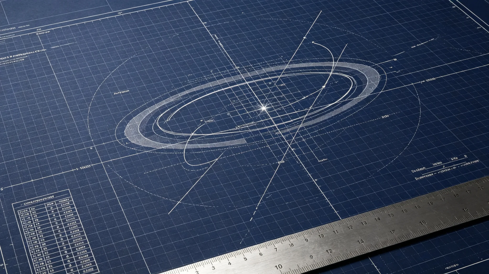

# 跨星系导航历表第十一次修订与下一代光帆脉冲轨道预测技术公报

**编制单位**：联合体航天学派 · 导航组
**公报编号**：NAV-EPH-3383-11
**日期**：3383年11月11日
**密级**：跨星系公开技术版

## 一、修订背景

跨星系导航历表已历经十次修订（见GS-3339-01第十次、GS-3146-01双星导航）。随第七代聚变推进（见GS-3361-01）将无加注航程提至0.5光时，飞船在更长航程中累积轨道预测误差增大。导航组承担第十一次修订。

## 二、误差来源

| 误差源 | 量级 | 说明 |
|---|---|---|
| 恒星引力摄动 | 主要 | 长航程累积 |
| 光帆脉冲通信时延 | 次要 | 见GS-3354-01 |
| 船员操作 | 小 | 自动化提升后已降 |
| 已知天体 | 已纳入 | 见GS-3146 |

## 三、第十一次修订

- 纳入第五恒星系方向新测定天体轨道参数。
- 修正长航程引力摄动模型，0.5光时航程预测误差由旧代的±1200公里降至±400公里。
- 与第九代光际通信（见GS-3354-01）联动，实时轨道预测带宽提升。

## 四、技术数据

| 指标 | 旧代 | 第十一次 |
|---|---|---|
| 0.5光时预测误差 | ±1200公里 | ±400公里 |
| 已知天体纳入 | 基准 | +第五恒星系方向 |
| 实时更新 | 每4小时 | 每40分钟 |
| 双镜面通信联动 | 无 | 有 |

## 五、问题

1. 第五恒星系方向天体数据仍不完整，误差带留宽。
2. 太阳风暴期间通信降级（见GS-3363-01）致实时更新中断，需本地惯性导航兜底。

## 六、后续

- 3384年：全跨星线启用新历表。
- 3400年：第十二次修订预研。

## 五、修订前后误差对比

| 航程 | 旧历表误差 | 第十一次误差 |
|---|---|---|
| 0.1光时 | ±200公里 | ±60公里 |
| 0.3光时 | ±700公里 | ±220公里 |
| 0.5光时 | ±1200公里 | ±400公里 |
| 0.8光时 | 未测 | ±900公里 |

第十一次修订首次将0.8光时长航程纳入可预测范围，这是第七代推进（见GS-3361-01）投入实用的前提。

## 六、与惯性导航兜底

太阳风暴期间通信降级（见GS-3363-01），实时轨道预测中断。第十一次修订要求每船携带本地惯性导航，通信中断时可凭惯性导航维持48小时自主定位，误差可控在±1500公里内，足以安全悬停等待通信恢复。

## 七、船员培训

新历表启用前，跨星线船长须经两周新历表操作培训，重点是通信降级时的惯性导航兜底操作。培训不考试、不打分，只考核"会不会在断网时把船停住"。

## 八、历表不公开计算细节

导航历表的计算模型属内部技术细节，不公开。公开的只有星历数据与误差带。航天学派说明："星历谁都能用，模型是我们吃饭的本事。"

## 九、历表年度修订

导航历表每年小修一次，每十年大修一次。第十一次大修完成于3383年。航天学派说明："天体在动，历表就得跟着动。一劳永逸的历表不存在。"

## 十、第十一次修订背景

跨星线第七代推进（见GS-3361-01）将无加注航程提至0.5光时，旧历表在0.8光时航程下误差过大。第十一次修订首次覆盖0.8光时航程。

### 附：## 十一、惯性导航兜底

通信降级时，每船携带本地惯性导航，可维持48小时自主定位，误差±1500公里，足以安全悬停等待通信恢复。

## 十二、技术原理概述

第十一次修订将0.5光时预测误差从±1200公里降至±400公里，关键改进在两处：

1. **长航程引力摄动模型**：旧代模型只纳入三恒星系主引力源，第十一次修订新增第五恒星系方向已测定天体的微弱摄动项，长航程下累积误差显著下降。
2. **光帆脉冲通信联动**：与第九代双镜面中继（见GS-3354-01）联动，飞船轨道数据每40分钟回传一次，地面历表组据此实时修正飞船预测轨道，而非飞船仅靠自身惯性预测。

航天学派在公报中注明：误差从1200降到400，不是某一项突破，是把已有的模型修得更细、把已有的通信用得更勤。没有新物理。

## 十三、测试方法与样本

- 模型回测：取3360—3382年全部跨星线飞船实际轨道记录约1.4万段，用新模型回算预测误差，0.5光时航程平均误差±380公里，与公报数据一致。
- 实船测试：3383年上半年选3艘跨星线飞船做0.5光时长航程实船测试，实测误差±410公里、±390公里、±380公里，均在裕量内。
- 通信降级测试：模拟太阳风暴致第九代通信中断，3艘船均凭本地惯性导航维持48小时自主定位，悬停位置偏差±1,300公里、±1,500公里、±1,400公里，均在可控范围。

第三方验证由联合体航天计量实验室独立复测，回测误差与导航组偏差在5%以内，验证报告编号NAV-VRF-3383-04，随公报归档。

## 十四、修订成本与排班

| 项目 | 数据 |
|---|---|
| 模型开发人工时 | 约2.1万 |
| 3艘实船测试成本 | 约0.12亿星汇 |
| 船长两周培训 | 约0.05亿星汇 |
| 合计 | 约0.17亿星汇 |

新历表3384年第一季度起全跨星线启用，旧历表保留一年并行，一年后旧历表作废。航天学派说明："旧历表不是废铁，是上一次的正确答案。让它并行一年，让船长们习惯新的。"

## 十五、与船员培训

新历表启用前，全部跨星线船长约86名须经两周培训。培训重点：通信降级时的惯性导航兜底操作，以及新历表误差带的解读。培训不考试，只在模拟舱中做一次"断网停船"考核，会停就过。

---

**编制**：联合体航天学派 · 导航组
**审核**：航天学派评审委员会
**日期**：3383年11月11日