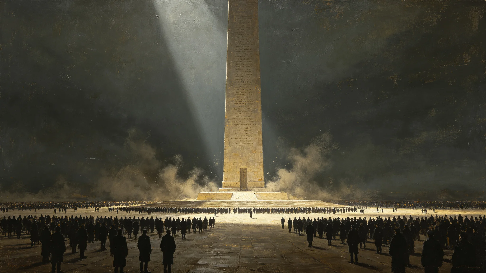

# 三恒星系"万代柱"刻名——千年无名者补刻与文明存续宣誓仪式规程公报

**发布机构**：三恒星系文明联合体文化委员会
**发布日期**：3384年4月4日
**文件等级**：跨星系公开

## 一、规程缘起

万代柱立于跨星系纪念广场，初刻于联合体成立百年（见GS-3148功勋墙同期）。柱上初刻首批拓荒者功勋名。此后百年，功勋墙刻名（见GS-3148-01）与保护名录刻石（见GS-3120-01）陆续补充。至3384年，柱上"有名者"已满，但大量"无名者"——那些考勤表上的名字、巡检表上的签名、没来得及被记住的普通人——尚未刻入。

文化委员会制定本规程，补刻无名者，并附文明存续宣誓。

## 二、补刻原则

**（一）不评功过**

补刻不问功劳大小。刻入标准只有一条：该人为联合体公共事务工作过，且其名见于某份公共记录（考勤、巡检、签字、值班表）。

**（二）不追封**

不追封"烈士""英雄"。刻名即刻名，不加头衔。

**（三）不遗漏**

凡见于公共记录、却从未在任何纪念物上留名者，一律补刻。

## 三、宣誓

补刻仪式后，参加者（自愿）可在柱前集体诵念一段固定宣誓。宣誓词不豪迈，只一句：

"我们接住了。下一回，看你们。"

不要求举手、不要求起立、不要求表情。诵完即散。

## 四、纪律

- 不录播、不直播。
- 不设"代表刻名"，每一名无名者平等刻入。
- 刻名不收费、不排名、不分星区先后。
- 仪式结束不合影。

## 五、第一届补刻

3384年为第一届。补刻无名者共1,247名，均见于跨星系公共记录。文化委员会不公布名单——名单已刻入柱上，想看的人自己去看。

## 六、附则

文化委员会在公报末写："功勋墙上刻的是被记住的人。万代柱刻的是没被记住、但其实做了事的人。我们不替他们出名，我们只是把名字写上，让一千年后的人知道：当年不只有几个英雄，有一千多个普通人，一起撑过了。"

## 六、刻名流程

| 步骤 | 内容 |
|---|---|
| 提名 | 任何公民可提名见于公共记录的无名者 |
| 核验 | 文化委员会核验其确见于公共记录、未在他处留名 |
| 刻名 | 按拼音排序刻入万代柱，不按功绩、不按星区 |
| 补刻 | 每年一次 |

不设"提名费"、不设"名额上限"。凡符合标准者，一律刻入。

## 七、无名者标准

补刻标准只有一条：见于公共记录（考勤、巡检、签字、值班表），且未在他处留名。不问功劳、不问星区、不问职业。刻名按拼音排序，不按"重要性"。

## 八、刻名不收费

刻入万代柱不向提名者或家属收费。刻石、人工、维护全部由文化遗产保护局公共预算承担。文化委员会说明："名字不该花钱买。花了钱的名字，就不干净了。"

## 九、首年补刻数

3384年首届补刻无名者共1,247名，均见于跨星系公共记录。文化委员会不公布名单，名单已刻入柱上。想看的人自己去广场看。

### 附：## 十、宣誓词

万代柱前诵念的固定宣誓词仅一句：我们接住了。下一回，看你们。不要求举手、不要求起立、不要求表情。诵完即散。

## 十一、第一届补刻来源分布

3384年第一届补刻1,247名无名者，其公共记录来源分布如下：

| 来源 | 人数 | 占比 |
|---|---|---|
| 巡检与值班记录 | 312 | 25% |
| 考勤与会务记录 | 287 | 23% |
| 签字与验收记录 | 245 | 20% |
| 医疗与体检记录 | 186 | 15% |
| 运输与调度记录 | 128 | 10% |
| 其他公共记录 | 89 | 7% |
| 合计 | 1,247 | 100% |

文化委员会注明：1,247名中，职务最高者不过工长，最低者为值班员。无一名理事、无一名学派主持人。他们是那些考勤表上的名字。

## 十二、刻名工艺

万代柱为花岗岩整体柱体，补刻采用手工凿刻，不用激光。每刻一个名字，由同一名刻石工连续凿完，不换人。文化委员会说明："机器刻得齐，人手刻得有轻重。名字是人的事，让人来刻。"

第一届补刻1,247名，由3名刻石工历时14个月完成。刻名按拼音排序，不按功绩、不按星区、不按年代。

## 十三、规程历史沿革

万代柱初刻于联合体成立百年（约3100年），柱上初刻首批拓荒者功勋名。此后近三百年，柱上只增刻"有名者"——功勋墙（见GS-3148-01）上的人、保护名录（见GS-3120-01）上的人。至3380年代，柱上有名者已满，但各星区档案馆中大量无名者——巡检表、考勤表、签字单上的名字——从未在任何纪念物上留名。

3380年，一名退休巡检员在跨星系公共讨论中提议："万代柱该给没名字的人留地方。"文化委员会经四年调研，于3384年制定本规程。本规程不是新造纪念物，是给已有三百年的万代柱补上它原本漏掉的那一面。

## 十四、后续安排

- 3385年起，补刻每年一次，每年新增人数不设上限。
- 每十年由文化委员会评估一次补刻标准，仅评估标准是否被滥用，不评估"刻得好不好"。
- 柱上若满，另建新柱，不拆旧柱。旧柱不挪、不改、不补刻第二排。

---

**发布**：三恒星系文明联合体文化委员会
**日期**：3384年4月4日