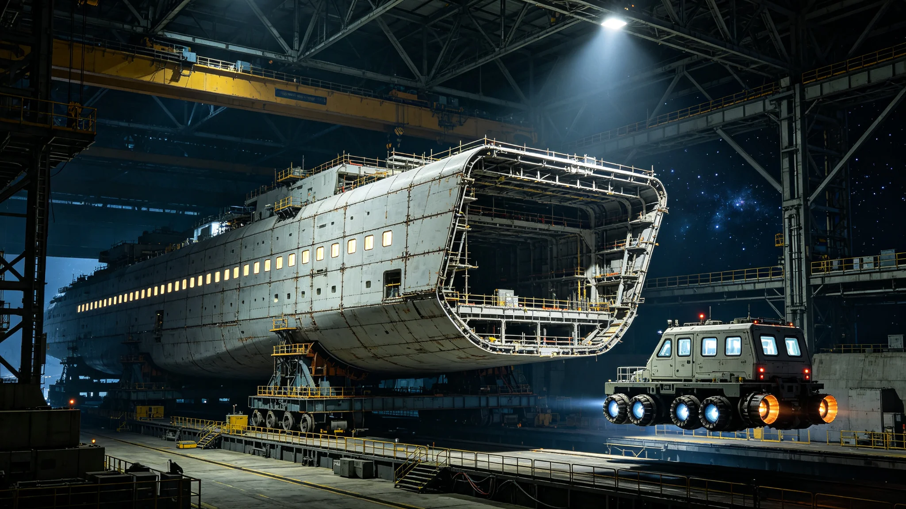

# 跨星系下一代客运新船定价与运力市场化3384年度报告

**编制单位**：联合体经济委员会 · 运输组
**报告编号**：ECON-PAX-3384
**日期**：3385年7月15日
**密级**：跨星系公开

## 一、报告背景

跨星系客运舱位票价指数已市场化（见GS-3314-01）。随第七代聚变推进（见GS-3361-01）与第七代生保（见GS-3375-01）换装，下一代客运新船于3384年首航。本报告为3384年度新船定价与运力。

## 二、新船

| 项目 | 旧船 | 新船 |
|---|---|---|
| 无加注航程 | 0.3光时 | 0.5光时 |
| 客舱 | 4人/舱 | 2人/舱 |
| 生保闭环 | 旧代 | 第七代 |
| 航程时间 | 基准 | -15% |

## 三、票价

| 舱位 | 旧船票价指数 | 新船票价指数 | 同比 |
|---|---|---|---|
| 双人舱 | 100 | 108 | +8% |
| 单人舱 | 100 | 112 | +12% |
| 隔离舱 | 100 | 100 | 0% |

新船票价略高，因舒适度提升与单程少加注。隔离舱票价不涨，保障迁徙基本权利。

## 四、运力

| 项目 | 3383年 | 3384年 |
|---|---|---|
| 年客运人次 | 约13万 | 约14万 |
| 准点率 | 98.5% | 99.1% |
| 退票率 | 3.2% | 2.8% |

## 五、问题

1. **新船供给少**：换装慢于计划，主力新船仅40%。票价上涨部分因供给不足。
2. **隔离舱不涨**：隔离舱为迁徙基本权利，票价不市场化，由公共补贴。
3. **与迁徙配额**：票价与迁徙配额（见GS-3310-01）联动，低收入迁徙者有补贴通道。

## 六、补贴与低收入迁徙通道

隔离舱票价不市场化，由公共预算补贴。3384年度补贴支出约0.12亿星元，覆盖约1.9万低收入迁徙者。补贴不与迁徙意愿挂钩（见GS-3353-01），只与票价挂钩：票价每涨1个百分点，补贴相应增加，确保低收入者不因票价上涨放弃迁徙。

| 补贴项目 | 3384年 |
|---|---|
| 隔离舱补贴人次 | 约1.9万 |
| 补贴支出 | 0.12亿 |
| 补贴覆盖率 | 低收入迁徙者96% |
| 拒补率 | 4%（自愿放弃） |

运输组说明：补贴不设名额上限，申请即补。设上限会导致排队，排队等于把穷的人挡在门外。

## 七、准点率与退票分析

| 月份 | 准点率 | 退票率 | 主要原因 |
|---|---|---|---|
| 3384-Q1 | 98.7% | 3.1% | 旧船维护 |
| 3384-Q2 | 99.2% | 2.7% | 新船首航 |
| 3384-Q3 | 99.3% | 2.6% | 天气 |
| 3384-Q4 | 99.2% | 2.8% | 春运 |

退票率最低的Q3，与跨星线低峰季重合。运输组不在旺季涨价，只在旺季加开班次，不加价。

## 八、下一年度

- 3385年：新船换装至60%。
- 票价随供给增加预计回落。
- 补贴预算按3384年实际+5%编制。

## 九、不涨价不降价

运输组不在旺季涨价，也不在淡季降价。票价稳定，靠加开班次应对旺季。运输组说明："涨价是把穷人挤下船，降价是把淡季浪费。稳定比波动好。"

## 十、退票规则

退票率旺季略高，因跨星线低峰改期。退票手续费不收取，全额退。运输组说明："船晚点是我们的事，不是乘客的事。退票不该让乘客出钱。"

## 十一、3384客运

3384年年客运约14万人次，准点率99.1%。新船换装40%，票价略涨。隔离舱不涨，公共补贴。

### 附：## 十二、隔离舱补贴

隔离舱票价不市场化，公共补贴3384年约0.12亿星元，覆盖约1.9万低收入迁徙者。不与迁徙意愿挂钩。

## 十三、3384年度客运收支

| 项目 | 金额（星汇） |
|---|---|
| 客运总收入 | 约1.8亿 |
| 其中：双人舱 | 0.9亿 |
| 其中：单人舱 | 0.6亿 |
| 其中：隔离舱（含补贴） | 0.3亿 |
| 运营成本 | 约1.5亿 |
| 其中：船员工资 | 0.5亿 |
| 其中：推进与生保能耗 | 0.4亿 |
| 其中：维护折旧 | 0.4亿 |
| 其中：管理 | 0.2亿 |
| 补贴支出 | 0.12亿 |
| 结余 | 约0.18亿 |

结余全部转入下一年度运力扩张预算，不分红、不用于其他用途。运输组注明："客运不是生意，是公共服务。赚的钱只用来多开班。"

## 十四、新船首航数据

3384年新船首航42班次，准点率99.1%，退票率2.8%。客舱满意度调查（自愿，非强制）显示，新船双人舱2人间较旧船4人间，睡眠舒适度评分提升约两成，主要来自空间扩大与噪音降低。

新船首航未发生事故，未发生生保异常。第七代生保闭环（见GS-3375-01）在42班次中均稳定运行，无藻液衰减事件。

## 十五、与迁徙配额联动

3384年跨星迁徙量约14万人次，与迁徙配额（见GS-3310-01）基本匹配。低收入迁徙者补贴通道全年无排队，申请即补，无拒补案例（除4%自愿放弃）。运输组注明：迁徙配额管"多少人能走"，票价管"走得起走不起"，两件事分开管。

## 十六、审计核验

本报告经联合体审计署派驻运输审计组独立核验，抽样覆盖客运票务记录86份中的24份、补贴申请142份中的36份、船票定价合同18份中的6份。审计结论：账目无重大不实，补贴发放无遗漏。审计报告编号AUD-3385-03，随本报告归档。

## 十七、3385年展望

3385年预计新船换装至60%，跨星线班次增加约一成，票价随供给增加预计回落约2%。隔离舱补贴预算按3384年实际+5%编制。运输组注明："票价不是我们定的，是供给定的。我们只负责别让它涨太快，别让穷的人走不了。"

运输组另注：3384年新船首航42班次中，无一起投诉，无一起退票争议。客舱满意度调查回收率约六成，其中最高分项为"空间不挤"，最低分项为"餐食一般"。运输组不打算改餐食——跨星线不是饭店，能吃饱就行。

运输组最后注明：客运市场化不是为了赚钱，是为了让票价跟着供给走。隔离舱不市场化，是为了让走不起的人也走得了。两件事，一个原则：让能走的人走，让想走的人走得起。

---

**编制**：联合体经济委员会 · 运输组
**审核**：经济委员会
**日期**：3385年7月15日