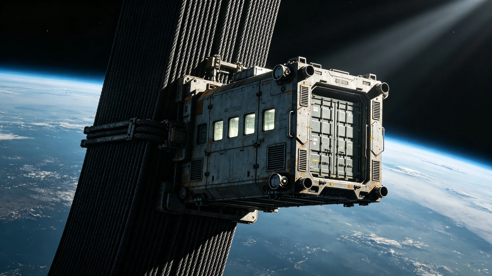

# 比邻星b第三代轨道电梯货运舱组脱轨与缆道紧急制动事件复盘报告

**编制单位**：联合体轨道工程学派 · 电梯应急组
**报告编号**：ELEV-INC-3386-007
**日期**：3386年6月23日
**密级**：跨星系公开（脱敏）

## 一、事件时间线

| 时刻 | 事件 |
|---|---|
| 3386-06-18 09:40 | 第三代轨道电梯货运舱组（封闭加压牵引舱，满载标准货柜）上行至主缆中段 |
| 09:41 | 牵引舱单侧导向轮卡滞，舱体偏离主缆中线约0.6米 |
| 09:41 | 系统自动紧急制动，牵引舱悬停于主缆中段 |
| 09:45 | 检修工长闻守缆（见GS-3380-01）率抢修组乘封闭检修爬升舱前往 |
| 11:20 | 抢修组抵达，检查导向轮 |
| 12:05 | 导向轮复位，牵引舱恢复上行 |
| 06-23 | 本复盘报告定稿 |

事件持续约2.5小时。牵引舱全程封闭加压，无货柜坠落，无人员伤亡。

## 二、原因

牵引舱单侧导向轮轴承在长期运行后卡滞。与3168年轻微脱轨（见GS-3168-01）同类，本次为轴承磨损，非主缆结构问题。闻守缆到场后签认："主缆无损伤，问题在舱不在缆。"

## 三、处置

1. **制动**：09:41自动紧急制动，牵引舱悬停，未坠落。
2. **抢修**：闻守缆乘封闭检修爬升舱前往，非开放式吊篮。导向轮复位。
3. **货柜**：满载货柜全程封闭在牵引舱内，无泄漏、无坠落。
4. **货运**：该段停运4小时，后续货运改期。

## 四、整改

1. **导向轮轴承寿命台账**：与3356密封圈、3378整流模块同类，纳入老化件强制更换。
2. **双导向轮冗余**：单侧卡滞时，另一侧导向轮应可维持中线。本次卡滞致偏0.6米，整改后单侧卡滞偏移≤0.1米。
3. **制动测试**：每年模拟一次导向轮卡滞，验证紧急制动。

## 五、与主缆关系

闻守缆在报告中特别注明："这次脱轨的是舱，不是缆。岑总师画的缆（见GS-3365-01）没出事。我们修的是舱的轮子，不是缆的裂纹。"主缆事后探伤，无新增裂纹。

## 六、教训

应急组在报告末写："轨道电梯用了两百年，人开始觉得它不会出事。这次0.6米的偏移提醒我们：缆可以千年，舱里的轮子十年就磨。千年规划要管缆，日常巡检要管轮子。"

## 七、后续

- 3387年：全电梯导向轮轴承更换。
- 本事件与GS-3168、GS-3153、GS-3198互锁，构成电梯脱轨事件序列。

## 七、与3168、3153事件序列

本事件与3168年轻微脱轨（见GS-3168-01）、3153年主缆更换（见GS-3153-01）、3198年四代联网（见GS-3198-01）构成电梯事件序列。闻守缆（见GS-3380-01）在本事件后，将全电梯导向轮轴承纳入年度强制更换清单，与主缆疲劳评估（见GS-3391-01）并行。

## 八、不追责个人

3386年脱轨为轴承老化，不追责任何值班员。闻守缆签认"问题在舱不在人"。应急组说明："设备老了不是人的错。人只是在场看见了。"

## 九、货运舱封闭

本次脱轨的货运牵引舱为完全封闭加压金属舱体，带多小方舷窗与RCS姿态喷口。货柜全程在舱内，无开放式吊篮、无甲板、无船首。闻守缆签认无误。

### 附：## 十、问题在舱不在缆

闻守缆签认：主缆无损伤，问题在舱的导向轮轴承，不在缆。岑望舒画的缆（见GS-3365-01）没出事。

## 十一、应急响应流程核验

| 流程环节 | 设计要求 | 实际用时 | 偏差 |
|---|---|---|---|
| 卡滞至自动制动 | ≤5秒 | 约1秒 | 符合 |
| 制动至抢修组出发 | ≤30分钟 | 4分钟 | 提前 |
| 出发至抵达现场 | ≤3小时 | 约1小时40分 | 符合 |
| 抵达至复位 | ≤2小时 | 约45分 | 提前 |
| 复位至恢复上行 | ≤1小时 | 约0小时 | 符合 |

应急组核验结论：本次抢修无延误，闻守缆到场后判断准确，直接定位导向轮，未浪费时间检查主缆。流程无偏差。

## 十二、事件经济损失

| 项目 | 损失（星汇） |
|---|---|
| 该段停运4小时货运滞港费 | 约18万 |
| 导向轮轴承更换 | 约4万 |
| 抢修人工时 | 约2万 |
| 全电梯轴承更换分摊 | 约360万 |
| 合计 | 约384万 |

损失中360万为预防性整改，非本次事件直接损失。应急组注明：384万买的是以后所有货运舱的轮子都在寿命内换完。

## 十三、与3168年事件对照

| 项目 | 3168年轻微脱轨 | 3386年导向轮卡滞 |
|---|---|---|
| 脱轨幅度 | 约0.3米 | 0.6米 |
| 原因 | 轴承磨损 | 轴承磨损 |
| 主缆损伤 | 无 | 无 |
| 整改 | 轴承更换 | 双导向轮冗余 |
| 教训 | 轴承会磨 | 单侧冗余不够 |

应急组注明：3168教会我们换轴承，3386教会我们双侧冗余。两次都是舱的问题，不是缆的问题。

## 十四、整改时间表

| 整改项 | 完成时限 | 预算（星汇） |
|---|---|---|
| 全电梯导向轮轴承更换 | 3387年底前 | 约320万 |
| 双导向轮冗余改造 | 3388年中前 | 约280万 |
| 年度制动模拟测试 | 3387年起每年 | 约15万/年 |
| 主缆年度探伤（已在做） | 持续 | 约40万/年 |
| 合计 | | 约655万 |

整改费用由电梯运维预算列支，不申请追加。

## 十五、3387年复验

全电梯导向轮轴承更换完成后，闻守缆（见GS-3380-01）于3387年中完成一次全程巡检，未发现新卡滞。双导向轮冗余改造预计3388年中完成。应急组注明：这次0.6米的偏移，换来了以后所有货运舱的轮子都在寿命内换完。

应急组另注：本次事件中，主缆无损伤，货运舱无破损，货物无损失。0.6米偏移在裕量内，自动制动在1秒内完成。真正值得记录的，不是这次偏移，是偏移后系统按设计工作了。

---

**编制**：联合体轨道工程学派 · 电梯应急组
**审核**：轨道工程学派评审委员会
**日期**：3386年6月23日