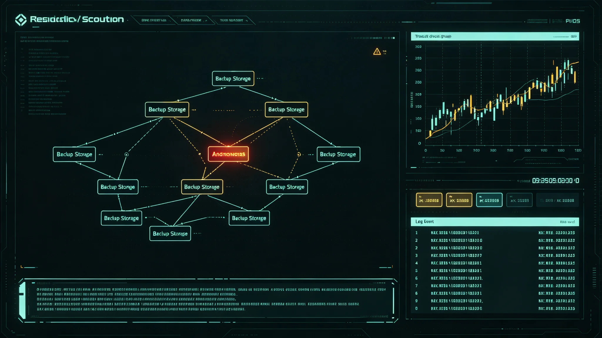

# 跨星系文明存续网"冷备存储"遭系统性渗透未遂事件通报与加固公报

**发布机构**：联合体安全协调委员会 · 网络安全处
**发布日期**：3387年10月12日
**文件等级**：跨星系公开（脱敏）

## 一、事件背景

跨星系联合网络安全防御体系百年升级（见GS-3187-01）后，文明存续网"冷备存储"——即千年规划（见GS-3360-01）下不联网、物理隔离的离线备份——于3387年发现一起系统性渗透未遂。

## 二、事件经过

| 时刻 | 事件 |
|---|---|
| 3387-08-20 | 网络安全处监测到针对冷备存储接入点的异常访问尝试 |
| 08-21 | 溯源发现访问尝试来自一个已被入侵的中继站运维终端 |
| 08-22 | 切断该终端，冷备存储未被实际接入 |
| 09-30 | 加固完成 |
| 10-12 | 本通报定稿 |

关键：冷备存储物理隔离，渗透者只能从联网终端尝试"接入"，未能实际触碰离线介质。渗透未遂，无数据泄露。

## 三、渗透手段

渗透者通过入侵一个中继站运维终端，尝试利用冷备存储的定期数据同步通道"捎带"接入。该同步通道设计为单向只读，但渗透者试图构造伪装数据包。网络安全处初筛拦截。

## 四、加固

1. **同步通道双向审计**：每次同步记录双向数据包，不依赖单向只读假设。
2. **运维终端隔离**：中继站运维终端与冷备同步通道物理断开，同步专用独立终端。
3. **玻璃介质不联网**：千年存档玻璃盘（见GS-3368-01）不接入任何网络，渗透无法触达。
4. **定期红队演练**：每年模拟一次冷备渗透尝试。

## 五、教训

网络安全处在通报中写："冷备存储的安全不靠'它不联网'，靠'就算有人摸到了门，门后面还有门'。这次未遂提醒我们：离线不等于安全，离线+审计+不联网介质，才是安全。"

## 六、与千年规划

本事件验证千年规划（见GS-3360-01）"不把关键数据只放在一处"原则。玻璃盘不联网，数字冷备有审计，热备有监控。三层冗余任一层被突破，另两层仍在。

## 六、渗透者溯源

网络安全处溯源结论：渗透者来自一个已被入侵的中继站运维终端，非来自第五恒星系方向文明，亦非来自联合体外部敌对势力——更接近内部运维终端被钓鱼后的试探性渗透。

溯源不公开渗透者身份。安全处说明："抓到的不是敌人，是一个被钓鱼的运维终端。真正要防的是钓鱼本身，不是抓某个人。"

## 七、冷备不联网原则

冷备存储物理隔离，不接公网。同步通过专用离线介质，人工搬运。网络安全处说明："联网的备分不算备分，只能算另一个主份。离线才叫备分。"

## 八、红队演练

网络安全处每年组织一次红队演练，模拟对冷备存储的渗透尝试。3387年事件后，红队频次由每年一次改为每年两次。安全处说明："真渗透一年不来，我们自己演两遍。"

## 九、渗透未遂结论

3387年渗透为内部运维终端被钓鱼后的试探，未触及冷备物理介质。加固后红队频次翻倍。无数据泄露。

### 附：## 十、离线同步

冷备与主网同步通过专用离线介质，人工搬运。冷备物理隔离，不接公网。联网的不算备份，离线才叫备份。

## 十一、事件经济损失

| 项目 | 损失（星汇） |
|---|---|
| 加固工程 | 约0.28亿 |
| 红队演练年度经费 | 约60万/年 |
| 运维终端隔离改造 | 约0.08亿 |
| 数据泄露 | 0（未遂） |
| 合计 | 约0.36亿 |

损失全部为预防性加固，无数据泄露、无业务中断。网络安全处注明：这次没出事，花0.36亿买的是下次真出事时还没出事。

## 十二、加固明细

| 加固项 | 完成时限 | 预算 |
|---|---|---|
| 同步通道双向审计 | 3387年9月已完成 | 0.06亿 |
| 运维终端物理隔离 | 3387年12月前 | 0.08亿 |
| 同步专用独立终端 | 3388年上半年 | 0.05亿 |
| 红队演练每年两次 | 3388年起 | 60万/年 |
| 玻璃介质离线复检 | 3388年中 | 8万 |
| 合计 | | 约0.36亿 |

加固费用由千年规划网络安全预算列支，不申请追加。

## 十三、与3187年网络安全升级的对照

| 项目 | 3187年网络安全升级 | 3387年冷备渗透未遂 |
|---|---|---|
| 范围 | 联网主网 | 离线冷备 |
| 性质 | 制度升级 | 事件触发 |
| 教训 | 联网须分级 | 离线也须审计 |
| 后果 | 无事故 | 未遂 |

网络安全处注明：3187教会我们怎么防联网的，3387教会我们怎么防离线的。两件事不互替。

## 十四、三层冗余验证

千年规划（见GS-3360-01）下文明存续数据存于三层：

| 层 | 介质 | 联网 | 本次渗透是否触及 |
|---|---|---|---|
| 热备 | 数字在线 | 联网 | 不直接 |
| 冷备 | 数字离线 | 物理隔离 | 未触及 |
| 千年介质 | 玻璃光刻 | 不联网 | 不可能触及 |

三层任一层被突破，另两层仍在。本次渗透仅触及冷备同步通道，未触及冷备介质本身，更未触及玻璃盘。

## 十五、红队演练结果

3387年加固完成后，网络安全处组织首次每年两次的红队演练，模拟对冷备存储的渗透尝试。红队尝试8种渗透路径，全部被双向审计与物理隔离拦截，无一触及离线介质。网络安全处注明："自己人打不进去，才敢说外面人打不进来。"

---

**发布**：联合体安全协调委员会 · 网络安全处
**日期**：3387年10月12日