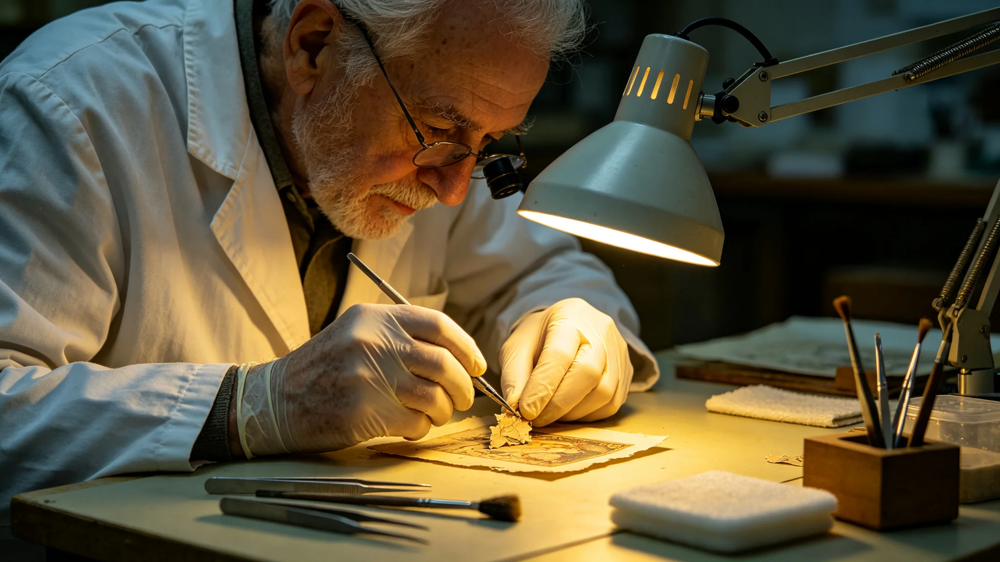

# 千年遗产首席修复师岑素文四十年文物修复与修复痕迹保留签认档案

**归档单位**：跨星系文化遗产保护局 · 修复组
**档案袋编号**：REST-LEAD-006
**立卷日期**：3388年8月20日

## 一、履历卡

| 项目 | 登记内容 |
|---|---|
| 姓名 | 岑素文 |
| 出生星区 | 三恒星系，比邻星b第一居住区 |
| 出生年 | 3308年 |
| 入组年 | 3332年 |
| 岗位 | 千年遗产首席修复师 |
| 在岗年限 | 至3388年满56年 |
| 经手 | 初代文书、原舱遗物、交换艺术品 |

岑素文是修复组首席。与闻远图（见GS-3351-01）守船骸不动、罗正和（见GS-3315-01）审数字不改不同，岑素文的工作是"动"文物——但她的哲学是"能不动就不动"。

## 二、四十年修复签认（择要）

| 年份 | 文物 | 修复 | 签认 |
|---|---|---|---|
| 3340 | 初代文书散页 | 最小干预，仅固定 | "不补字" |
| 3356 | 结露污损三件（见GS-3356-01） | 缓慢干燥，不描红 | "晕了就晕了" |
| 3362 | 原舱铭牌脆化 | 不加固 | "它本就该碎" |
| 3374 | 第五恒星系方向交换艺术品 | 清洗表面尘，不补色 | "它的颜色是它的" |

岑素文的修复原则：保留一切岁月痕迹，只阻止它继续损坏，不"美化"它。

## 三、处分记录（一次）

**3350年**：岑素文在修复一件初代文书时，未经审批，擅自将一处旧修复（三百年前某位修复师的补字）去除，露出原迹。她认为旧补字是错误，应去掉。处分：书面检查，扣半年津贴，调离该文物修复岗一年。

检查原件："我以为去掉错的补字是对的。规程说得对，三百年前那位修复师的补字，也是这件文物的历史。我没权力替他擦掉。"

## 四、考勤与体检

- 56年修复，累计修复文物约480件。
- 考勤：连续40年出勤满，迟到2次，均因通勤班车故障。
- 3388年体检：长期精细操作致手部微震颤（早期），视网膜疲劳，其余正常。
- 年度考核：连续30年"优秀"。

## 五、签名页

岑素文签收："我修了四十年文物，原则只有一个：让它还是它。能不碰就不碰，碰了也只让它别继续坏，不让它变新。它老了，我不把它当病人，我把它当一位老人，扶一把，不化妆。"签名日期3388年8月20日。

## 六、修复师的工作

修复组在档案袋末写："岑素文的手很稳，但她的原则是手尽量别碰。四十年修了四百件文物，她修得最少的那一件，往往是她最得意的——因为它不需要修。"

## 七、修复师传承

岑素文带徒三人，均按"能不碰就不碰"原则培养。修复组说明：手艺可以教，原则只能跟。她的三个徒弟里，能独立修复初代文书的，至今一人。

## 八、不补色

岑素文修复一切遵循"不补色、不补字、不加固"三不原则。文物旧了就让它旧，坏了就阻止它继续坏，不把它变新。修复组说明："新是假的，旧是真的。我们修真的，不造假的。"

## 九、岑素文经手

岑素文四十年修复文物约480件，含初代文书、原舱铭牌、第五恒星系方向交换艺术品。每一件都按"不补色不描红"原则。

### 附：## 十、三不原则

不补色、不补字、不加固。旧了就让它旧，坏了就阻止继续坏，不把它变新。

## 十一、履历时间线补

| 年份 | 履历事项 |
|---|---|
| 3308 | 生于比邻星b第一居住区 |
| 3328—3332 | 联合体普通公民教育，主修文物修复 |
| 3332 | 入文化遗产保护局修复组任学徒 |
| 3340 | 独立修复首批初代文书散页 |
| 3350 | 因擅自去除旧补字受书面检查 |
| 3356 | 主持结露污损三件修复（见GS-3356-01） |
| 3362 | 签认原舱铭牌脆化不加固 |
| 3374 | 主持第五恒星系方向交换艺术品修复 |
| 3380 | 任首席修复师 |
| 3388 | 本档案立卷 |

## 十二、修复方法与样本

岑素文四十年修复480件文物，方法固定为三步：

1. **观察**：每件文物上手前，先在恒温台旁观察不少于三天，记录现状，不碰。
2. **最小干预**：只在文物即将继续损坏处做最小干预，如纸张即将碎裂处贴薄纸加固，不在完好处动刀。
3. **留痕**：所有干预均在修复记录中标注位置与材料，后代修复师可追溯、可移除。

480件文物中，她真正动刀的不到六成，其余四成只做了干燥、环境控制，未上手。

## 十三、考勤与处分补录

- 56年累计出勤满，迟到2次，均因通勤班车故障，无缺席。
- 3350年书面检查原件随档案袋另卷保存。检查末尾自书："三百年前那位修复师的补字，也是这件文物的历史。我没权力替他擦掉。"
- 3350年处分后，3351—3388年无再次处分。年度考核连续30年"优秀"。

## 十四、签名文件摘录

档案袋保留岑素文签认文件七份，其中四次修复签认已在第二节摘录，另三份为纯事务性签认：

- 3355年修复学徒年度考核签："徒弟甲可独立修复纸本文书。徒弟乙尚需一年。"
- 3368年玻璃千年介质（见GS-3368-01）样本检查签："玻璃盘表面无划痕，可读。"
- 3380年首席修复师接任签："接。但三不原则不变。"

## 十五、传承

岑素文带徒三人，其中一人可独立修复初代文书。修复组注明：手艺可以教，原则只能跟。三不原则——不补色、不补字、不加固——由徒弟继续传给下一代。

---

**立卷**：跨星系文化遗产保护局 · 修复组
**复核**：与四十年修复记录（另卷）互锁
**日期**：3388年8月20日