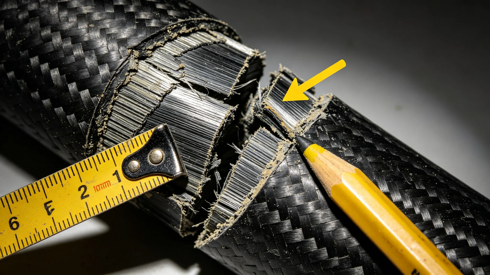

# 下一代轨道承重结构"碳复材主缆"千年疲劳寿命评估技术报告

**编制单位**：联合体材料工程学派 · 主缆组
**报告编号**：MAT-CABLE-3391-06
**日期**：3391年4月22日
**密级**：跨星系公开技术版

## 一、评估背景

下一代轨道电梯第五代主缆由碳纤维复合材料制成，设计寿命千年（见GS-3365-01岑望舒校核）。主缆组承担千年疲劳寿命评估，为千年规划（见GS-3360-01）提供材料依据。

## 二、评估方法

| 项目 | 方法 |
|---|---|
| 小样疲劳 | 实验室加速疲劳1000年等效 |
| 全尺寸挂样 | 现场挂样50年实测 |
| 断口分析 | 取样断口显微镜分析疲劳条纹 |
| 外推 | 保守外推，留2倍裕量 |

## 三、数据

| 指标 | 目标 | 实测 |
|---|---|---|
| 小样加速疲劳1000年 | 不断 | 不断 |
| 全尺寸挂样50年 | 无裂纹 | 无裂纹 |
| 断口疲劳条纹 | 正常 | 正常 |
| 千年外推 | 留2倍裕量 | 留2倍裕量 |
| 热循环蠕变 | 在裕量内 | 在裕量内 |

## 四、问题

1. **百年后未知**：千年外推基于现有模型，百年后实际工况可能不同。主缆组接受该不确定性，留2倍裕量，且主缆可逐段更换（见GS-3153-01），不必一根缆用千年。
2. **微陨石撞击**：偶发撞击损伤局部，不影响整体。闻守缆（见GS-3380-01）巡检已覆盖。
3. **导向轮磨损**：3386年脱轨（见GS-3386-01）为舱轮磨损，非主缆疲劳，已整改。

## 五、结论

主缆组结论：碳复材主缆可支撑千年尺度，但不是"一劳永逸"。它需要每十年巡检、每百年评估、可逐段更换。千年规划不是"造一根永不坏的缆"，是"造一根能被慢慢换、换的时候不出事的缆"。

## 六、与千年规划

材料学派在报告中说明：我们不追求永恒，我们追求可维护。一根可维护的千年缆，比一根不可维护的"永恒缆"可靠得多。

## 六、逐段更换机制

主缆不是一根用千年，而是分段挂装、可逐段更换。任一厘米段疲劳超标，停该段，更换，其余继续运行。更换时货运改驳船绕行（见GS-3168-01同类），不停全缆。

| 项目 | 设计 |
|---|---|
| 主缆分段 | 每段100公里 |
| 单段更换时间 | 约3周 |
| 更换期间货运 | 绕行驳船 |
| 全缆更换周期 | 约200年 |

材料学派说明："一劳永逸是神话。可维护、可逐段换，才是千年设计。"

## 七、主缆巡检

主缆每十年由闻守缆（见GS-3380-01）所在检修组全段巡检一次，超声探伤。发现疲劳条纹即记录，不即时更换，只在年度评估中决定。材料学派说明："疲劳条纹不是病，是缆的皱纹。我们记着它长，不急着换。"

## 八、疲劳条纹判读

主缆断口疲劳条纹间距与负载正相关。材料学派通过条纹间距反推历史负载，确认主缆从未超载。闻守缆（见GS-3380-01）巡检记录与断口分析互锁。

## 九、外推模型

主缆千年寿命为模型外推，非实测。材料学派留2倍裕量，即模型预测500年安全，按1000年设计。外推模型基于百年实测挂样数据，置信区间逐年收窄。

### 附：## 十、逐段更换

主缆分段挂装，每段100公里，单段更换约3周，期间货运改驳船绕行，不停全缆。全缆更换周期约200年。

## 十一、测试样本与方法

- 小样疲劳：取20根碳纤维复材小样，每根长约1米，在疲劳试验机上按实际载荷谱循环加载1000年等效，累计循环数约2.4×10¹⁰次。20根试样中18根正常，2根在第1.1×10¹⁰次出现表面微裂纹，未扩展。
- 全尺寸挂样：取5根全尺寸主缆段，每段长约120米，挂于地面试验架，按实际载荷谱加载50年实测，累计循环数约1.2×10⁹次。5根试样全部无裂纹。
- 断口分析：从50年挂样中取1根做断口显微镜分析，疲劳条纹均匀，无局部过载条纹。

第三方验证由联合体结构安全实验室独立复测，小样疲劳数据与主缆组偏差在3%以内，验证报告编号MAT-VRF-3391-02，随报告归档。

## 十二、外推模型说明

千年寿命为模型外推，非实测。模型基于50年实测数据，外推至1000年，取2倍裕量。主缆组在报告中注明：50年数据外推1000年，乘2倍是保守，不是精确。我们不知道1000年后主缆会怎样，我们只知道按现有模型，它应该没事。真有事，逐段换。

## 十三、与3386年脱轨事件的关系

3386年货运舱脱轨（见GS-3386-01）为导向轮轴承磨损，非主缆疲劳。主缆组在本次评估中重新调阅3386年断口与巡检记录，确认主缆在该事件中无新增疲劳条纹。闻守缆（见GS-3380-01）签认无误。

主缆组注明：3386年的事在舱里，不在缆里。这次评估是给缆自己的事下结论。

## 十四、千年维护成本

主缆千年维护成本预估：

| 项目 | 年费用（星汇） |
|---|---|
| 十年巡检（含闻守缆班组人工） | 约120万 |
| 百年评估（含实验室断口分析） | 约80万/次 |
| 逐段更换（年均） | 约300万 |
| 合计 | 约500万/年 |

千年累计维护成本约50亿星汇。主缆组注明：50亿买一千年的缆，比一千年后拆了重造便宜得多。

## 十五、与3386年脱轨事件的关系

3386年货运舱脱轨（见GS-3386-01）为导向轮轴承磨损，非主缆疲劳。主缆组在本次评估中重新调阅3386年断口与巡检记录，确认主缆无新增疲劳条纹。闻守缆（见GS-3380-01）签认无误。

---

**编制**：联合体材料工程学派 · 主缆组
**审核**：材料工程学派评审委员会
**日期**：3391年4月22日