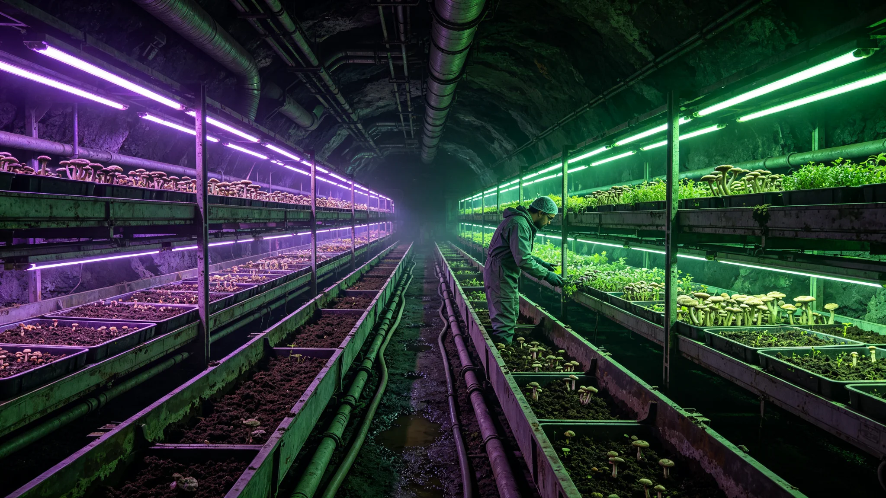

# 鲸鱼座τ星地下城第三代深地生态闭环与真菌分解链百年监测公报

**发布机构**：联合体生态学派 · 鲸鱼座τ生物圈站
**发布日期**：3392年7月18日
**文件等级**：跨星系公开

## 一、监测背景

鲸鱼座τ星地下城深地生态闭环已运行百年。火星地下城市第二代闭环百年监测（见GS-3163-01）已完成。本公报为鲸鱼座τ方向第三代深地闭环与真菌分解链（见GS-3131-01）百年数据。

## 二、百年数据

| 指标 | 百年前 | 现况 |
|---|---|---|
| 闭环率 | 初建 | 97% |
| 真菌分解链 | 试验 | 稳定运行 |
| 深地农业 | 试点 | 自足 |
| 废弃物处理 | 外送 | 闭环消化 |
| 能耗 | 基准 | -30% |

## 三、真菌分解链

真菌分解链自3131年试验（见GS-3131-01）以来，百年间已成为深地闭环核心。它把有机废弃物分解为可再利用基质，减少深地对外送补给的依赖。

## 四、问题

1. **真菌群落稳定**：百年间真菌群落未失控，与深地农业共生。
2. **与火星对照**：鲸鱼座τ深地闭环较火星地下城市（见GS-3163-01）闭环率高2%，因真菌分解链更成熟。
3. **深地心理**：长期深地居住的心理影响另见公共卫生监测，本公报不涉及。

## 五、百年结论

生态学派总结：鲸鱼座τ地下城用百年证明，深地闭环可以自持。人住在地下，不靠地表补给，也能活下去——而且活得比百年前省能耗。

## 六、下一期

- 3400年：与火星、比邻星b数据合并，做跨星区生态闭环总评估。

## 五、与火星地下城市对照

| 指标 | 鲸鱼座τ深地 | 火星地下城市（见GS-3163-01） |
|---|---|---|
| 闭环率 | 97% | 95% |
| 真菌分解链 | 成熟 | 试验中 |
| 深地农业自足 | 是 | 部分 |
| 能耗 | 基准-30% | 基准-20% |

鲸鱼座τ方向因真菌分解链更早成熟（见GS-3131-01），闭环率高出2个百分点。两个样本为跨星区深地居住提供对照。

## 六、深地心理监测

生态学派不评估深地心理，另由公共卫生监测。但生态学派在公报中附注：深地闭环稳定本身有利于心理稳定——食物自产、空气自循环，居民不必担心"外面坏了里面就死"。

## 七、下一期监测重点

- 真菌群落百年后的适应性演化；
- 深地农业与地表农业的成本比较；
- 与比邻星b穹顶生态（见GS-3389-01）的能量消耗对照。

## 八、深地真菌链运维

真菌分解链由专人值守，监测温度、湿度、菌床厚度。运维员不干预菌床自然分解，只在菌床过厚时人工翻堆。百年间菌床自然更替三轮，未失控。

## 九、百年数据对比

| 指标 | 2292年 | 3392年 |
|---|---|---|
| 深地人口 | 0.8万 | 3.1万 |
| 闭环率 | 78% | 97% |
| 深地农业 | 依赖补给 | 自足 |
| 真菌分解链 | 无 | 成熟 |

百年间深地人口翻了近四倍，闭环率提升19个百分点。生态学派说明：深地居住从"试验"变成了"日常"。

## 十、深地人口

3392年鲸鱼座τ地下城深地人口约3.1万，其中第三代深地出生者占62%。深地出生者从未见过露天天空，其心理与生理另由公共卫生监测。生态学派只负责闭环稳定，不评估人。

### 附：## 十一、真菌分解链参数

菌床温度37℃，湿度85%，循环周期90天。运维员只翻堆不干预分解。百年间未失控、未污染、未外溢。

## 十二、监测网络

百年监测由鲸鱼座τ生物圈站执行，监测网络布设如下：

| 监测点 | 类型 | 巡检频率 | 主要观测 |
|---|---|---|---|
| 深地农业层 | 温度湿度 | 实时 | 作物生长 |
| 真菌分解槽 | 温度湿度菌床 | 实时 | 分解效率 |
| 水循环 | 水质 | 每日 | 闭环率 |
| 空气循环 | 成分 | 每日 | CO₂/O₂ |
| 废弃物处理 | 闭环率 | 每周 | 消化率 |
| 合计 | 28处监测点 | | |

28处监测点数据每小时回传生物圈站一次，异常自动报警。

## 十三、百年投入

百年间鲸鱼座τ深地闭环累计投入约合星汇220亿，年均约2.2亿。其中真菌分解链建设占35%，深地农业占28%，水循环占18%，监测网占9%，运维占10%。

生态学派注明：220亿买的是3.1万人能在地下活一百年，且能耗逐年下降。这笔钱比把他们送回地表便宜。

## 十四、与比邻星b穹顶生态的对照

| 指标 | 鲸鱼座τ深地 | 比邻星b穹顶（见GS-3389-01） |
|---|---|---|
| 闭环率 | 97% | 96.2% |
| 人口 | 3.1万 | 约8万 |
| 能源 | 地热 | 恒星 |
| 光照 | 人工补光 | 自然+人工 |
| 心理 | 深地 | 半露天 |

两个方向相反的样本：一个在地下靠地热，一个在半露天靠恒星。百年数据互证：深地闭环可行，半露天闭环也可行。

## 十五、百年未发生的事

百年间鲸鱼座τ深地闭环未发生以下事件：

- 真菌群落失控外溢；
- 闭环率跌破90%；
- 深地农业绝收；
- 水循环污染；
- 空气循环事故。

生态学派注明：百年没出事，不是因为我们运气好，是因为我们每年都在看。下一个百年，继续看。

## 十六、与3400年总评估衔接

3400年，鲸鱼座τ深地闭环将与火星地下城市、比邻星b穹顶生态数据合并，做跨星区生态闭环总评估。生态学派注明：三个样本——地下、地表、半露天——拼在一起，才是我们对"人能不能在星星上活"的全部回答。

生态学派另注：百年间，地下城3.1万居民中，出生于地下城者占比从0%升至约60%。他们从未见过蓝天，但他们在深地活了一辈子。这不是悲剧，这是数据。

---

**发布**：联合体生态学派 · 鲸鱼座τ生物圈站
**日期**：3392年7月18日