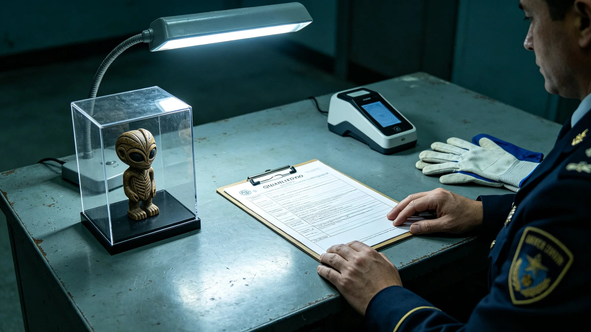

# 第五恒星系方向第二批交换货物中一件原生艺术品入境检疫争议事件通报

**编制单位**：联合体贸易与生物安全联合工作组
**通报编号**：TRADE-INC-3394-015
**日期**：3394年8月25日
**密级**：跨星系公开（脱敏）

## 一、事件经过

| 时刻 | 事件 |
|---|---|
| 3394-07-30 | 第二批交换货物（见GS-3370-01温控整改后）含一件第五恒星系方向原生艺术品 |
| 07-31 | 检疫开箱，艺术品表面检出微量未知生物活性（非病原体，为表面附着的原生环境微生物） |
| 08-01 | 检疫组争议：按四级隔离（见GS-3302-01）应灭活；但灭活将破坏艺术品 |
| 08-10 | 工作组裁决：不入境，原件退回，复制影像件入境 |
| 08-25 | 本通报定稿 |

事件无生物安全事故。争议焦点：艺术品的文化价值与生物安全隔离的冲突。

## 二、争议

- 检疫方：表面未知微生物按四级隔离应灭活，灭活必破坏艺术品。
- 文化方：灭活即毁艺术品，文化损失不可逆。
- 贸易方：灭活后入境无意义，不如退回。

## 三、裁决

工作组裁决：

1. 原件不入境，退回第五恒星系方向贸易方。
2. 高精度影像复制件入境，供三恒星方向文化研究，不接触生物圈。
3. 表面微生物不培养、不研究、不取样——按四级隔离，连取样都是扩大风险。
4. 后续交换艺术品一律先影像入境，原件是否入境另议。

## 四、与不可交易名录

该艺术品若入名录（见GS-3374-01），则不可交易。工作组建议：待影像研究后，由文化遗产保护局决定是否入名录。

## 五、教训

工作组在通报中写："我们喜欢它，但不能为了喜欢就把它的微生物带进来。文化值多少钱，生物圈赔不起。看影像吧，看得清的。"

## 五、影像复制规范

高精度影像复制件入境后，按以下规范管理：

- 不实体展出，只在档案馆内供研究者调阅；
- 不复制影像件再分发；
- 不将影像用于商业或宣传；
- 研究结束后影像件归档，不删除（供未来技术分析）。

工作组说明："影像看一眼就够了，多看无益。它属于那边，不属于我们。"

## 六、检疫争议的原则

工作组在通报中总结：凡涉及第五恒星系方向的交换物，无论多美，一律先影像后实物。生物安全不审美。工作组说明："一件艺术品再美，它表面的微生物我们不认识。不认识的东西，不能进。看影像吧，影像不传染。"

## 七、影像复制件管理

影像复制件入境后存于中立对接港专用舱，不进入任何星区生物圈。研究者须在对接港现场调阅，不可复制带走。工作组说明："它属于那边，我们只看一眼，不带回家。"

## 八、检疫争议处置过程

3394年7月30日开箱，7月31日检出未知生物活性。检疫组与文化组争议持续十日。8月10日工作组裁决：原件退回，影像入境。8月25日通报定稿。整个过程未公开争议细节，仅在事后通报中简述结论。

### 附：## 九、争议十日

检疫组坚持灭活，文化组坚持保留。十日里工作组三次现场勘验，最终决定不入境、不灭火、不培养，原件退回，影像留下。

## 十、事件经济损失

| 项目 | 损失（星汇） |
|---|---|
| 艺术品退回运费 | 约12万 |
| 影像复制成本 | 约3万 |
| 检疫十日滞港费 | 约8万 |
| 合计 | 约23万 |

损失由联合体贸易与生物安全联合工作组公共预算承担，不向贸易方追偿。工作组注明：23万买的是以后所有交换艺术品都先影像入境。

## 十一、与GS-3370年事件对照

| 项目 | 3370年植物样本坏死 | 3394年艺术品争议 |
|---|---|---|
| 性质 | 贸易损失 | 文化与生物安全冲突 |
| 生物风险 | 零（已坏死） | 微量未知活性 |
| 处置 | 坏死样本封存 | 原件退回，影像入境 |
| 教训 | 温控监控 | 先影像后实物 |

工作组注明：3370教会我们温控，3394教会我们审美不能压过生物安全。

## 十二、后续交换艺术品规则

本事件后，工作组修订《第五恒星系方向交换艺术品检疫规则》：

1. 所有交换艺术品一律先影像入境，高精度扫描后归档；
2. 原件是否入境，由检疫、文化、贸易三方联席会议逐件裁决；
3. 裁决原则：生物安全优先于文化价值；
4. 原件入境须先经表面灭活，灭活后文化价值由文化组评估是否可接受。

工作组注明：规则不追求"让每件艺术品都进来"，追求"让进来的每件艺术品都不带来我们不认识的微生物"。

## 十三、与不可交易名录的衔接

该艺术品经影像研究后，由文化遗产保护局（见GS-3374-01）决定是否入不可交易名录。若入名录，则该艺术品无论原件或影像，均不可交易、不可商业复制。工作组注明：名录决定它能不能卖，检疫决定它能不能进。两件事分开。

## 十四、后续交换艺术品规则

本事件后，所有交换艺术品一律先影像入境，原件是否入境由三方联席会议逐件裁决。裁决原则：生物安全优先于文化价值。工作组注明："我们喜欢它，但不能为了喜欢就把它的微生物带进来。"

---

**编制**：联合体贸易与生物安全联合工作组
**审核**：贸易与生物安全监管委
**日期**：3394年8月25日