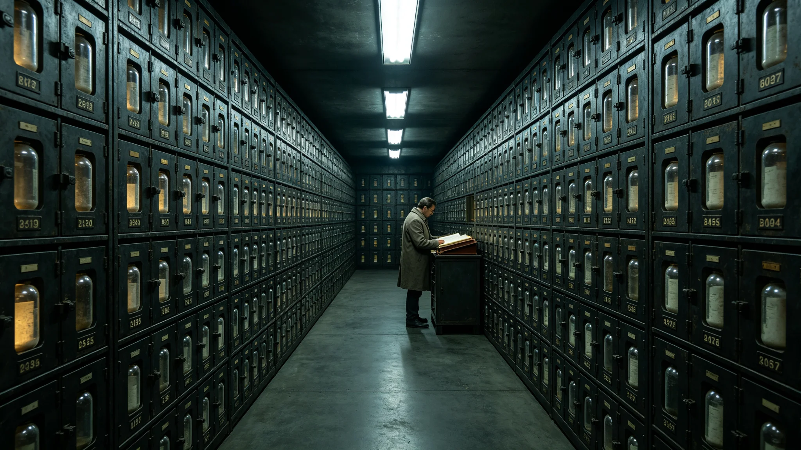

# 深时间遗嘱库首任守册人闻久藏三十年封册与开封审批签认档案

**归档单位**：深时间遗嘱库 · 守册人室
**档案袋编号**：WILL-KEEP-001
**立卷日期**：3396年9月9日

## 一、履历卡

| 项目 | 登记内容 |
|---|---|
| 姓名 | 闻久藏 |
| 出生星区 | 三恒星系，比邻星b第一居住区 |
| 出生年 | 3316年 |
| 入馆年 | 3360年 |
| 岗位 | 深时间遗嘱库首任守册人 |
| 在岗年限 | 至3396年满36年 |
| 经手 | 遗嘱封册与开封审批 |

闻久藏是遗嘱库从建立起的首任守册人。与闻远图（见GS-3351-01）守船骸不动、岑素文（见GS-3388-01）修文物少碰不同，闻久藏的工作是"不看"——他管遗嘱，但遗嘱封存后他不读。

## 二、封册记录

| 年份 | 封册数 | 累计 |
|---|---|---|
| 3360 | 147 | 147 |
| 3370 | 380 | 1,240 |
| 3380 | 420 | 2,860 |
| 3390 | 450 | 4,720 |
| 3396 | 280 | 6,180 |

闻久藏只登记封册数、开启时间、提交者编号，不读内容。

## 三、开封审批（一次）

遗嘱封存后，提交者在世期间可申请开封一次。33年间闻久藏签批开封申请共11次。

- 每次开封须提交者本人到场（或其合法代理），闻久藏核验身份后开封。
- 开封后提交者可修改，重新封存，开启时间重置。
- 闻久藏在开封时回避——他不看内容，只完成物理开封与重新封册。

## 四、处分记录（一次）

**3375年**：闻久藏在一次整理格架时，误拆了一份开启时间未到的遗嘱封条。他未读内容，立即重新封条并上报。处分：书面检查，扣半年津贴，调离格架整理岗半年。

检查原件："我没看，但我拆了。规程说得对，哪怕没看，手碰到了不该碰的封条，就是错。"

## 五、体检与考核

- 3396年体检：长期室内值守，骨密度正常，其余正常。
- 年度考核：连续30年"称职"，无"优秀"。守册人岗不产生业绩，只保证遗嘱不被误读。
- 退休预计：3400年。继任者一名，已在跟岗。

## 六、签名页

闻久藏签收："我三十年封了六千份遗嘱，一份没读过。这不是忠于职守，是这活儿本来就不该读。遗嘱是写给一千年后的，不是写给我的。我只负责别让它提前打开、别让我自己好奇。"签名日期3396年9月9日。

## 七、守册人的工作

遗嘱库在档案袋末写："闻久藏守了三十年，没有一个外人知道他长什么样。他守的不是遗嘱，是一千年后那个人的隐私。他自己的隐私，也没人知道——因为他三十年没说过一句话。"

## 八、守册人的禁忌

闻久藏三十年有三不：不读遗嘱、不拆未到期封条、不向任何人透露库中内容。遗嘱库在档案袋末注："他三十年没说过一句话。不是不能说，是不该说。"

## 九、守册人不晋升

闻久藏守册三十年，从未晋升。遗嘱库不设"主任"，守册人就是守册人。遗嘱库说明："这活儿不需要领导，需要一个人安安静静守着。"

## 十、守册人退休

闻久藏3396年仍在岗，继任者一名已在跟岗。他退休后遗嘱库仍不设主任，由继任守册人继续。遗嘱库说明：这活儿传下去，但不传成"领导"。

## 十一、闻久藏封册

3360—3396年，闻久藏累计封册6,180份遗嘱。开封申请33年间仅11次。他未读一份。

### 附：## 十二、守册人三不

不读遗嘱、不拆未到期封条、不向任何人透露库中内容。三十年未说过一句话。

## 十三、履历时间线补

| 年份 | 履历事项 |
|---|---|
| 3316 | 生于比邻星b第一居住区 |
| 3340—3360 | 联合体普通公民，任档案馆编目员20年 |
| 3360 | 深时间遗嘱库建立，任首任守册人 |
| 3370 | 累计封册1,240份 |
| 3375 | 误拆未到期封条受书面检查 |
| 3380 | 累计封册2,860份 |
| 3390 | 累计封册4,720份 |
| 3396 | 本档案立卷，累计6,180份 |
| 3400 | 预计退休 |

## 十四、封册方法

每份遗嘱提交时，闻久藏完成以下步骤：

1. 核验提交者身份；
2. 登记遗嘱编号、开启时间、提交者编号（不登记内容）；
3. 将遗嘱单独密封于金属罐；
4. 罐外只刻编号与开启年份，不刻作者名；
5. 入格架，按开启年份排序。

封册过程闻久藏全程不读遗嘱内容。33年间封册6,180份，零次误读。

## 十五、开封审批记录

33年间开封申请11次，全部按规程执行：

| 项目 | 数据 |
|---|---|
| 开封申请总数 | 11次 |
| 申请后修改重封 | 9次 |
| 申请后不修改重封 | 2次 |
| 误拆（3375年处分） | 1次 |
| 闻久藏在开封时回避 | 11次全部 |

闻久藏在开封时回避内容，只完成物理开封与重新封册。11次开封中，他未读过任何一份遗嘱内容。

## 十六、签名文件摘录

档案袋保留闻久藏签认文件六份，其中封册记录与开封审批已在第二、三节摘录，另三份为纯事务性签认：

- 3365年遗嘱库年度巡检签："格架无异常，密封罐无泄漏。"
- 3380年继任者跟岗记录签："继任者已掌握封册流程，可独立签认。"
- 3396年本档案立卷签："我没读过。这就够了。"

## 十七、继任安排

闻久藏3400年退休，继任者一名已在跟岗。遗嘱库不设主任，继任守册人继续三不原则：不读、不拆未到期封条、不透露内容。遗嘱库注明："这活儿传下去，但不传成领导。下一任守册人，还是一个人安安静静守着。"

---

**立卷**：深时间遗嘱库 · 守册人室
**复核**：与封册登记原始记录（另卷）互锁
**日期**：3396年9月9日