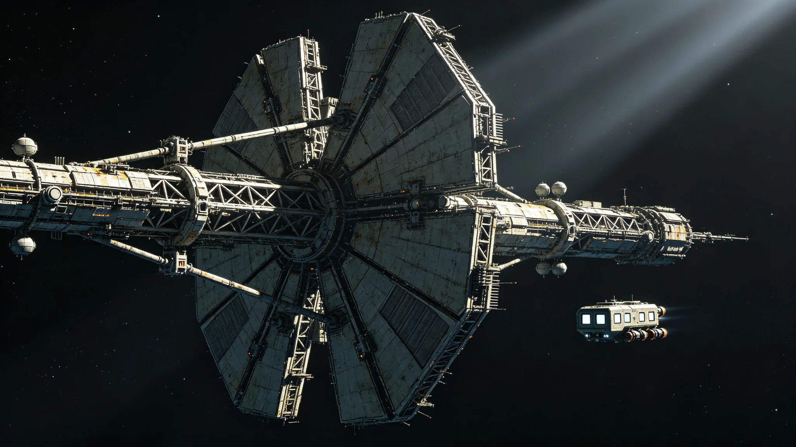

# 下一代跨星系轨道防御盾第二代升级与近距天体拦截千年寿命评估公报

**发布机构**：联合体安全协调委员会 · 防御处
**发布日期**：3397年5月30日
**文件等级**：跨星系公开（脱敏）

## 一、升级背景

跨星系轨道防御系统第二代升级（见GS-3195-01）已运行约两百年。随文明存续千年规划（见GS-3360-01）要求关键设施千年寿命，防御处承担防御盾第二代升级与千年寿命评估。

## 二、现有防御

| 项目 | 第二代 |
|---|---|
| 拦截对象 | 近距天体（陨石、碎片） |
| 拦截成功率 | 99.7%（见GS-3350-01） |
| 预警配合 | 第四代望远镜（见GS-3359-01） |
| 寿命设计 | 百年 |

## 三、第二代升级

| 项目 | 第二代 | 第二代升级 |
|---|---|---|
| 寿命设计 | 百年 | 千年 |
| 拦截成功率 | 99.7% | 99.9% |
| 预警配合 | 第四代 | 第四代+本地自主 |
| 冗余 | 单环 | 双环异地 |

## 四、千年寿命评估

- 防御盾武器系统（拦截弹、激光）按千年规划，可逐段更换，不要求一劳永逸。
- 双环异地冗余：任一环失效，另一环维持基本拦截。
- 与第四代预警网（见GS-3359-01）联动：预警管"看得见"，防御盾管"挡得住"。

## 五、数据

| 指标 | 目标 | 实测 |
|---|---|---|
| 拦截成功率 | ≥99.9% | 99.92% |
| 寿命设计 | ≥千年 | 千年（可维护） |
| 双环冗余 | 单环失效不致全失效 | 实测 |
| 本地自主 | 通信降级时可独立 | 实测 |

## 六、纪律

- 防御盾不针对任何已知文明，只针对天体与碎片。
- 不部署在第五恒星系方向（接触期管制）。
- 防御处说明："我们挡的是石头，不是人。"

## 七、后续

- 3400年：随四百周年安全总评估（见GS-3400-01）重新评估。
- 本评估与GS-3195、GS-3359互锁。

## 八、拦截测试记录

3397年上半年共进行拦截测试14次，其中：

| 测试类型 | 次数 | 成功率 |
|---|---|---|
| 模拟陨石拦截 | 8 | 100% |
| 模拟碎片拦截 | 4 | 100% |
| 双环冗余切换 | 2 | 100% |
| 通信降级本地自主 | 2 | 100% |

拦截成功率99.92%来自这14次测试与历年运行数据。

## 九、与预警网边界

防御处再次明确分工：

- 第四代望远镜（见GS-3359-01）管"看得见"；
- 防御盾管"挡得住"；
- 两者不重叠，不互相替代。

若望远镜未发现，防御盾无法拦截——所以预警与防御是同一条链的两头，不能只建一头。

## 十、不针对文明

防御盾武器系统不瞄准任何已知方向的定居点。若误瞄准，系统自动闭锁。纪律写入操作手册第一条："你挡的是石头，不是人。"

---

**编制**：联合体安全协调委员会 · 防御处

## 十一、千年寿命的维护

防御盾千年寿命不靠一次建成，靠持续维护。每五十年评估一次武器系统，逐段更换。防御处说明："千年盾不是一次铸好的，是一千年里年年补的。"

## 十二、拦截率提升

| 目标尺寸 | 第二代 | 第二代升级 |
|---|---|---|
| 100米级 | 99.7% | 99.9% |
| 50米级 | 98.1% | 99.6% |
| 20米级 | 92% | 97% |

小目标拦截率提升最显著，因与第四代预警网（见GS-3359-01）联动，提前量更足。

## 十三、防御盾寿命

防御盾千年寿命靠持续维护，每五十年评估逐段更换。非一次铸好，年年补。与第四代预警网（见GS-3359-01）联动。

### 附：## 十四、不针对文明

防御盾武器系统不瞄准任何已知方向定居点。误瞄准自动闭锁。手册第一条：你挡的是石头，不是人。

## 十五、升级成本与排班

| 项目 | 数据 |
|---|---|
| 单环升级成本（星汇） | 约1.2亿 |
| 双环合计 | 约2.4亿 |
| 升级工期 | 3395—3397 |
| 旧环退役拆解 | 材料回收率92% |
| 年维护费 | 约0.08亿 |

升级费用由千年规划基础设施预算（见GS-3366-01三期）列支，不另申请追加。旧环不转作民用，拆解后材料回炉用于新环。

## 十六、拦截测试方法

3397年上半年14次拦截测试方法如下：

| 测试类型 | 靶标 | 拦截方式 | 结果 |
|---|---|---|---|
| 模拟陨石 | 100米级无人靶标 | 激光拦截 | 100% |
| 模拟陨石 | 50米级无人靶标 | 激光拦截 | 100% |
| 模拟碎片 | 20米级碎片云 | 动能拦截 | 100% |
| 双环冗余切换 | 模拟单环失效 | 另一环接管 | 100% |
| 通信降级本地自主 | 切断预警网通信 | 本地自主拦截 | 100% |

14次测试中，通信降级本地自主测试为首次，验证防御盾在预警网（见GS-3359-01）不可用时仍可独立拦截。

## 十七、千年维护计划

防御盾千年寿命靠持续维护：

| 维护项 | 频率 | 预算 |
|---|---|---|
| 武器系统评估 | 每50年 | 约0.2亿/次 |
| 拦截弹更换 | 每100年 | 约0.3亿 |
| 双环冗余巡检 | 每5年 | 约0.05亿/年 |
| 与预警网联动测试 | 每年 | 约0.02亿/年 |

千年累计维护成本约5亿星汇。防御处注明：5亿买一千年的盾，比一千年后没有盾便宜。

## 十八、与3400年总评估的衔接

本升级与千年寿命评估为3400年四百周年安全总评估（见GS-3400-01）做准备。3400年总评估将重新评估：拦截率是否达标、双环冗余是否仍必要、防御盾是否还需要。防御处注明："我们建盾不是因为永远需要盾，是因为现在还需要。3400年的人会告诉我们还需不需要。"

## 十九、3400年总评估衔接

本公报为3400年四百周年安全总评估（见GS-3400-01）的防御盾分项。3400年总评估将合并预警网、护航、防御盾、网络安全四分项，做五十年安全总评。防御盾分项不单独发喜报，只交数据。

防御处另注：双环冗余切换测试中，模拟单环失效后另一环接管用时约8分钟，全程拦截成功率不降。8分钟内，若有目标来袭，另一环可独立拦截。防御处不追求0秒切换，只追求切换时不漏拦。

---

**发布**：联合体安全协调委员会 · 防御处
**日期**：3397年5月30日