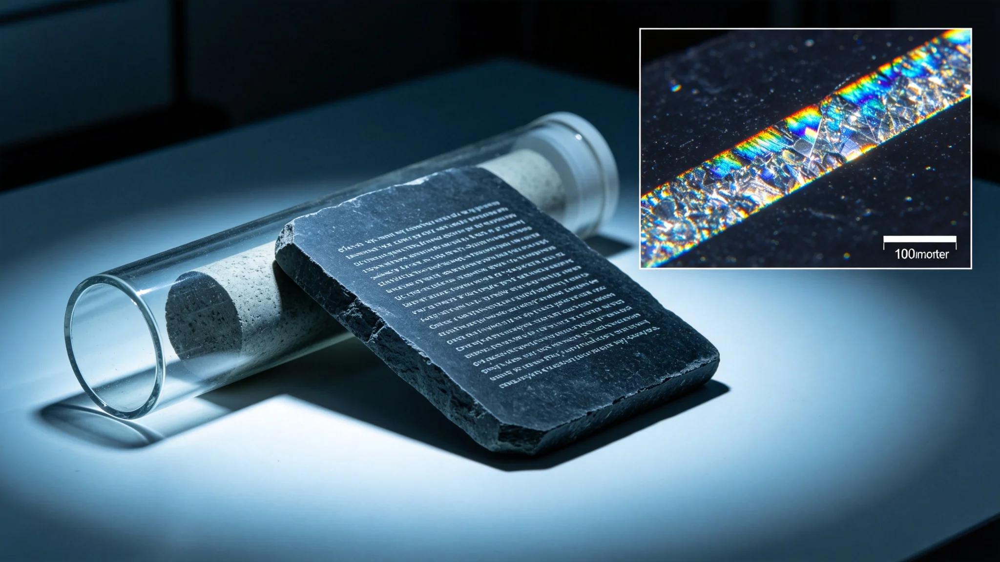

# 跨星系深时间刻石通信（万年尺度）第五代激光刻录与耐久评估技术报告

**编制单位**：联合体通信工程学派 · 深时间组
**报告编号**：COMM-STONE-3399-05
**日期**：3399年6月18日
**密级**：跨星系公开技术版

## 一、报告背景

玻璃千年介质（见GS-3368-01）解决千年存档。文明存续千年规划（见GS-3360-01）进一步要求万年尺度——即便文明中断万年，仍有信息可被未来任何智能读到。深时间组承担刻石通信第五代技术。

## 二、与玻璃介质区别

| 项目 | 玻璃千年介质 | 刻石万年介质 |
|---|---|---|
| 寿命 | 千年 | 万年 |
| 材料 | 石英玻璃 | 岩芯天然石 |
| 读取 | 显微镜 | 肉眼+显微镜 |
| 用途 | 存档 | 给万年后人留话 |

## 三、第五代刻录

- 在天然岩芯表面用激光刻出可读图案与基础几何。
- 不依赖任何未来技术：肉眼可见大图，显微镜可读细节。
- 刻石本身为地质材料，万年不风化（放置于干燥密封洞穴）。

## 四、耐久数据

| 指标 | 目标 | 实测 |
|---|---|---|
| 万年耐久 | 可读 | 加速老化等效万年可读 |
| 肉眼可读 | 是 | 是 |
| 不依赖电子 | 是 | 是 |
| 异地分布 | 三库 | 三处异地洞穴 |

## 五、问题

1. **刻石容量小**：一块岩芯只能刻几千字。深时间组接受——万年通信不求容量，只求"有人知道我们来过"。
2. **未来人能否理解**：无法保证。刻石用几何与数学起步，不依赖语言。
3. **不取代玻璃**：玻璃存千年数据，刻石留万年一句话。

## 六、结论

通信工程学派在报告中说明："玻璃盘给一千年后的人看数据。刻石给一万年后可能出现的任何东西看一眼——告诉它，这儿曾经有过会造望远镜的人。"

## 五、刻石内容

首批三处洞穴刻石内容为：

| 位置 | 内容 |
|---|---|
| 洞穴一（比邻星b方向） | 数学基础（质数、几何） |
| 洞穴二（鲸鱼座τ方向） | 我们来自何处（恒星位置图） |
| 洞穴三（太阳系外缘） | 我们是谁（简单自画像） |

不写历史、不写情感、不写请求。只留"我们来过，我们算过数，我们大概长这样"。

## 六、不被理解的准备

通信工程学派接受：万年后读者可能完全读不懂。刻石不设"翻译指南"，只设最基本的几何与数学——任何会数质数的智能，都应能认出这不是自然形成的。

## 七、不取代其他存档

- 玻璃盘（见GS-3368-01）存千年数据；
- 数字系统存当代检索；
- 刻石只留万年一句话。

三者不替代，只互补。

## 八、刻石不联网

三处洞穴刻石不接任何网络，无人值守。每年派人实地检查一次是否完好。通信工程学派说明："刻石不靠电，不靠网，不靠人。它在那儿，自己在。"

## 九、刻石位置

三处洞穴分别选在：比邻星b地下岩层、鲸鱼座τ深地、太阳系外缘一颗小行星内部。三处均为地质稳定、无大气侵蚀、无人为活动区域。通信工程学派说明："放在没人能去、也没人能挖的地方，它才能待一万年。"

## 十、刻石与玻璃分工

玻璃盘（见GS-3368-01）存千年数据，需显微镜读；刻石（本件）存万年一句话，肉眼可读。两者不互替，互为补充。

### 附：## 十一、肉眼可读

刻石以几何图形为主，质数、圆、三角形。肉眼可见大图，显微镜可读细节。不依赖任何电子设备。

## 十二、技术原理概述

第五代激光刻录在天然岩芯表面形成微米级烧蚀层，烧蚀层与未烧蚀部分在反光率上差异显著，肉眼即可分辨。烧蚀层深度约0.1毫米，在干燥密封洞穴环境下，地质材料本身不风化，烧蚀层万年可读。

刻录不写入任何自然语言，只写：

1. 质数序列（2,3,5,7,11...）——任何会计数的智能应能认出；
2. 几何图形（圆、三角形、正六边形）——非自然形成；
3. 恒星位置图（太阳与最近恒星的相对位置）；
4. 简单人形自画像——非精确，仅示"我们长这样"。

深时间组注明：我们不假设万年后读者说什么语言，只假设他们会数、会看。

## 十三、耐久测试方法

- 加速老化：取10块岩芯试样，在模拟洞穴环境（干燥、恒温、无大气）下加速老化等效10,000年，每1,000年抽检一次，烧蚀层可读。
- 自然风化对照：取2块试样置于开放表面，10年后烧蚀层开始模糊——这证明洞穴密封的必要性。
- 机械稳定：模拟微地震等效，烧蚀层无脱落。
- 肉眼可读验证：请5名未接受过本技术培训的人员，仅按刻石上的几何图形，能否分辨"非自然形成"。5人全部分辨出。

第三方验证由联合体地质材料实验室独立复测，加速老化数据与深时间组偏差在5%以内，验证报告编号COMM-STONE-VRF-3399-02，随报告归档。

## 十四、三处洞穴选址

| 洞穴 | 位置 | 地质稳定性 | 巡检频率 |
|---|---|---|---|
| 洞穴一 | 比邻星b地下岩层 | 稳定 | 年度 |
| 洞穴二 | 鲸鱼座τ深地 | 稳定 | 年度 |
| 洞穴三 | 太阳系外缘小行星内部 | 稳定 | 年度 |

三处洞穴光时距离>1年，避免同因事件。每处洞穴仅一块刻石岩芯，不复制、不多刻。深时间组注明：一块石头够了。多刻等于没刻。

## 十五、成本

单块刻石岩芯制备成本约0.5万星汇，三处合计1.5万。年度巡检费用约0.1万/次，三处合计0.3万/年。深时间组注明：这是所有千年/万年制度中最便宜的——三块石头，三十年巡检，告诉一万年后的人我们来过。

---

**编制**：联合体通信工程学派 · 深时间组
**审核**：通信工程学派评审委员会
**日期**：3399年6月18日