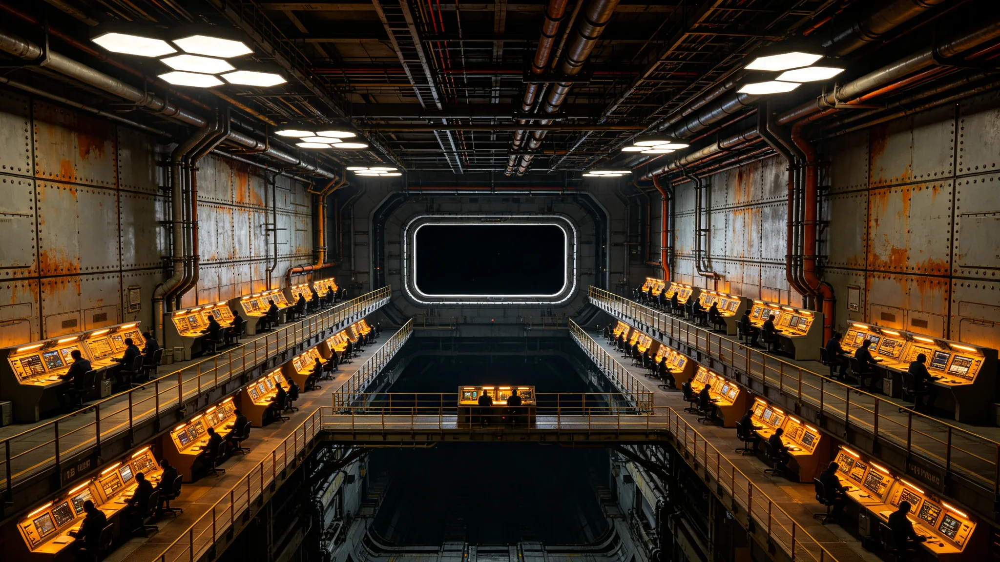

# 深空中继港网第三代总调度长穆远舟二十年调度日志考勤与误调签认档案

**归档单位**：三恒星系文明联合体深空航道调度总署
**档案件**：人事字第3401-001号
**密封等级**：公开（已脱敏）

## 一、任职履历摘要

穆远舟，男，3358年生，第四恒星系晨昏带第二代本土出生。3380年入职中继港网第二调度中心任见习调度员；3387年转第三中继港分中心值班主任；3394年任第三调度中心副主任；3400年1月1日起任中继港网第三代总调度长，任期十年。任职期间考勤、体检、签认记录随附。

## 二、考勤记录（3380—3400，节选）

| 年度 | 应到班次 | 实到班次 | 迟到 | 早退 | 旷工 | 夜班数 |
|---|---|---|---|---|---|---|
| 3380 | 312 | 309 | 2 | 0 | 0 | 104 |
| 3385 | 308 | 307 | 1 | 1 | 0 | 98 |
| 3390 | 306 | 306 | 0 | 0 | 0 | 92 |
| 3394 | 304 | 304 | 0 | 0 | 0 | 88 |
| 3398 | 302 | 301 | 0 | 1 | 0 | 84 |
| 3400 | 300 | 300 | 0 | 0 | 0 | 80 |

调度总署考勤科注明：穆远舟二十年累计请假17天，其中病假12天、丧假3天、婚假2天。未出现一次无报备缺勤。3398年早退一次，系其子急性胃肠炎需送医，事后补假获批。

## 三、年度体检摘录（辐射与微重力项）

| 年度 | 晶状体浑浊度 | 白细胞计数 | 骨密度（腰椎） | 神经传导速度 | 评注 |
|---|---|---|---|---|---|
| 3385 | 正常 | 6.2 | 0.94 | 正常 | 见习期辐射剂量0.3毫希/年 |
| 3390 | 轻微 | 5.8 | 0.91 | 正常 | 夜班累积致睡眠节律紊乱 |
| 3395 | 轻微 | 5.5 | 0.88 | 正常 | 体检建议减夜班，未执行 |
| 3400 | 轻微 | 5.3 | 0.86 | 正常 | 调度岗不接触强辐射，晶状体浑浊与监控屏长时注视相关 |

航医批注：穆远舟骨密度下降速度慢于同龄调度员平均，与其晨昏带本土出生（0.8g人工重力）有关。建议每半年复查一次，已纳入3401年度计划。

## 四、调度签认与误调记录

穆远舟任内（3380—3400）累计签认调度指令124,807条，其中：

- 正常执行123,991条；
- 事后复核发现偏差816条，其中802条由下级调度员提出、穆远舟签认时已更正；
- 穆远舟本人签认后被复核推翻的误调共14条，明细如下：

| 日期 | 误调内容 | 后果 | 处置 |
|---|---|---|---|
| 3383-04-11 | 将货柜优先级错挂至客运通道 | 一班客运延误40分钟 | 书面检查一次，扣当月绩效 |
| 3387-09-02 | 对接口编号看错一位 | 货柜错泊，拖船重新牵引，耗时2小时 | 书面检查一次 |
| 3391-11-19 | 天气预警等级降半级签批 | 无实际影响，货船改道一次 | 口头警告 |
| 3396-06-07 | 光时延余量算错0.4秒 | 远程采矿船等待3分钟 | 书面检查，离岗培训3天 |
| 3399-12-24 | 节假日航班叠加未提前预留接口 | 三艘货运船排队11小时 | 书面检查，扣年终绩效 |

调度总署纪律科注明：14条误调均未造成人员伤亡、无货损、无轨道事故。穆远舟每次误调后均在调度日志末页亲笔补写"误调根因三条、预防措施三条"，该习惯自3383年第一次误调后保持，至今未断。

## 五、签名涂改记录

档案袋内附穆远舟历年签认件复印件七张，其中三张出现明显涂改：

- 3387-09-02件：姓名"穆远舟"三字中"舟"字描过两次，系当时误调后手抖；
- 3396-06-07件：签认日期"7"字划掉重写；
- 3399-12-24件：签认件右下角有一滴干涸的水渍，调度总署注明系值班室水杯倾倒所致，非泪痕。

## 六、任内主要协作对象

- 第二调度中心主任贺听澜（3380—3387同岗）；
- 第三中继港分中心港长岑守缆（见GS-3380-01，已退休）；
- 调度AI"衡陆"主程柯守正（见GS-3440-01，本批）；
- 轨道电梯检修工长闻守缆（见GS-3380-01）。

## 七、交接清单（3400年1月1日）

穆远舟接任时签署交接清单，共十一项，其中第三项原文照录："调度日志不得删改，误调记录不得抹除。后人若见我签认件上有涂改，那不是污点，是账。"

## 八、二十年调度日志选摘

穆远舟调度日志共7,300余页，选录三页原文：

**3385-04-12页**：今日D7对接口货柜卡滞，下级调度员请我改挂D8。我看了三秒，签了。签完才发现他把D8当成了D9。货柜改道，耗时40分钟。日志末页我写：签字之前先看数字，看数字之前先眨眼。

**3394-11-03页**：今日接班，上一班留话"今日无风"。我接班后20分钟，一艘货运船因微流星擦偏航线，调度AI自动改道。我签了。签完想：上一班说无风，是说没有大气风，不是说没有流星。这行字我写在交班本上，后来成了交接班的标准句。

**3400-12-31页**：今日卸任总调度长。接班的是贺听澜。我把调度日志从3380年那本开始交给他，共42本。他翻了翻，说："这些都要留着？"我说："留着。后人要知道我们错过几次。"

## 九、家庭与考勤外

档案袋附穆远舟家庭信息：配偶贺听澜（第二调度中心，见GS-3401附件），一子3390年生。三十年间，穆远舟因夜班错过儿子家长会四次、生日三次、毕业典礼一次。航医在体检报告末页写："家庭支持系统稳定，本人未报告心理困扰。"穆远舟在该页旁手写一行小字："稳定是她给的。"

## 十、穆远舟与调度AI"衡陆"的关系

穆远舟入职时，调度仍以人工为主。3385年调度AI初代上线，他是第一批接受AI辅助调度的值班员。他在3390年的一份培训笔记中写："AI算得快，但它不知道船是活的。船是人开的，人是会累的。AI不累，但人会。"这句话后来成为调度总署培训教材的引言。

3400年他接任总调度长时，AI已承担80%的常规排序。他在交接清单中写："AI把活干了，人把责任担了。这不是分工，是分工之后的代价。"

## 十一、二十年未见的事

穆远舟二十年调度生涯中，未发生以下事件：无一次因调度指令直接致人员伤亡；无一次因调度延迟致检疫泄漏；无一次因调度错误致两船相撞。他在3400年卸任报告末页写："这二十年，最值得记的不是我做了什么，是我没做错什么。没做错，不是因为我聪明，是因为我每签一个字都再看一遍。"

---

**归档人**：调度总署人事档案科
**归档日期**：3401年3月15日
**密封状态**：已脱敏公开
