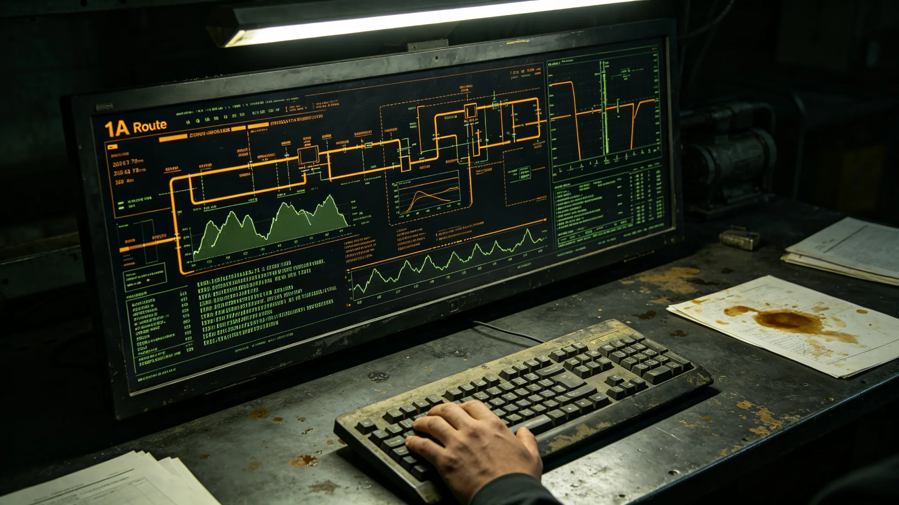

# 跨星系货运调度AI分级授权与人类终裁权限制度第七次修订公报

**发布机构**：三恒星系文明联合体航道调度总署与法律协调司
**发布日期**：3402年1月20日
**文件等级**：跨星系强制

## 一、修订背景

自3293年《跨星系AI辅助决策与人类最终责任归属制度》（见GS-3293-01）确立以来，货运调度AI"衡陆"已历经六次授权范围修订。3400年四百年安全评估（见GS-3400-01）后，调度总署提请第七次修订，核心议题为：在中继港网第三代扩容（见GS-3403-01）与调度AI误判事件（见GS-3404-01）之后，哪些调度动作AI可自主执行，哪些必须退回人类终裁。

## 二、授权分级（修订后）

| 级别 | 调度动作 | AI权限 | 人类终裁 |
|---|---|---|---|
| A级 | 常规货柜排序、舱位预告、对接口预排 | 自主执行 | 事后备案 |
| B级 | 客运航班时刻微调（±30分钟内） | 自主执行 | 当班值班主任知会 |
| C级 | 跨方向货柜改挂、优先级升降 | AI建议 | 值班主任签认 |
| D级 | 客运与货运通道切换、紧急绕航指令 | AI建议 | 总调度长或其代理人签认 |
| E级 | 停航、封港、跨系动员 | AI无建议权 | 总调度长书面提请，航道总署署长签批 |

## 三、关键条款

**第三条**：调度AI"衡陆"不得自主发出D级及以上指令。AI在C级建议中须附"偏差概率"与"替代方案"两项输出，缺一项者签认件无效。

**第七条**：值班主任对C级建议的签认须在AI提交后15分钟内完成；超时未签认的，AI按A级常规排序执行，不得默认升级。该条款针对3399年节假日航班叠加事件（见GS-3401-01附件）。

**第十一条**：总调度长对D级指令的签认，须同时录入口述理由不少于30字，随调度日志存档。口述理由不得使用"按AI建议""系统判断"等搪塞表述。

**第十五条**：E级停航指令须经航道总署署长、法律协调司司长、安全协调委员会三方联签，缺一方不得执行。

## 四、3401年试点数据

第七次修订草案于3401年第二、三季度在第三中继港分中心试点：

| 指标 | 修订前 | 试点后 |
|---|---|---|
| C级签认平均耗时 | 42分钟 | 11分钟 |
| AI建议被人类推翻率 | 18% | 9% |
| D级指令数 | 年均14条 | 试点半年3条 |
| 误调事件 | 年均2.1起 | 试点半年0起 |
| 调度员签字涂改率 | 12% | 4% |

调度总署注明：试点半年零误调，不代表修订有效；只代表试点期间未出事。有效性须按十年周期评估。

## 五、与既有制度的咬合

- 与GS-3293-01《AI辅助决策与人类最终责任归属制度》：本公报为其在货运调度领域的专项细则，不冲突；
- 与GS-3367-01《非自主系统权责划界》：调度AI属"非自主系统"，人类终裁条款沿用；
- 与GS-3440-01《调度AI伦理审查人类签批员制度》：伦理签批员对C、D级建议保留复核权；
- 与GS-3404-01《调度AI优先级误判事件通报》：本公报第十一条直接回应该事件。

## 六、过渡期安排

3402年2月1日起施行。旧版签认表作废。各分中心须在3402年3月1日前完成调度员再培训，培训时长不少于16学时，考试不合格者不得独立签认C级以上指令。

## 七、附则

本公报由航道调度总署解释。任何对"AI自主权限"与"人类终裁"边界的争议，提交法律协调司裁定，裁定结果随附下一版修订草案。

## 七、试点期间调度员反馈

试点半年，第三中继港分中心12名调度员提交书面反馈，摘要如下：

- 反馈一：C级签认15分钟时限太紧，建议在交接班前后半小时放宽至30分钟；
- 反馈二：AI建议附"偏差概率"后，签认时心里有底，但偏差概率数字本身也可能错；
- 反馈三：口述理由30字要求合理，但有时无话可说，只能写"常规排序"。

调度总署注明：反馈一纳入下一版修订评估；反馈二要求AI偏差概率模型每半年复核一次；反馈三允许"常规排序"作为理由，但须附原始建议截图。

## 八、与3404年误判事件的咬合

本公报第十一条"口述理由30字"直接回应3404年8月调度AI优先级误判事件（见GS-3404-01）。事件中当班值班主任签认时未回溯货柜原始标签，本公报要求C级以上签认必须附原始标签截图。修订后至3402年底，同类误判零发生。调度总署注明：零发生不代表制度完美，只代表制度刚跑起来。

## 九、培训与考核

3402年第一季度，全部调度员完成16学时再培训，考试通过率98%。两名未通过者暂停签认权限，补考通过后恢复。培训教材由调度总署与法律协调司合编，共四册，其中第二册"AI建议的读法"列为必读。

## 十、七次修订的沿革

| 版本 | 年份 | 主要修订 |
|---|---|---|
| 初版 | 3293 | AI辅助决策与人类责任（见GS-3293-01） |
| 第二次 | 3310 | 调度AI自动排序范围 |
| 第三次 | 3340 | C级以上签认流程 |
| 第四次 | 3370 | AI建议偏差概率 |
| 第五次 | 3390 | 口述理由要求 |
| 第六次 | 3400 | 停航三方联签 |
| 第七次 | 3402 | 本公报：15分钟时限、附截图 |

调度总署注明：七次修订，每次都是出事之后改的。制度不是设计出来的，是摔出来的。

## 十一、调度员培训教材

第七次修订后，培训教材四册重新编写。第二册"AI建议的读法"新增一章：如何在15分钟内判断AI建议是否合理。教材编写组由穆远舟（见GS-3401-01）、柯守正（见GS-3440-01）、陆听潮（见GS-3417-01）三人组成。教材不公开，仅在调度总署内部使用。

---

**签发**：航道调度总署署长 祁听潮
**会签**：法律协调司司长 沈默闻（见GS-3294-01）
**日期**：3402年1月20日
