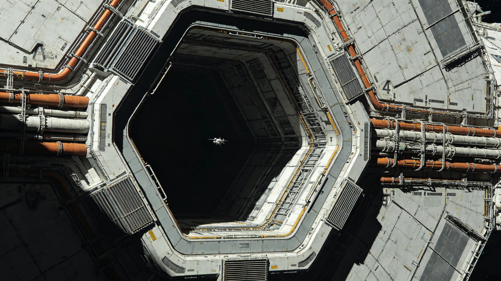

# 深空中继港网第三代扩容节点对接口径向公差累积整舱测试报告

**测试单位**：联合体深空基础设施总工程局第三测试大队
**报告编号**：INF-3403-007
**测试对象**：第三中继港第三代扩容节点D5—D12对接口共八组

## 一、测试目的

第三代中继港网扩容后，八组新对接口串联于主桁架东侧悬臂，距港心4.2公里。设计要求任意对接口径向偏差不超过±0.8毫米，轴向偏差不超过±1.2毫米。本报告验证整舱串联后的公差累积是否在设计裕度内。

## 二、测试方法

1. 在D5对接口中心架设激光跟踪仪，基准点固定于主桁架零号节点；
2. 沿悬臂依次向D12测量，每间隔100米设一个校核点；
3. 每组对接口测量径向X、径向Y、轴向Z三轴偏差，每轴测10次取均值；
4. 连续测试72小时，覆盖恒星直射、恒星阴影、轨道姿态调整三个工况；
5. 测试期间货柜正常通过，不中断港务。

## 三、测试数据

| 对接口 | 径向X（mm） | 径向Y（mm） | 轴向Z（mm） | 累积径向（mm） | 判定 |
|---|---|---|---|---|---|
| D5 | +0.12 | -0.08 | +0.21 | 0.14 | 合格 |
| D6 | +0.21 | -0.15 | +0.33 | 0.26 | 合格 |
| D7 | +0.33 | -0.24 | +0.41 | 0.41 | 合格 |
| D8 | +0.47 | -0.31 | +0.52 | 0.56 | 合格 |
| D9 | +0.58 | -0.42 | +0.66 | 0.71 | 合格 |
| D10 | +0.71 | -0.55 | +0.78 | 0.90 | 临界 |
| D11 | +0.84 | -0.66 | +0.91 | 1.07 | 超限 |
| D12 | +0.97 | -0.78 | +1.08 | 1.24 | 超限 |

## 四、超限原因分析

D11、D12两组对接口径向累积偏差超出设计±0.8毫米。测试大队逐节点复查，定位原因有三：

1. 主桁架东侧悬臂在第三代扩容焊接时，施工温降曲线未按图纸执行，致焊后残余应力偏大约14%；
2. D10至D11间连接环段的碳复材拼接板（见GS-3391-01）在3402年一次微流星擦击中局部产生0.3毫米凹坑，未在前期巡检中标记；
3. 悬臂姿态调整机构在3403年1月一次校准中零点漂移0.2毫米，未被值班主任发现。

## 五、处置建议

| 项目 | 措施 | 责任单位 | 完成期限 |
|---|---|---|---|
| D11、D12 | 停机校正，重新标定零点 | 第三测试大队 | 3403-06-30 |
| D10—D11环段 | 更换拼接板，修补微流星凹坑 | 基础设施维护段 | 3403-07-15 |
| 悬臂姿态机构 | 全港同类机构零点普查 | 调度总署设备科 | 3403-08-01 |
| 施工温降曲线 | 纳入第三代扩容后续节点强制检查项 | 总工程局 | 即时 |

## 六、测试期间货柜通过情况

72小时测试期间，八组对接口共通过标准货柜1,204柜，其中D11、D12两组通过158柜，均未发生卡滞。测试大队注明：未卡滞不等于合格；D11、D12在公差超限状态下继续通过货柜，系校前紧急措施，校正前不得再安排标准货柜以外的大型舱组对接。

## 七、与既有正典咬合

- 主桁架碳复材拼接板参见GS-3391-01《碳复材主缆千年疲劳寿命评估》；
- 第三代扩容投资决算参见GS-3366-01；
- 调度AI对接口预排参见GS-3402-01；
- 后续D11焊缝微裂事件参见GS-3443-01。

## 八、结论

第三中继港第三代扩容八组对接口中，D5—D10六组合格，D11、D12超限。超限原因已定位，处置措施已下达。校正完成前，D11、D12仅限空柜通过，不得安排载人舱段或危险品舱组对接。

## 九、测试期间人员安排

72小时测试期间，第三测试大队出动人员18名，分三班轮值，每班6人。测试大队长闻涤轨（见GS-3432-01）全程在场，未离开测试台超过30分钟。测试期间无人员轮换、无餐饮中断。

## 十、与设计方的交接

D11、D12校正完成后，测试大队与总工程局设计组举行交接会议。设计组承认3403年扩容焊接温降曲线未按图纸执行是主因，书面致歉。测试大队注明：致歉不写进事故档案，但写进本报告附件。后续同型节点（D13—D16，在建）焊接温降曲线已按本报告整改。

## 十一、成本与工时

| 项目 | 数据 |
|---|---|
| 测试工时 | 2,160人时 |
| 测试费用（万） | 85 |
| D11、D12校正费用（万） | 120 |
| 拼接板更换费用（万） | 60 |
| 合计 | 265 |

测试大队注明：265万比一次货损（见GS-3428-01）便宜。

## 十二、D5—D10合格节点的后续

D5至D10六组合格对接口在3403年校正后运行正常。至3442年桁架复测（见GS-3442-01），六组对接口径向偏差均未超出1毫米。维护总队注明：这六组是"听话的孩子"，但不省心的是D11、D12。

## 十三、对接口设计单位的反馈

总工程局设计组在D11、D12校正后提交一份设计改进意见：后续D13—D16对接口（在建）应将焊接温降曲线从"建议"改为"强制"。该意见被总工程局采纳，写入第三代扩容后续节点施工规范。设计组在意见末页写："我们错了一次，后人别再错。"

## 十四、测试期间的人员排班

72小时测试期间，第三测试大队出动十八名人员，分三班轮值，每班六人，每班八小时。测试大队长闻涤轨全程在场，未离开测试台超过三十分钟。测试期间无餐饮中断，值班人员在测试台旁用餐。测试大队注明：这种测试不能换人换一半。人换了，节奏就乱了。

## 十五、D11、D12校正后的首次靠泊

校正完成后，首班货柜靠泊D11为一柜标准货柜，编号CN-8821。靠泊过程全程录像，对接时间比标准慢十二秒。闻涤轨在日志中写："慢十二秒，比快十二秒好。"

## 十六、测试后的港务影响

D11、D12限航期间，第三中继港调度总署将货柜分流至D8、D9及备用对接口。分流期间未发生货柜卡滞，未发生人员伤亡。测试大队注明：限航五天，港务没乱。这是调度AI（见GS-3402-01）在人类签批下正常工作的结果。

## 十七、测试数据归档与复测安排

本报告全部原始激光跟踪仪读数已归档至第三中继港技术档案室，归档号INF-3403-007-C。归档保留期三十年，期间任何复测须由总工程局第三大队书面申请。3408年6月进行首次例行复测，复测点与本次一致，复测结果另报。测试大队注明：原始读数不删改，复测若与本次不符，以复测为准。

---

**测试大队长**：闻涤轨（见GS-3432-01，本批）
**审核**：总工程局第三大队
**日期**：3403年5月10日
