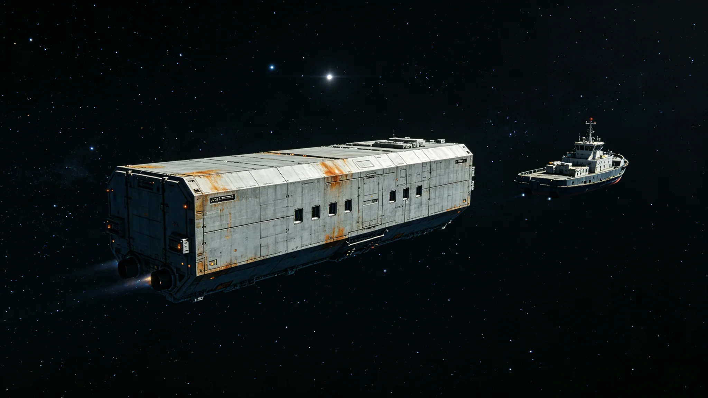

# 跨星系货运调度AI首次优先级误判致四船绕航十九小时事件通报

**通报单位**：联合体航道调度总署安全科
**通报编号**：INC-3404-009
**事件等级**：三级（无伤亡、无货损、无轨道事故）

## 一、事件时间线

| 时刻（中继港标准时） | 事件 |
|---|---|
| 3404-08-19 06:12 | 调度AI"衡陆"接收第三中继港D11对接口校正通告（见GS-3403-01） |
| 3404-08-19 06:15 | AI将D11、D12标记为"仅限空柜通过" |
| 3404-08-19 06:18 | AI对在途四艘货船（"远穗-3""远禾-7""安澜-2""安澜-9"）重新排序 |
| 3404-08-19 06:21 | AI将"安澜-9"所载一批急救器官优先级从C级升至A级 |
| 3404-08-19 06:23 | 当班值班主任复核AI建议，未发现异常，签认 |
| 3404-08-19 06:30 | 四船按AI新排序改走备用航线 |
| 3404-08-20 01:45 | 急救器官接收方来函质问："安澜-9"所载为冷冻育种胚胎，非急救器官 |
| 3404-08-20 02:10 | 调度总署核查发现AI误读货柜标签：胚胎标签"CRYO-EMB"被识别为"CRYO-EMG"（急救器官） |
| 3404-08-20 02:30 | 四船改回主航线，绕航停止 |
| 3404-08-20 23:50 | 四船全部靠泊，绕航累计19小时 |

## 二、误判根因

1. **标签识别错误**：AI对"CRYO-EMB"与"CRYO-EMG"两组标签在低分辨率货柜扫描图上相似度97%，AI按历史样本权重将其归入急救器官类；
2. **货柜标签贴附不规范**："安澜-9"货柜在第三恒星系方向装船时，标签因装卸摩擦边缘卷曲，AI扫描时未能读取完整字符；
3. **人类复核流于形式**：值班主任在06:23签认时，仅核对了AI输出的优先级结论，未回溯货柜原始标签图像；
4. **制度漏洞**：修订前的调度授权制度（见GS-3402-01修订前版本）未要求C级以上签认必须附原始标签截图。

## 三、影响评估

| 项目 | 数据 |
|---|---|
| 绕航货船 | 4艘 |
| 绕航时长 | 19小时 |
| 货柜总数 | 216柜 |
| 货损 | 0 |
| 人员伤亡 | 0 |
| 轨道事故 | 0 |
| 急救器官延误 | 0（实际无急救器官在船） |
| 育种胚胎延误 | 1批，冷冻状态未受影响 |
| 直接经济损失 | 约合星汇1,200万（绕航工质与工时） |
| 间接影响 | 第三中继港D11、D12校正延后24小时 |

## 四、整改措施

| 序号 | 措施 | 责任单位 | 完成期限 |
|---|---|---|---|
| 1 | C级以上签认必须附货柜原始标签截图，缺件签认无效 | 调度总署 | 3404-09-01 |
| 2 | 全部在途货柜标签重新普查，卷曲、污损标签强制更换 | 各港装卸段 | 3404-10-31 |
| 3 | AI标签识别模型加入"CRYO-EMB/EMG"对抗样本训练 | 调度总署算法科 | 3404-09-15 |
| 4 | 值班主任签认流程改为"先看原图、再看结论"，不得反序 | 调度总署 | 即时 |
| 5 | 本事件纳入GS-3402-01第七次修订第十一条补充说明 | 法律协调司 | 3404-11-01 |

## 五、责任认定

- 调度AI"衡陆"：误判，承担系统责任，不承担纪律责任；
- 当班值班主任：签认流于形式，书面检查一次，扣当月绩效；
- "安澜-9"装船港：标签贴附不规范，通报批评；
- 调度总署算法科：未及时发现标签识别模型盲区，书面检查。

## 六、后续

本事件无人员伤亡、无货损、无轨道事故，按三级事件结案。调度总署注明：这是调度AI自3293年制度建立以来首次优先级误判。第一次不丢人，丢人的是第二次。第二次若来，我们希望它发生在整改之后，而不是整改之前。

## 七、货主申诉与赔偿

"安澜-9"所属货主在事件后48小时内向调度总署提交申诉，要求按绕航工质与工时赔偿。调度总署按3402年第七次修订（见GS-3402-01）C级签认责任划分，裁定调度AI标签识别模型承担主要责任，当班值班主任承担次要责任。赔偿总额1,200万星汇，其中AI模型方承担800万，值班主任个人承担120万（从年度绩效扣除），调度总署承担280万。

## 八、媒体与舆论

事件后，跨星系公共论坛出现三种意见：一种认为调度AI应全面退回人工；一种认为AI进步必经试错；一种认为标签贴附不规范才是根因。调度总署在公报中未回应舆论，仅公开整改措施。公共论坛注明：调度总署不辩论，只整改。

## 九、48秒的教训

事件中，从AI误读标签到货主来函质问，间隔19小时。调度总署在整改报告末页写：19小时里，我们有三次机会发现错误——AI自检、值班主任签认、货主到货核对。三次都没拦住。第四次，是货主自己发现的。第四次不能再靠外人。

## 十、"CRYO-EMB/EMG"对抗样本

3404年误判后，调度AI算法科建立"CRYO-EMB/EMG"对抗样本库，收录12,000张货柜标签图像，其中：

| 类别 | 数量 |
|---|---|
| CRYO-EMB（胚胎） | 6,000 |
| CRYO-EMG（急救器官） | 6,000 |
| 人工标注正确 | 11,800 |
| 标注错误（用于训练） | 200 |

该样本库每季度更新一次，至3410年累计收录48,000张。算法科注明：误判一次，换来四万八千张教材。

## 十一、货主"安澜-9"的后续

"安澜-9"在事件后继续服役，至3430年退役。退役时船长在交接日志中写："3404年那次绕航，我们在备用航线上多走了十九个小时。柜里的胚胎后来活了，种下去了。这十九个小时，没白等。"

## 十二、事件后的公共讨论

事件后跨星系公共论坛出现三派意见：一派主张调度AI全面退回人工；一派认为AI进步必经试错；一派认为标签贴附不规范才是根因。调度总署未参与公共讨论，仅公开整改措施。公共论坛注明：调度总署不辩论，只整改。

## 十三、事件的长远影响

3404年误判事件后，调度AI标签识别模型建立对抗样本库，值班主任签认流程改为先看原图再看结论。三年间同类误判零发生。调度总署注明：一次误判，换来一整套流程。这学费交得值。

---

**签发**：航道调度总署安全科
**日期**：3404年8月22日
