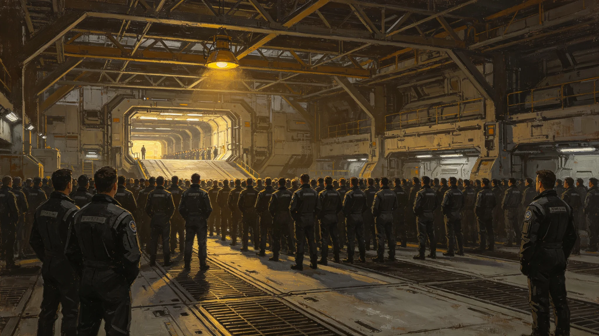

# 跨星系货运"准点节"——首班全准点航线纪念日确立规程公报

**发布机构**：联合体航道调度总署与文化协调司
**发布日期**：3405年4月1日
**文件等级**：跨星系公开

## 一、设立缘由

3404年8月调度AI优先级误判事件（见GS-3404-01）后，全港整改。3405年1月1日至3月31日，第三中继港至第四恒星系方向"安澜线"连续91天实现全部货柜准点靠泊，无一延误超15分钟。这是中继港网第三代扩容以来首条全准点航线。调度总署提请将每年3月最后一个星期日定为"准点节"，以纪此事。

## 二、节日时间

每年3月最后一个星期日，为跨星系货运"准点节"。首个准点节为3405年3月30日，已举行首祭。

## 三、仪式规程

**（一）升旗**

准点节当日06:00，第三中继港中庭升起"准点旗"——深蓝底，中央一枚白色怀表表盘，十二点刻度精确。旗高9米，宽4.5米。升旗由当值满三年的最年轻调度员与刚退休的最年长调度员共同完成。

**（二）诵词**

升旗后，全体在场人员齐诵准点词：

> 货不等人，港不等人。
> 光有速度，人有准头。
> 柜到了，事就成了；柜晚了，事就黄了。
> 我们把准字记在心里，把点记在表上。
> 下一柜，准时。

诵词由调度总署文化科拟定，共五句，不增删。

**（三）献柜**

准点节当日09:00，首班全准点航线首班货船"安澜-9"（见GS-3404-01）所载第一柜标准货柜，在第三中继港D5对接口开启。柜内货物并非节日特别供奉，而是3405年首航实际载运的一批微型拟步甲培养盒（见GS-3407-01）。调度总署注明：准点节不搞花架子，献的就是当天空运的那一柜。

**（四）熄灯**

准点节当日21:00，第三中继港中庭灯光熄灭三分钟，仅留调度塔一盏值班灯。三分钟后灯复亮。熄灯期间，全体在场人员静默，不交谈、不拍照。

**（五）交班**

熄灯后，当值调度员与下一班调度员在中庭完成例行交班，交班词与平日无异，仅在末尾加一句："今日准点。"

## 四、参与范围

- 第三中继港中庭为主祭场；
- 其余各中继港、轨道电梯站、救援船，于准点节当日09:00同步静默一分钟，不举行仪式；
- 跨星系各港务人员可自愿参加主祭场，不强制。

## 五、节日经费

首个准点节总支出约合星汇80万，其中旗具12万、诵词刻印3万、献柜运输5万、其余为中庭清洁与值班加班。调度总署注明：一个节花80万，比一次绕航便宜得多。

## 六、与既有节日的关系

- 准点节不替代复航节（见GS-3335-01）；
- 准点节不与归航节（见GS-3395-01）合并；
- 准点节为调度与港务人员行业节日，不放假，不发补贴，仅当日值班人员餐食加一道热菜。

## 七、附则

本规程自3405年4月1日起施行。准点节的核心不在庆祝，在于提醒：准点是本分，不是功劳。若哪一年"安澜线"再次出现误判绕航，该年准点节照常举行，但不献柜、不熄灯，仅诵词。

## 七、首班"安澜线"数据

| 项目 | 数据 |
|---|---|
| 航线 | 第三中继港—第四恒星系方向 |
| 全程 | 2.1亿公里 |
| 首班日期 | 3405年1月1日 |
| 准点率（91天） | 100% |
| 最短延误 | 0分钟 |
| 最长延误 | 12分钟 |
| 货柜总数 | 1,840柜 |

## 八、准点旗

准点旗深蓝底白表盘，旗高9米。旗面不绣任何机构标识、不绣任何人物。调度总署注明：准点不是哪一家的功劳，是整条线的功劳。旗上不写名字，是怕后人把准点当成某个人的事。

## 九、餐食加菜

准点节当日值班人员餐食加一道热菜，标准为每人星汇12元。3405年首祭，第三中继港食堂加的是炖肉。食堂师傅在菜单背面写："准点了，吃口热的。"这行字随准点节档案存档。

## 十、准点节与其他节日的日程

| 节日 | 日期 | 行业 |
|---|---|---|
| 准点节 | 3月最后星期日 | 调度 |
| 缆道点灯 | 缆道贯通日 | 电梯 |
| 秒级日 | 10月最后星期六 | 通信 |
| 归灯节 | 8月2日 | 救援 |
| 检修祭 | 4月第一个星期一 | 维护 |
| 首柜纪念 | 逢十年 | 物流 |

调度总署注明：六个节，六个行业，互不放假。

## 十一、准点节的餐食

准点节当日值班人员餐食加一道热菜，标准每人星汇十二元。3405年首祭，第三中继港食堂加炖肉。食堂师傅在菜单背面写："准点了，吃口热的。"这行字随准点节档案存档。

## 十二、准点节的延续

准点节自3405年首祭后，每年3月最后一个星期日举行。3410年、3420年、3430年均照常。若"安澜线"再出误判绕航，该年准点节改为静默。至3450年，准点节已举行四十五年，从未改静默。

## 十三、准点节不放假的由来

调度总署在设立准点节时，明确该节日不放假。理由：准点是每一天的事，不是某一天的事。若放假，反而打乱准点节奏。当日值班人员照常值班，仅在早交班时集体诵词一遍，餐食加一道热菜。穆远舟在规程上签批："节是记的，不是歇的。记着就行，别歇。"这句话写入规程附录。

## 十四、准点节档案归档与监督

准点节首祭全部记录（升旗录像、诵词录音、献柜封条照片、食堂菜单背面手迹）由文化协调司档案科归档，归档号CUL-3405-018，保留期跨星系公开一百年。每年准点节后三十日内，各港务段须将当值诵词签到表报文化协调司备查。监督责任由文化协调司文化科承担，若发现哪一年未诵词或未加菜，书面通报。调度总署注明：节能立住，靠的是年年有人查。

---

**签发**：航道调度总署署长 祁听潮
**会签**：文化协调司司长
**日期**：3405年4月1日
