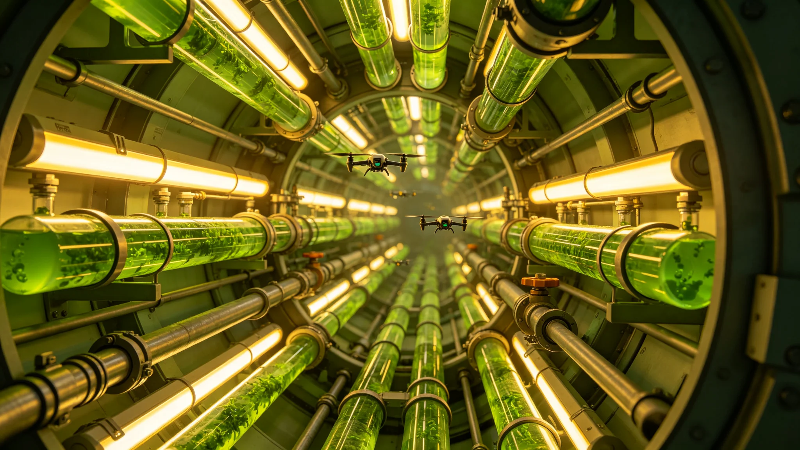

# 中继港生态舱引入微型拟步甲十年种群监测与分解效率公报

**发布机构**：联合体深空生态协调委员会中继港生态组
**公报编号**：ECO-3407-003
**监测周期**：3397—3407

## 一、引入背景

第三中继港生态舱自第三代扩容（见GS-3403-01）后，植物残体与舱内有机碎屑分解压力逐年上升。原有微生物分解链在3395年监测中显示效率下降约12%。3397年，生态组从老地球野化区（见GS-3352-01）引入一种微型拟步甲（体长约3毫米），设计目标为补充碎屑分解环节。引入前按跨星系迁徙伴生物种检疫规程（见GS-3309-01）完成四级隔离，确认无致病性、无逸出风险。

## 二、种群监测数据

| 年度 | 种群密度（头/升基质） | 成虫比 | 繁殖率 | 分解效率提升 |
|---|---|---|---|---|
| 3397 | 120 | 0.31 | 1.2 | 基准 |
| 3398 | 180 | 0.33 | 1.5 | +8% |
| 3399 | 240 | 0.35 | 1.7 | +14% |
| 3400 | 310 | 0.36 | 1.6 | +19% |
| 3401 | 360 | 0.38 | 1.5 | +23% |
| 3402 | 390 | 0.39 | 1.4 | +25% |
| 3403 | 410 | 0.40 | 1.3 | +26% |
| 3404 | 415 | 0.40 | 1.2 | +26% |
| 3405 | 412 | 0.41 | 1.2 | +26% |
| 3406 | 410 | 0.41 | 1.2 | +26% |

生态组注明：种群在3403年达到410头/升后趋于稳定，未出现爆发性增长。成虫比逐年上升，表明种群结构从增长期进入稳态期。

## 三、分解效率

| 指标 | 引入前 | 3407年 |
|---|---|---|
| 植物残体分解周期 | 21天 | 14天 |
| 有机碎屑矿化率 | 68% | 89% |
| 舱内异味事件 | 年均3.2起 | 年均0.4起 |
| 基质更换频次 | 每6个月 | 每11个月 |

## 四、伴生影响

拟步甲引入十年，对生态舱其他组分的影响：

- 微藻培养池（见GS-3423-01）：未受影响，藻华周期正常；
- 水培作物根系：未发现拟步甲啃食活根，仅取食死根；
- 舱内空气微生物：拟步甲体表携带的共生真菌对舱内空气微生物谱无显著改变；
- 中继港人员：未发现拟步甲进入居住区，生态舱与居住区之间设两道气闸，拟步甲无法通过。

## 五、检疫复核

3407年第二季度，生态组按规程对中继港生态舱拟步甲种群进行再次检疫：

- 未发现病原体变异；
- 未发现对人类致敏蛋白；
- 未发现拟步甲逃逸至非生态舱区域；
- 种群遗传多样性维持引入初的94%，未出现瓶颈。

## 六、与准点节献柜的关系

3405年首个准点节（见GS-3405-01）献柜所献，即为一批拟步甲培养盒，由第三中继港运往第四恒星系方向中继港进行扩繁。调度总署注明：献柜献的不是祭品，是干活的虫子。

## 七、结论与后续

拟步甲引入十年，种群稳态、分解效率提升26%、无检疫风险。生态组建议：

1. 维持现有种群密度，不再追加引入；
2. 每两年检疫复核一次；
3. 第四恒星系方向中继港3408年起可按同款规程引入；
4. 不得跨系直接携带活体，须经检疫通道（见GS-3311-01）。

## 六、拟步甲生活史

引入微型拟步甲（体长3毫米）为老地球野化区原生种，以干燥植物碎屑与死根为食，不食活组织。室温22℃、相对湿度60%条件下，完成一代约45天。成虫寿命约90天。中继港生态舱条件下，繁殖率略高于野外，因舱内温度稳定。

## 七、检疫四级隔离流程

引入前按跨星系迁徙伴生物种检疫规程（见GS-3309-01）完成四级隔离：

1. 一级隔离：野化区采样，确认无寄生螨；
2. 二级隔离：中继港独立培养舱繁殖三代，确认无致病变异；
3. 三级隔离：与生态舱其他组分（微藻、水培作物）混养，确认无互害；
4. 四级隔离：小范围投放，监测三个月。

四级全部通过后方可正式引入。

## 八、十年间一次异常

3401年第二季度，拟步甲种群密度从360突升至390，生态组排查后发现：一批死根基质含水率偏高0.5%，致拟步甲繁殖加快。调整基质含水率后，密度回落至360。生态组注明：这是十年间唯一一次种群异常，无危害。

## 九、拟步甲与中继港生态舱的关系

拟步甲引入后，中继港生态舱分解效率提升26%，但生态组未因此扩大拟步甲种群。理由：中继港生态舱是闭环，拟步甲多了会吃其他分解者的食。生态组注明：引入一个物种，不是请它来当主角，是请它来干活。干完活，让它待着，别喂多了。

## 十、跨系扩繁计划

3407年公报后，第四恒星系方向中继港于3408年按同款规程引入拟步甲。引入前仍走四级隔离（见GS-3407-01第三节），不简化。生态组注明：跨系引入，每一次都要从头来。老规矩不能省。

## 十一、拟步甲十年未扩繁的原因

拟步甲引入十年，生态组未扩大种群，也未向其他中继港扩繁。理由：闭环系统中，引入一个物种容易，控住它难。十年监测数据刚够稳定，下一步观察。生态组注明：急不得。虫子多了，生态舱就不是舱了，是虫窝。

## 十二、拟步甲与中继港的关系

拟步甲在中继港生态舱待了十年，种群稳定，分解效率提升百分之二十六。生态组不扩大、不缩编。生态组注明：引入一个物种，不是请它当主角，是请它来干活。干完活，让它待着，别喂多了。

## 十三、拟步甲跨系扩繁的谨慎

生态组在十年监测报告后，未立即批准向其他中继港扩繁拟步甲。理由：中继港生态舱闭环虽稳定，但跨系运输中可能带入其他未检测微生物。扩繁须重新走四级隔离流程，每一步不简化。生态组注明：十年数据够稳，但跨系不是跨港。急不得。

## 十四、拟步甲种群监测档案与后续

十年监测原始记录（种群密度抽样表、基质含水率记录、3401年异常事件处置单）由中继港生态组归档，归档号ECO-3407-003-A，保留期三十年。3409年起每两年检疫复核一次，复核报告另报。生态组注明：本公报不向公众公开拟步甲精确培养位置，仅公开数据结论；若其他中继港申请引入，须按四级隔离流程重新申请，不凭本公报直接放行。

---

**签发**：深空生态协调委员会中继港生态组
**日期**：3407年9月12日
