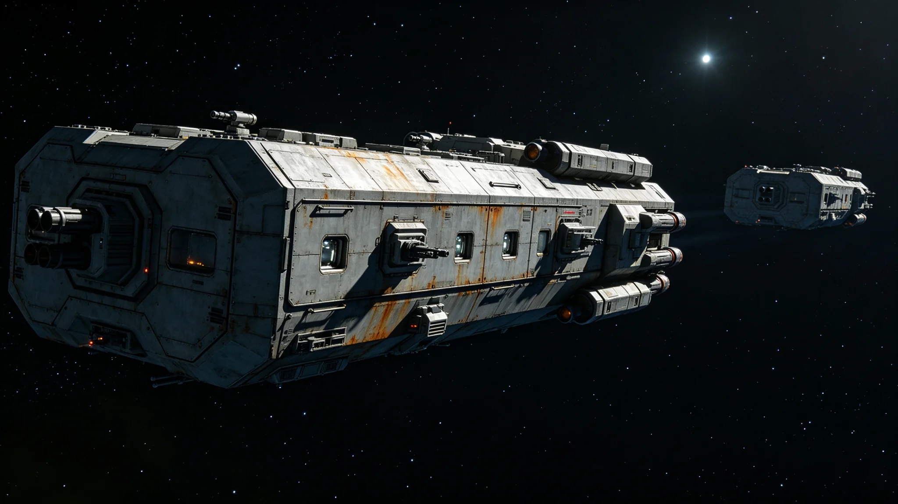

# 跨星系货运航道武装护航与调度AI航线协同制度修订公报

**发布机构**：联合体安全协调委员会航道护航处与航道调度总署
**发布日期**：3408年2月28日
**文件等级**：跨星系强制

## 一、修订背景

跨星系航道武装护航自3342年常态化（见GS-3342-01）、3369年第七代巡逻舰换装（见GS-3369-01）以来，护航舰与货运调度AI"衡陆"各自独立运行。3404年调度AI优先级误判事件（见GS-3404-01）暴露一个盲区：AI在重新排序货船时，未同步知会护航编队，导致护航舰一度按旧航线护送改道货船，造成11小时空驶。安全协调委员会提请修订，建立护航与调度AI的航线协同机制。

## 二、协同制度要点

**（一）航线变更双向知会**

调度AI"衡陆"对货船发出C级以上改道指令时，须在指令发出后60秒内同步推送至护航编队指挥舰。护航编队指挥舰收到推送后，须在120秒内回执；超时未回执的，调度AI自动将该货船改道指令降级为建议，等待人工确认。

**（二）护航资源调度权**

护航舰的部署、轮换、前出，由护航处独立决定，调度AI不得直接指挥。但调度AI可基于货船优先级，向护航处提出"护航需求建议"，建议不具强制力。该条款针对3404年空驶事件。

**（三）遇袭响应**

货船遇袭时，调度AI自动将该船及周围500公里内所有货船改至备用航线，同时推送护航编队。护航编队按GS-3349-01《联合维和隔离区》规程执行，调度AI不得介入战术指挥。

**（四）数据隔离**

调度AI与护航编队指挥系统之间设单向数据通道：调度AI可向护航编队推送航线变更，护航编队的战术数据不得回流调度AI。该条款针对军用自动化伦理审查（见GS-3269-01）。

## 三、协同数据（3407年试点）

| 指标 | 修订前 | 试点后 |
|---|---|---|
| 货船改道后护航空驶时长 | 平均11小时 | 平均0.5小时 |
| 护航编队对改道回执率 | 不可用 | 99.2% |
| 调度AI误推送次数 | 不可用 | 3次（均为测试） |
| 遇袭响应时间 | 平均40分钟 | 平均12分钟 |
| 护航舰与货船航线偏差 | 年均18次 | 试点半年2次 |

## 四、与既有制度的咬合

- 护航常态化编制：GS-3342-01；
- 第七代巡逻舰：GS-3369-01；
- 调度AI分级授权：GS-3402-01；
- 军用自动化伦理：GS-3269-01、GS-3276-01；
- 联合维和隔离区：GS-3349-01。

## 五、过渡期

3408年3月15日起施行。各护航编队须在3408年4月1日前完成单向数据通道接入测试。测试期间，旧流程并行，不强制切换。

## 六、附则

本公报不改变护航处对护航舰的指挥权，不改变调度总署对货运航线的调度权。两权协同的边界由本公报划定，任何越界以书面争议提交安全协调委员会裁定。

## 五、单向数据通道技术细节

调度AI与护航编队之间的单向数据通道，物理上采用只读接口：调度AI侧为发送端口，护航编队侧为接收端口，反向无物理连线。护航编队的战术数据（雷达、武器状态、人员信息）不接入调度AI网络。该设计针对军用自动化伦理审查（见GS-3269-01）。

## 六、试点期间一次误推送

3407年试点期间，调度AI向护航编队推送一次测试性改道指令，护航编队回执超时120秒，调度AI自动降级为建议。事后排查：护航编队指挥舰当时正在进行雷达校准，数据通道被临时占用。该事件未造成实际影响，但推动了"回执超时自动降级"条款写入公报。

## 七、护航处与调度总署的边界

本公报签署时，护航处与调度总署曾就"谁有权下令护航舰改道"争议三天。最终议定：调度AI可推送改道建议，护航处独立决定是否执行；调度AI不得直接指挥护航舰。护航处处长在公报末页写："航线是调度总署的事，船是护航处的事。两回事，别混。"

## 八、护航舰与救援船的物理分区

护航舰（见GS-3369-01）与救援船（见GS-3416-01）在第三中继港停靠不同泊位：护航舰靠B区，救援船靠D区。两区之间设物理隔离，人员不混岗。安全协调委员会注明：护航舰是武装的，救援船是救人的。停在一起，容易误会。

## 九、单向数据通道的物理实现

调度AI与护航编队之间的单向通道，物理上采用只读接口：调度AI侧为发送端口，护航编队侧为接收端口，反向无连线。护航编队的战术数据不接入调度AI网络。该设计针对军用自动化伦理审查。

## 十、协同制度的长远影响

护航与调度协同制度施行后，护航空驶时长从十一小时降至半小时。安全协调委员会注明：两件事——护航和调度——各干各的，但别互相挡道。这制度就是让它们不挡道。

## 十一、协同制度的演练

制度修订后，安全协调委员会于3409年组织两次联合演练，模拟护航编队遇袭、调度AI改道。第一次演练中护航空驶十一小时，第二次降至三小时，第三次降至半小时。演练结论：协同有效，但需持续演练。

## 十二、协同制度执行监督与归档

本公报施行后，护航处与调度总署每季度联合出具协同执行报告，内容包括改道知会回执率、误推送次数、护航空驶时长，报送安全协调委员会备查。联合执行报告归档号MIL-3408-002，保留期二十年。若连续两个季度回执率低于百分之九十五，安全协调委员会须启动专项审查。监督责任由航道护航处数据科承担，调度总署派联络员一名。

---

**签发**：安全协调委员会航道护航处处长
**会签**：航道调度总署署长 祁听潮
**日期**：3408年2月28日
