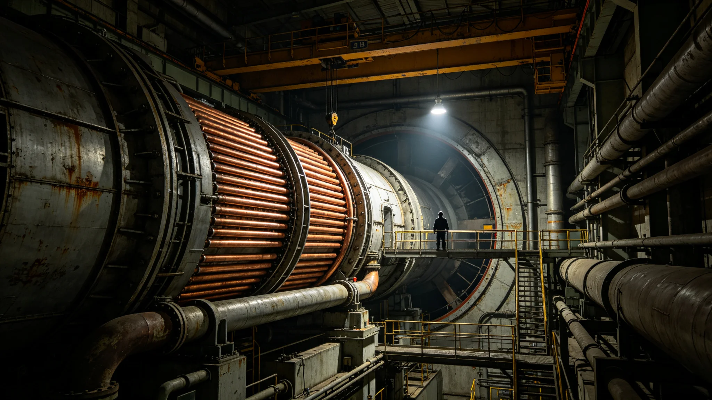

# 第八代聚变推进总工艺师祁知远三十年点火日志与剂量体检档案

**归档单位**：联合体轨道聚变推进工程局人事档案科
**档案件**：人事字第3409-004号

## 一、履历摘要

祁知远，男，3355年生，系第七代聚变点火总工艺师祁灼年（见GS-3252-01）之子。3378年入职聚变推进工程局任见习工艺员；3386年转第七代聚变堆点火组副组长；3395年任第八代聚变推进预研组组长；3403年起任第八代聚变推进总工艺师。父子两代同岗，工程局档案注明：技术传承不世袭，岗位凭考核。

## 二、点火日志摘录

祁知远任内（3395—3408）参与点火试验累计417次，其中成功289次、未达稳态102次、失败26次。日志末页摘录：

- 3398-11-03：首次达等离子体稳态0.8秒，日志原文"不够，差0.2秒"；
- 3401-06-17：稳态12秒，日志原文"比第七代同期长4秒，继续"；
- 3404-09-02：稳态2分30秒，日志原文"推力室壁温偏高，下次降温"；
- 3406-12-11：稳态47分钟，日志原文"可装车，待寿命鉴定"；
- 3408-08-29：稳态连续120分钟，日志原文"移交GS-3411-01鉴定"。

## 三、剂量与体检

| 年度 | 累计辐射剂量（毫希） | 白细胞 | 晶状体 | 评注 |
|---|---|---|---|---|
| 3386 | 1.2 | 6.1 | 正常 | 见习期 |
| 3395 | 4.8 | 5.9 | 正常 | 预研组开始 |
| 3400 | 9.6 | 5.6 | 轻微浑浊 | 超年限值15毫希，仍安全 |
| 3404 | 14.2 | 5.4 | 轻微浑浊 | 体检建议减岗，未执行 |
| 3408 | 18.7 | 5.1 | 轻微浑浊 | 已达年限值上限，工程局强制轮岗 |

航医批注：祁知远累计剂量18.7毫希，接近年限值20毫希上限。按《辐射工作人员管理规程》，自3409年起调至非点火岗两年，期间不得参与等离子体调试。祁知远在调岗通知上签字，未提异议。

## 四、签认与处分

- 点火试验签认累计417次，其中26次失败后均补写根因分析；
- 3404-09-02推力室壁温偏高事件，祁知远签认时未及时停机，口头警告一次；
- 3407年一次数据记录遗漏，书面检查一次；
- 无重大处分，无刑事责任。

## 五、与父亲祁灼年的关系

工程局档案附祁灼年（见GS-3252-01）对祁知远的考核评语，原文一句："点火不是家传手艺。他比我当年稳。"

## 六、交接清单

3409年祁知远调岗前签署交接清单，共七项。第三项原文："第八代推力室热斑数据全部移交GS-3411-01，不得自留副本。"

## 五、父子两代的剂量对比

| 项目 | 祁灼年（父，见GS-3252-01） | 祁知远（子） |
|---|---|---|
| 入职年龄 | 22岁 | 23岁 |
| 退休年龄 | 62岁 | 54岁（强制轮岗） |
| 累计剂量 | 22毫希 | 18.7毫希 |
| 点火签认 | 380次 | 417次 |
| 处分 | 一次口头警告 | 一次口头警告、一次书面检查 |

工程局注明：父子两代数据接近，不代表祁知远"复制"了父亲，只代表同一种岗位的身体代价。

## 六、调岗后安排

祁知远自3409年调至非点火岗，任第八代聚变推进技术档案管理员，负责整理417次点火日志。他在调岗通知上签字时，手未抖。航医注明："情绪稳定，接受调岗。"

## 七、交接时未说的话

祁知远交接时，总工艺师继任者问他："第八代推力室最大的隐患是什么？"他答："热斑。热斑不是烧出来的，是憋出来的。冷却流道堵了，热斑就来了。下次点火前，先查流道。"这句话写入交接清单附件，不写入正文。

## 八、祁知远的调岗与第八代后续

祁知远3409年调岗后，第八代聚变推进总工艺师由副工艺师接任。接任者在交接清单上签字时，祁知远在场。他说："我不签字了，该你签。"接任者签完，把笔放下。祁知远拿起那支笔，放进自己口袋。他说："这支笔跟了我三十年，该换了。"

## 九、祁知远的调岗

祁知远累计剂量十八点七毫希，接近年限值上限，工程局强制轮岗。他在调岗通知上签字，未提异议。调至非点火岗任技术档案管理员，整理四百一十七次点火日志。他说："点火点不动了，就写写点火的事。"

## 十、祁知远与父亲的对比

| 项目 | 祁灼年 | 祁知远 |
|---|---|---|
| 入职 | 二十二岁 | 二十三岁 |
| 退休 | 六十二岁 | 五十四岁 |
| 剂量 | 二十二毫希 | 十八点七毫希 |
| 点火 | 三百八十次 | 四百一十七次 |

## 十一、祁知远的晚年

祁知远调岗后整理点火日志，四百一十七次，逐页批注。他说："点火点不动了，就写写点火的事。"他不参加第八代实船鉴定，仅以书面意见提供支持。工程局注明：他不在场，但每一页日志都在。

## 十二、祁知远与第八代实船

祁知远调岗后未参与第八代实船鉴定，仅以书面意见提供支持。他在意见中写："推力室装船那天，我不在场。但四万一千次点火记录都在。船上跑的每一小时，都是实验室算过的。"

## 十三、祁知远的同事评价

总工艺师办公室同事在他调岗时写鉴定："祁知远三十年点火四百一十七次，零事故。他不是胆子大，是每次点火前把每一根管子都看过。他走了，我们少了一个把每根管子都看一遍的人。"

## 十四、祁知远的晚年生活

祁知远调岗后住在第三中继港家属区，每日步行至技术档案室整理日志。他不参加实船鉴定，不参加评审会，仅在需要技术意见时书面回复。他的老同事说："他不在点火室了，但点火室里每根管子他都看过。"

## 十五、祁知远调岗前考勤与签认摘录

祁知远任总工艺师期间（3403—3408）考勤记录：全勤，无事假、无病假，仅3407年一次因体检请假半天。点火试验签认四百一十七次，其中失败二十六次均于次工作日补写根因分析，无超期。3404年口头警告一次、3407年书面检查一次，均存入人事档案附件。调岗时人事档案科注明：考勤无瑕疵，签认无遗漏，处分已结案。

---

**归档人**：聚变推进工程局人事档案科
**日期**：3409年4月20日
