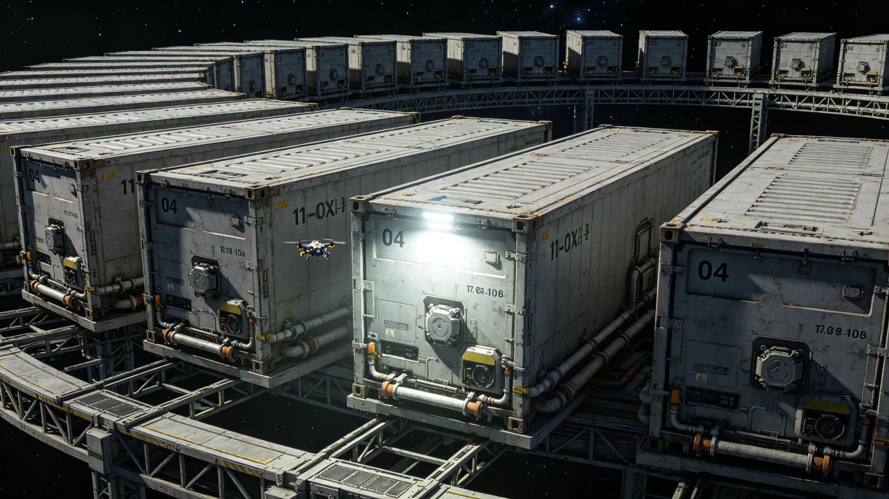

# 跨星系物流第七代标准货柜统一规格与互认制度公报

**发布机构**：联合体物流标准化委员会
**发布日期**：3410年7月1日
**文件等级**：跨星系强制

## 一、修订背景

跨星系标准货柜自第一代统一规格以来，已历六代。第六代标准货柜（3350年代启用）在调度AI化（见GS-3402-01）与中继港第三代扩容（见GS-3403-01）后，暴露出三项不适应：磁吸接口（见GS-3427-01）与新一代对接口公差不匹配；货柜标签扫描分辨率不足致3404年误判（见GS-3404-01）；单柜载重上限不适应标准货柜租赁产业（见GS-3414-01）扩张。标准化委员会提请第七代修订。

## 二、第七代标准规格

| 项目 | 第六代 | 第七代 |
|---|---|---|
| 外部尺寸（长×宽×高） | 6.058m×2.438m×2.591m | 6.058m×2.438m×2.896m |
| 自重 | 2,200kg | 2,050kg |
| 最大载重 | 28,000kg | 32,000kg |
| 磁吸接口 | 旧版三触点 | 新版五触点（兼容旧版） |
| 标签规格 | 10cm×15cm印刷 | 15cm×20cm耐磨覆膜+RFID芯片 |
| 材料 | 铝镁合金 | 碳复材外层+铝镁内衬 |
| 设计寿命 | 30年 | 50年 |

## 三、互认安排

- 第七代货柜自3410年10月1日起可在全部中继港使用；
- 第六代货柜可继续使用至3440年，过渡期三十年；
- 第六代与第七代混用时，磁吸接口须使用转接板，转接板由标准化委员会统一配发；
- 各港不得拒收第六代货柜，不得加收混装费。

## 四、标签与RFID

第七代货柜标签采用耐磨覆膜，表面字符高不小于3厘米，RFID芯片写入唯一柜号、载重、上次检疫日期。3404年误判事件（见GS-3404-01）后，标签字符"CRYO-EMB/EMG"等易混淆组合强制采用差异化字形，不得使用相似字体。

## 五、与既有制度咬合

- 调度AI标签识别：GS-3404-01整改；
- 磁吸接口疲劳测试：GS-3427-01；
- 货柜租赁产业：GS-3414-01；
- 货柜伴生微生物：GS-3431-01；
- 运输成本下降：GS-3430-01。

## 六、过渡期成本

| 项目 | 金额（星汇万） |
|---|---|
| 新柜制造补贴 | 8,000 |
| 旧柜转接板配发 | 2,400 |
| RFID芯片写入设备 | 1,200 |
| 各港适配改造 | 3,600 |
| 合计 | 15,200 |

标准化委员会注明：这笔投入在十年内通过准点率提升与货损下降可回收。

## 七、附则

本公报自3410年7月1日发布，10月1日施行。任何对货柜规格的修改须经标准化委员会三分之二多数通过，不得由单港单方面变更。

## 七、旧柜处理

第六代货柜过渡期三十年间（3410—3440），旧柜可继续使用。3440年起，旧柜不得在跨系航线上使用，但可在单星系内短途使用。3450年起，旧柜全部强制报废，材料回收。标准化委员会注明：旧柜不是废物，是还能干活的旧家具。用满三十年，再退。

## 八、RFID芯片写入流程

第七代货柜RFID芯片写入流程：

1. 货柜出厂时写入唯一柜号、载重、材料；
2. 每次靠泊时，港口读写器自动更新上次检疫日期；
3. 每次装卸后，调度AI读取RFID确认货物清单；
4. RFID损坏时，货柜不得离港，更换芯片后重新写入。

## 九、与第六代的衔接成本

| 项目 | 金额（万） |
|---|---|
| 新柜制造补贴 | 8,000 |
| 旧柜转接板 | 2,400 |
| RFID写入设备 | 1,200 |
| 港口改造 | 3,600 |
| 合计 | 15,200 |

标准化委员会注明：15,200万分摊到十年，每年1,520万。比一次锁扣松脱（见GS-3428-01）贵，但比十次便宜。

## 十、第七代货柜制造

第七代货柜由三家工厂制造：

| 工厂 | 年产能（柜） | 主供方向 |
|---|---|---|
| 第三中继港总装厂 | 12,000 | 三系内圈 |
| 第四恒星系方向厂 | 8,000 | 第四方向 |
| 第五恒星系方向厂 | 4,000 | 第五方向 |

三家工厂均按统一图纸生产，程守恒（见GS-3425-01）驻厂校准。

## 十一、旧柜过渡期

第六代货柜可继续使用至3440年，之后强制报废。过渡期三十年间，旧柜可在单星系内短途使用，不得跨系。标准化委员会注明：旧柜不是废物，是还能干活的旧家具。用满三十年，再退。

## 十二、第七代货柜的RFID流程

| 步骤 | 说明 |
|---|---|
| 出厂写入 | 唯一柜号、载重、材料 |
| 靠泊更新 | 港口读写器更新检疫日期 |
| 装卸读取 | 调度AI读取RFID确认货单 |
| 损坏更换 | 柜不得离港，换芯片重写 |

## 十三、第七代货柜的社会影响

第七代货柜投入使用后，单柜载重从二十八吨升至三十二吨，单次航行可多拉四吨。按年航行十二次计算，单柜年运量增四十八吨。物流标准化委员会注明：一个柜子多装四吨，一万个柜子就是多装四万八千吨。这就是标准化的账。

## 十四、旧柜过渡期的社会影响

第六代货柜可继续使用至3440年。过渡期内，部分小货主继续使用旧柜单星系短途运输。标准化委员会注明：旧柜不是废物，是还能干活的旧家具。用满三十年，再退。退下来的旧柜材料回收，用于第七代制造。

## 十五、第七代货柜的制造与检测

第七代货柜由三家工厂按统一图纸制造，出厂前逐柜检测：外壳焊缝超声探伤、磁吸收接口测力、RFID写入测试、气密性保压二十分钟。程守恒驻厂校准每月一次。出厂合格率百分之九十九点二，不合格柜返修后复测。

## 十六、第七代货柜的社会影响

第七代货柜统一后，跨系货柜互认，货主不再因换柜而装卸。物流标准化委员会注明：柜统一了，货才敢跑远。一个柜子从第三港到第五港，不用换柜，直接走。这就是标准化的意义。

## 十七、第七代货柜执行监督与归档

本公报施行后，物流标准化委员会每半年发布一次互认执行通报，内容包括各港旧柜拒收率、转接板配发率、RFID读写故障次数。通报归档号STD-3410-009，跨星系公开，保留期三十年。若某港连续两次通报中旧柜拒收率超过百分之一，标准化委员会派员驻港核查。3440年旧柜强制报废前一年，须提前六个月发布报废清退预告。

---

**签发**：物流标准化委员会主任 程守恒（见GS-3425-01，本批）
**日期**：3410年7月1日
