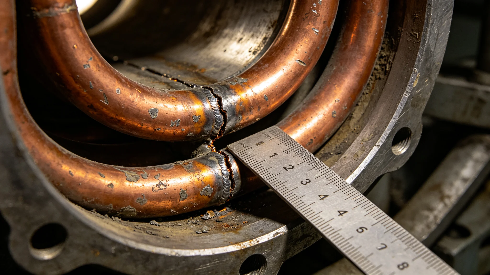

# 第八代聚变推进长寿命推力室热斑蠕变万小时鉴定报告

**鉴定单位**：联合体聚变推进工程局第三鉴定大队
**报告编号**：PROP-3411-006
**鉴定对象**：第八代聚变推进试验推力室两台（编号P8-T01、P8-T02）

## 一、鉴定目的

第七代聚变推进（见GS-3361-01）推力室设计寿命为6万小时，实际运行中热斑蠕变为主要失效模式。第八代推力室采用钨铜梯度内衬与主动冷却流道，设计目标寿命10万小时。本报告鉴定两台试验推力室累计1万小时后的热斑蠕变数据，验证设计裕度。

## 二、鉴定方法

1. P8-T01连续点火累计10,000小时，P8-T02累计9,800小时；
2. 每1,000小时停机检查一次，测量热斑区壁厚减薄率；
3. 每5,000小时取样一段内衬，进行金相与蠕变断口分析；
4. 点火工况按额定推力85%—110%循环，模拟实际货运负荷。

## 三、鉴定数据

| 累计小时 | P8-T01热斑壁厚（mm） | P8-T01减薄率 | P8-T02热斑壁厚 | P8-T02减薄率 |
|---|---|---|---|---|
| 0 | 12.00 | 0% | 12.00 | 0% |
| 1,000 | 11.94 | 0.5% | 11.95 | 0.4% |
| 2,000 | 11.86 | 1.2% | 11.88 | 1.0% |
| 3,000 | 11.77 | 1.9% | 11.80 | 1.7% |
| 4,000 | 11.66 | 2.8% | 11.71 | 2.4% |
| 5,000 | 11.54 | 3.8% | 11.60 | 3.3% |
| 6,000 | 11.40 | 5.0% | 11.48 | 4.3% |
| 7,000 | 11.24 | 6.3% | 11.34 | 5.5% |
| 8,000 | 11.06 | 7.8% | 11.19 | 6.8% |
| 9,000 | 10.85 | 9.6% | 11.01 | 8.2% |
| 10,000 | 10.61 | 11.6% | 10.81 | 9.9% |

## 四、对比第七代

| 指标 | 第七代（6万小时设计） | 第八代（10万小时设计） |
|---|---|---|
| 1万小时减薄率 | 18% | 11.6% |
| 热斑区温度峰值 | 2,850K | 2,620K |
| 主动冷却流道堵塞率 | 年均0.3次 | 1万小时0次 |
| 内衬更换周期 | 3万小时 | 设计8万小时 |

## 五、金相与断口分析

5,000小时取样段金相显示：钨铜梯度内衬界面未出现分离；热斑区晶界蠕变空洞尺寸小于0.1毫米，远低于0.5毫米的报废阈值。P8-T01在9,000小时后出现一条长度2毫米的微裂纹，位于冷却流道边缘，未穿透内衬。鉴定大队注明：该微裂纹在设计裕度内，不构成报废，但须在后续5,000小时停机时重点复查。

## 六、结论

两台试验推力室累计1万小时热斑蠕变数据符合设计预期，P8-T01减薄率11.6%、P8-T02减薄率9.9%，均远低于报废阈值（30%）。按外推模型，第八代推力室可达10万小时设计寿命，P8-T01微裂纹须列入持续监测项。

## 七、后续

- P8-T01、P8-T02继续试验至5万小时；
- 3415年启动实船装车测试；
- 3420年提交最终寿命鉴定报告；
- 与GS-3449-01混合推进比冲鉴定并行。

## 八、推力室结构

第八代推力室采用钨铜梯度内衬+主动冷却流道：

| 层 | 材料 | 厚度 | 功能 |
|---|---|---|---|
| 内层 | 钨合金 | 2mm | 耐高温 |
| 中间层 | 铜合金 | 5mm | 导热 |
| 外层 | 不锈钢 | 5mm | 结构 |
| 冷却流道 | 铜 | 1mm | 工质循环 |

设计推力室总长2.4米，直径0.8米，重1.8吨。

## 九、测试期间一次异常

3410年6月，P8-T01在第9,000小时测试中出现一条2毫米微裂纹。测试大队立即停机，取样金相分析。微裂纹位于冷却流道边缘，未穿透内衬。测试大队决定继续试验至10,000小时，并在后续5,000小时重点监测该裂纹。该裂纹最终未扩展，不影响结论。

## 十、与第七代推力室的对比

| 项目 | 第七代 | 第八代 |
|---|---|---|
| 内衬材料 | 纯钨 | 钨铜梯度 |
| 冷却方式 | 被动辐射 | 主动循环 |
| 设计寿命 | 6万小时 | 10万小时 |
| 热斑温度 | 2,850K | 2,620K |
| 重量 | 2.4吨 | 1.8吨 |

测试大队注明：第八代比第七代轻了600公斤，多了4万小时寿命。这0.6吨是材料学十年的账。

## 十一、第八代推力室实船装车

3415年，P8-T01与P8-T02在累计3万小时后，开始实船装车测试。首艘装车船为"远帆-08"（见GS-3449-01）。装车过程中，推力室与船体对接一次成功，无返工。推进工程局注明：实验室跑了一万小时，船上跑了三万小时，没出问题。

## 十二、第八代推力室与第七代的传承

祁知远（见GS-3409-01）父子两代同岗。父亲祁灼年主持第七代，儿子祁知远主持第八代。第八代推力室设计中，继承了第七代的钨内衬思路，改进为钨铜梯度。工程局注明：技术传承不世袭，岗位凭考核。

## 十三、P8-T01微裂纹后续

P8-T01在九千小时测试中出现二毫米微裂纹，位于冷却流道边缘。测试大队决定继续试验至一万小时，并在后续五千小时重点监测。该裂纹最终未扩展，不影响结论。

## 十四、第八代推力室的后续

两台试验推力室在万小时测试后继续运行，P8-T01带微裂纹运行至三万小时，微裂纹未扩展。推进工程局决定继续试验至五万小时。祁知远（见GS-3409-01）调岗前签认本报告，注明："热斑不是烧出来的，是憋出来的。"

## 十五、万小时测试的社会评价

万小时鉴定报告公布后，推进工程局收到业内质询十一封，均关注P8-T01微裂纹是否影响实船安全。工程局逐封回复：微裂纹在冷却流道边缘，未扩展，实船设计已留余量。祁知远签批："热斑不是烧出来的，是憋出来的。憋住了，就没事。"

## 十六、热斑蠕变的物理机制

推力室内壁在高温梯度下产生热斑，热斑处材料蠕变速率为正常区三至四倍。冷却流道若有堵塞，局部温度升高，热斑加剧。P8-T01微裂纹即位于一处曾有轻微堵塞的流道边缘。推进工程局注明：热斑不是设计问题，是清洁问题。

## 十七、万小时鉴定的签认

祁知远在报告上签字，注明："热斑不是烧出来的，是憋出来的。"推进工程局局长副签。报告封存于第三港技术档案室，保存期五十年。

## 十八、鉴定数据归档与外推说明

本报告全部热斑壁厚测量原始记录、金相照片、断口分析图谱由第三鉴定大队归档，归档号PROP-3411-006-A，保留期五十年。万小时外推至十万小时的模型参数另附技术附件，未写入正文。外推模型假设冷却流道清洁周期维持每一万小时一次，若实船运行中清洁周期延长，须重新外推。P8-T01微裂纹列入实船装车后持续监测项，每五千小时复查一次。

---

**鉴定大队长**：聚变推进工程局第三鉴定大队
**审核**：总工艺师祁知远（见GS-3409-01，调岗前签认）
**日期**：3411年3月18日
