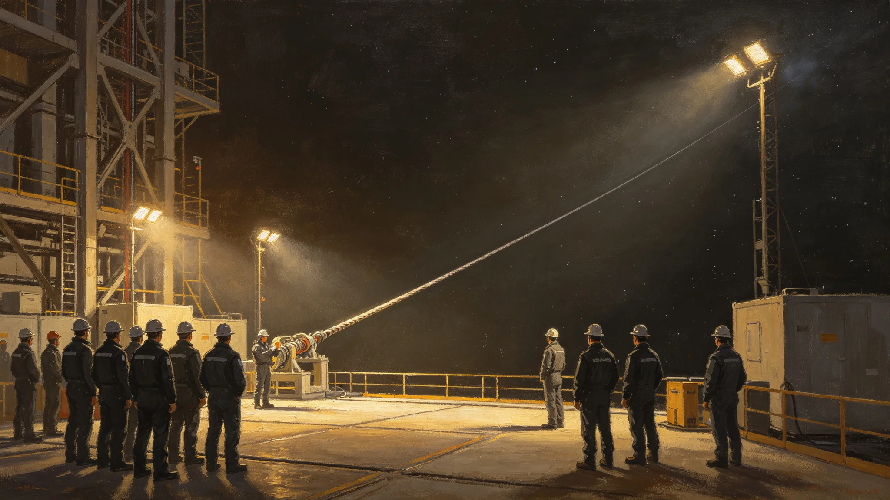

# 轨道电梯第三条缆道贯通"缆道点灯"换班仪式规程公报

**发布机构**：联合体轨道电梯维护总队与文化协调司
**发布日期**：3413年5月20日
**文件等级**：跨星系公开

## 一、仪式缘由

第三轨道电梯第三条缆道自3408年开工铺设，历时五年，于3413年5月18日贯通。贯通当日，首班货运爬升车（非事件车"爬-17"，系备用车"爬-22"）沿第三条缆道从地表站升至轨道站，全程64,000公里，耗时3小时42分钟，无异常。维护总队提请举行"缆道点灯"换班仪式，以纪第三条缆道投入运行。

## 二、仪式时间

3413年5月20日09:00—11:00，轨道电梯地面站中庭。

## 三、仪式规程

**（一）点灯**

09:00，第三条缆道顶端轨道站点亮首盏导航灯，灯光沿缆道自上而下逐盏亮起，每盏间隔3秒，共214盏。全部亮起耗时约11分钟。点灯由维护总队长闻守缆（见GS-3380-01，已退休，特邀）与现任检修工长共同按下首灯开关。

**（二）诵词**

点灯毕，全体在场人员齐诵缆道词：

> 缆道一绳，上接星站，下连地表。
> 柜沿绳上，人沿绳上，货沿绳上。
> 绳不断，事就通；绳一断，事就停。
> 我们把绳攥在手里，把灯挂在绳上。
> 下一程，稳上。

诵词由维护总队文化科拟定，五句，不增删。

**（三）交舱**

09:30，首班爬升车"爬-22"在地面站开启舱门。舱内所载为第三轨交首班货柜共21柜，其中3柜为第三中继港生态舱拟步甲培养盒（见GS-3407-01），18柜为标准货柜常规货物。维护总队注明：点灯不搞空舱仪式，首班拉的就是活货。

**（四）换班**

10:00，第三条缆道首班值班爬升车司机与下一班司机在中庭完成换班。换班词与平日一致，末尾加一句："第三条，已通。"

**（五）熄灯**

11:00，仪式结束，缆道导航灯转为常亮模式，不再逐盏启闭。中庭灯熄灭一盏，其余保持。

## 四、参与范围

- 地面站中庭为主祭场；
- 轨道站同步点灯，不举行仪式；
- 第二条缆道（既有）当日不举行仪式，仅在导航灯旁加挂一盏临时灯，三日后取下。

## 五、经费

本次仪式总支出约合星汇65万，其中灯具更换18万、诵词刻印2万、首班货柜运输补贴5万、其余为清洁与加班。维护总队注明：点灯花65万，比一次脱轨（见GS-3386-01）便宜。

## 六、与既有仪式的关系

- 缆道点灯不替代准点节（见GS-3405-01）；
- 缆道点灯为轨道电梯行业仪式，不放假，不发补贴；
- 第四条缆道（见GS-3447-01）贯通时另行举行，规程沿用本件。

## 七、附则

本规程自3413年5月20日起施行。第三条缆道若在首年内发生一次四级以上事件，次年点灯仪式改为静默，不诵词、不交舱。

## 四、第三条缆道技术参数

| 项目 | 参数 |
|---|---|
| 全长 | 64,000公里 |
| 材料 | 碳复材（见GS-3391-01） |
| 爬升车数 | 12辆 |
| 额定速度 | 120km/h |
| 单程时长 | 3小时42分 |
| 设计寿命 | 50年 |

## 五、首班货单

首班"爬-22"所载21柜中：3柜拟步甲培养盒（见GS-3407-01）运往第四恒星系方向扩繁；18柜为标准货柜常规货物，其中7柜微藻培养罐（见GS-3423-01）、6柜医疗物资、5柜食品。维护总队注明：点灯不拉空舱，首班拉的是活货。

## 六、闻守缆到场

第三条缆道贯通点灯仪式，特邀退休检修工长闻守缆（见GS-3380-01）到场按下首灯开关。闻守缆到场时已78岁，脊柱戴护具。他按下开关后说："我守了三十年缆，没见过第四条。你们见了，替我多看一眼。"这句话随仪式档案存档。

## 七、第三条缆道与前两条的区别

| 项目 | 第一条 | 第二条 | 第三条 |
|---|---|---|---|
| 建成 | 3280s | 3350s | 3413 |
| 爬升车数 | 6 | 9 | 12 |
| 额定速度 | 80km/h | 100km/h | 120km/h |
| 材料 | 钢缆 | 碳复材 | 碳复材改进 |

## 八、缆道点灯不年年办

第三条缆道贯通点灯为一次性仪式，不年年办。后续第四条缆道（见GS-3447-01）贯通时另行举行。维护总队注明：点灯是给新缆道的，不是给旧缆道的。旧缆道，照常巡检就行。

## 九、首班货单细节

首班"爬-22"所载二十一柜中，三柜拟步甲培养盒运往第四方向，十八柜常规货物。维护总队注明：点灯不拉空舱，首班拉的是活货。

## 十、第三条缆道的历史地位

第三条缆道是中继港网扩容期首条贯通的新缆道，标志轨道电梯从两条线扩至三条线。维护总队注明：第三条不是终点，是第四条的开始。

## 十一、点灯仪式后的港务

点灯后首班"爬-22"载二十一柜，全程三小时四十分钟，比预计快五分钟。宋攀索随车观察全程。他在日志中写："第三条比第二条稳。慢，但稳。"

## 十二、点灯换班的人员

点灯仪式由维护总队总工程师主持，第三条缆道首批爬升车司机六名到场。换班时，老司机将操作手册交新司机，新司机回赠一枚缆道铜牌。宋攀索在场，未上台。他在日志中写："灯亮了，人换了。缆道不换。"

## 十三、点灯仪式后的港务

点灯后首班"爬-22"载二十一柜，全程三小时四十分钟。宋攀索随车观察全程。他在日志中写："第三条比第二条稳。慢，但稳。"

## 十四、点灯仪式档案与后续监督

点灯仪式全部记录（首灯按下录像、诵词录音、首班货单、闻守缆致辞手迹）由维护总队文化科归档，归档号CUL-3413-007，保留期跨星系公开一百年。第三条缆道首年内若发生一次四级以上事件，次年点灯改为静默；至3414年5月首年期满，未发生四级以上事件，次年点灯规程照常。第四条缆道贯通时沿用本规程，另文发布。

---

**签发**：轨道电梯维护总队长
**会签**：文化协调司
**日期**：3413年5月20日
