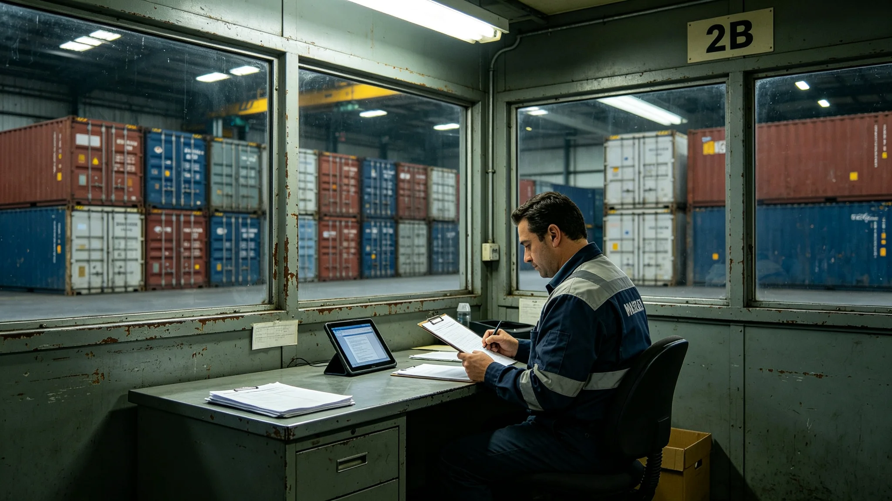

# 跨星系标准货柜租赁与中转仓储产业链年度决算报告

**编制单位**：联合体经济协调司产业结算科
**报告编号**：ECO-3414-033
**结算周期**：3413年7月—3414年6月

## 一、产业范围

标准货柜租赁产业，指向货主出租第七代标准货柜（见GS-3410-01）并提供中转仓储的市场服务。中转仓储指中继港货柜堆场的短期存放、分拣、中转。本报告为该产业链第二个完整年度决算。

## 二、交易总额

| 项目 | 金额（星汇万） | 占比 |
|---|---|---|
| 货柜租赁（按柜日） | 8,400 | 46% |
| 中转仓储（按柜位日） | 5,200 | 28% |
| 货柜清洗与熏蒸 | 1,800 | 10% |
| 标签更换与RFID写入 | 900 | 5% |
| 货柜维修 | 1,200 | 7% |
| 其他 | 700 | 4% |
| 合计 | 18,200 | 100% |

## 三、主要服务商

| 服务商 | 市占率 | 主要业务 | 年营收（万） |
|---|---|---|---|
| 安澜租柜 | 31% | 货柜租赁 | 5,642 |
| 远禾仓储 | 22% | 中转仓储 | 4,004 |
| 衡陆柜务 | 15% | 租赁+仓储 | 2,730 |
| 听澜柜修 | 8% | 维修清洗 | 1,456 |
| 其余十家 | 24% | 综合 | 4,368 |
| 合计 | 100% | — | 18,200 |

## 四、成本与利润

| 项目 | 金额（万） |
|---|---|
| 总营收 | 18,200 |
| 货柜折旧 | 4,600 |
| 仓储设施折旧 | 2,200 |
| 人工 | 3,600 |
| 清洗耗材 | 900 |
| 总利润 | 6,900 |
| 利润率 | 38% |

## 五、与上年对比

| 指标 | 3412—3413 | 3413—3414 |
|---|---|---|
| 交易总额（万） | 14,800 | 18,200 |
| 第七代货柜占比 | 38% | 72% |
| 平均租赁周期（柜日） | 14天 | 11天 |
| 仓储周转天数 | 3.2天 | 2.4天 |
| 货柜故障率 | 1.8% | 1.1% |

## 六、就业

| 岗位 | 人数 |
|---|---|
| 堆场管理 | 1,200 |
| 货柜维修 | 860 |
| 清洗熏蒸 | 640 |
| 标签RFID | 320 |
| 调度与客服 | 480 |
| 合计 | 3,500 |

## 七、风险

1. 第七代货柜设计寿命50年（见GS-3410-01），折旧期拉长，短期利润率偏高；
2. 货柜租赁与调度AI准点率强相关，准点率下降则租赁需求波动；
3. 货柜伴生微生物（见GS-3431-01）须持续监测，熏蒸成本可能上升。

## 八、与既有正典咬合

- 第七代标准货柜：GS-3410-01；
- 调度AI服务：GS-3406-01；
- 运输成本下降：GS-3430-01；
- 货柜伴生微生物：GS-3431-01；
- 锁扣松脱事件：GS-3428-01。

## 七、货柜周转流程

| 步骤 | 时长 | 责任方 |
|---|---|---|
| 货主提柜 | 1小时 | 租赁公司 |
| 装货 | 2小时 | 货主 |
| 港口装卸 | 4小时 | 港口 |
| 在途 | 3—7天 | 货运船 |
| 到港装卸 | 4小时 | 港口 |
| 卸货 | 2小时 | 收货人 |
| 空柜回库 | 1天 | 租赁公司 |

平均周转周期11天，比3412年的14天缩短3天。

## 八、堆场布局

第三中继港中转仓储区共12个堆场，每个堆场可容纳480柜。堆场间设磁悬浮运输线，连接对接口与堆场。3414年堆场利用率78%，3430年预计降至65%（因调度AI准点率提升，堆存时间缩短）。

## 九、就业结构变化

| 岗位 | 3410年 | 3414年 |
|---|---|---|
| 堆场管理 | 1,800 | 1,200 |
| 货柜维修 | 1,200 | 860 |
| 清洗熏蒸 | 800 | 640 |
| 调度AI审核 | 100 | 480 |
| 合计 | 3,900 | 3,180 |

## 十、货柜租赁价格

| 货柜类型 | 日租金（星汇） |
|---|---|
| 标准柜 | 12 |
| 冷藏柜 | 28 |
| 危险品柜 | 45 |
| 超大柜 | 60 |

价格随旺季浮动，旺季上浮20%—30%。

## 十一、货柜租赁的淡旺季

| 季度 | 出租率 |
|---|---|
| 一季度 | 82% |
| 二季度 | 78% |
| 三季度 | 91%（旺季） |
| 四季度 | 88% |

旺季出租率高，租金上浮百分之二十至三十。货主在旺季前提前订柜，避免无柜可用。

## 十二、货柜堆场布局

第三中继港中转仓储区共十二个堆场，每个可容四百八十柜。堆场间设磁悬浮运输线，连接对接口与堆场。3414年利用率百分之七十八，3430年预计降至百分之六十五。

## 十三、货柜租赁与准点率

货柜租赁周转率与调度AI准点率强相关。准点率从百分之九十一升至百分之九十七点五后，平均周转周期从十四天缩至十一天。租赁产业注明：柜转得快，钱赚得稳。

## 十四、租赁产业与准点率的关系

货柜租赁周转率与调度AI准点率强相关。准点率从百分之九十一升至百分之九十七点五后，平均周转周期从十四天缩至十一天。租赁产业注明：柜转得快，钱赚得稳。港不挤，柜就不堵。

## 十五、货柜租赁的产业链条

租赁产业上游为货柜制造（见GS-3410-01），中游为租赁与堆场管理，下游为货主与船东。3414年产业链就业四千一百人，其中堆场管理一千八百人，租赁服务一千二百人，调度辅助六百人，维修五百人。

## 十六、货柜租赁产业的淡旺季与就业

货柜出租率三季度最高，达百分之九十一，四季度百分之八十八，一季度百分之八十二，二季度百分之七十八。旺季租金上浮百分之二十至三十。租赁产业就业四千一百人，其中堆场管理一千八百人、租赁服务一千二百人、调度辅助六百人、维修五百人。旺季临时增聘三百人，主要用于堆场理货与清洗。经济协调司注明：旺季忙，淡季闲。忙的时候多招人，闲的时候培训。这行不是一年四季都满，但一年四季都得有人。

## 十七、货柜租赁的社会评价

经济协调司注明：租赁产业让小货主不用买柜，租得起、用得上。柜转得快，钱赚得稳。港不挤，柜就不堵。

## 十八、租赁产业的十年展望

经济协调司预计，随着第七代货柜（见GS-3410-01）全面铺开，租赁周转率将从十一天进一步缩至九天。届时堆场面积可缩减两成，释放空间用于在建D13—D16对接口。租赁产业就业结构也将从人工理货转向数据管理，预计五年内数据检测岗位从六百人增至九百人。经济协调司在决算报告末页写：柜是租的，账是自己的。租得明白，转得明白，这产业就活得明白。

## 十九、决算复核与归档

本决算全部租赁与仓储交易明细由经济协调司产业结算科复核，复核签认单附后。原始交易流水保留十年，审计署可随时调阅。3413—3414年度利润率百分之三十八为第七代货柜铺开早期数据，不构成长期预期；经济协调司在决算末页加注：次年若利润率回落超过八个百分点，须单独说明原因。本报告归档号ECO-3414-033，跨星系公开。

---

**编制**：经济协调司产业结算科
**日期**：3414年6月30日
