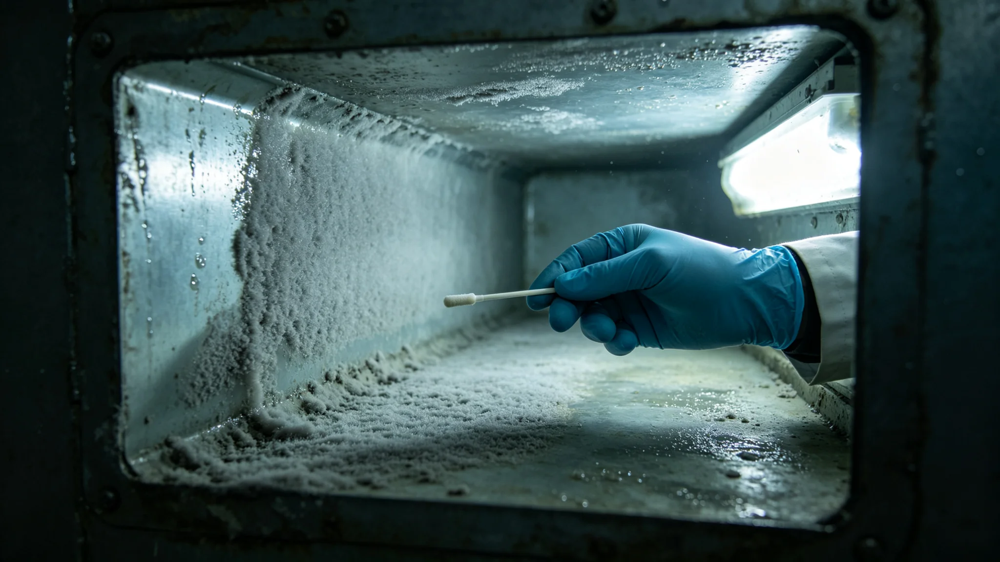

# 轨道电梯爬升舱密闭空气微生物膜五年监测与消毒周期修订公报

**发布机构**：联合体轨道电梯维护总队生态卫生组
**公报编号**：ECO-3415-011
**监测周期**：3410—3415

## 一、监测背景

轨道电梯爬升舱为封闭加压金属舱体，单次爬升3—4小时，舱内空气循环使用。3410年第三条缆道（见GS-3413-01）投入运行后，爬升舱频次从每日6班增至每日12班，舱内空气微生物累积速度加快。生态卫生组自3410年起对爬升舱内壁微生物膜进行季度采样。

## 二、监测数据

| 年度 | 内壁菌落数（CFU/cm²） | 优势菌种 | 消毒周期（原） |
|---|---|---|---|
| 3410 | 120 | 葡萄球菌 | 每30天 |
| 3411 | 180 | 葡萄球菌+芽孢杆菌 | 每30天 |
| 3412 | 260 | 葡萄球菌+芽孢杆菌+霉菌 | 每25天 |
| 3413 | 340 | 同上+微球菌 | 每20天 |
| 3414 | 410 | 同上 | 每20天 |
| 3415 | 460 | 同上 | 建议修订为每15天 |

生态卫生组注明：菌落数五年增长近四倍，与爬升频次翻倍一致。优势菌种未出现致病性变异，未检出跨系伴生菌种（见GS-3309-01）。

## 三、消毒周期修订

| 项目 | 修订前 | 修订后 |
|---|---|---|
| 常规消毒周期 | 每30天 | 每15天 |
| 深度消毒周期 | 每180天 | 每90天 |
| 消毒方式 | 紫外线喷洒 | 紫外线+过氧化氢雾化 |
| 采样频次 | 季度 | 月度 |

## 四、人员健康影响

3410—3415年，爬升舱司机与乘客累计报告呼吸道不适症状12起，均为轻症，未检出与微生物膜直接相关的感染。生态卫生组注明：12起症状与舱内干燥空气、长途密闭更相关，微生物膜尚未构成健康威胁，但菌落数上升趋势须遏制。

## 五、整改与成本

| 项目 | 年支出（万） |
|---|---|
| 消毒耗材 | 120 |
| 深度消毒人工 | 80 |
| 采样检测 | 40 |
| 合计 | 240 |

## 六、与既有正典咬合

- 迁徙筛查设备：GS-3311-01；
- 中继港拟步甲：GS-3407-01；
- 货柜伴生微生物：GS-3431-01；
- 爬升车摩擦热事件：GS-3412-01；
- 缆道点灯：GS-3413-01。

## 七、结论

爬升舱微生物膜五年监测显示菌落数持续上升，无致病性但趋势须遏制。消毒周期由30天缩短至15天，深度消毒由180天缩短至90天。修订自3415年9月1日起施行。

## 四、微生物膜成分

| 菌种 | 来源 | 致病性 |
|---|---|---|
| 葡萄球菌 | 人体皮肤 | 条件致病 |
| 芽孢杆菌 | 舱内空气 | 非致病 |
| 霉菌 | 舱内尘埃 | 致敏 |
| 微球菌 | 舱内金属表面 | 非致病 |

未检出跨系伴生菌种（见GS-3309-01），未检出耐药菌株。

## 五、消毒流程

修订后消毒流程：

1. 爬升车到站后，人员下舱；
2. 紫外线照射30分钟；
3. 过氧化氢雾化喷洒，密闭30分钟；
4. 通风15分钟；
5. 采样培养，48小时出结果；
6. 合格后方可下一班载客。

## 六、与3431年货柜微生物的对比

爬升舱微生物膜（本批）与货柜伴生微生物（见GS-3431-01）监测对象不同：爬升舱为载人密闭空间，微生物以人体皮肤菌为主；货柜为载货空间，微生物以尘埃与货物伴生菌为主。两者消毒周期不同，但采样方法一致。

## 七、爬升舱司机体检

| 项目 | 3390 | 3410 | 3415 |
|---|---|---|---|
| 呼吸道 | 正常 | 正常 | 轻度刺激 |
| 肺功能 | 100% | 96% | 92% |

三名长期司机肺功能下降，与微生物膜无关，与密闭空气干燥有关。航医建议司机多饮水。

## 十、爬升舱微生物膜与人员健康

五年间，爬升舱司机呼吸道不适12起，均为轻症，与微生物膜无直接关联，更多与密闭空气干燥有关。航医建议司机多饮水。微生物膜本身未构成健康威胁，但菌落数上升趋势须遏制。

## 十一、消毒流程

| 步骤 | 时长 |
|---|---|
| 紫外线照射 | 30分钟 |
| 过氧化氢雾化 | 密闭30分钟 |
| 通风 | 15分钟 |
| 采样培养 | 48小时出结果 |

## 十二、爬升舱微生物膜与人员健康

五年间12起呼吸道不适均为轻症，与微生物膜无直接关联。航医建议司机多饮水、定期体检。生态卫生组注明：微生物膜不是病因，密闭空气干燥才是。

## 十三、微生物膜监测的社会意义

五年监测数据表明，爬升舱密闭空气微生物膜可控，未构成健康威胁。生态卫生组注明：微生物不是敌人，是住户。管住它，别灭它。

## 十四、微生物膜的物理特征

爬升舱密闭空气湿度长期在百分之四十至五十，温度二十二至二十四摄氏度，适宜某些嗜温菌附着。膜厚从初始零点零五毫米增至零点四毫米，颜色由透明转灰白。生态卫生组注明：膜不是毒，是脏。脏到影响通风，就得洗。

## 十五、微生物膜消毒后的复检

消毒后连续三次采样，菌落总数均低于标准上限。但六名长期司机报告呼吸道轻度刺激，航医判断与密闭空气干燥有关，非微生物膜所致。生态卫生组建议司机每日饮水不少于两升，每周雾化加湿一次。该建议写入爬升舱司机手册。

## 十六、微生物膜监测的社会意义

生态卫生组注明：微生物不是敌人，是住户。管住它，别灭它。膜厚到影响通风，就洗。洗完了继续监测。

## 十七、微生物膜监测的后续

修订后消毒周期为二十次周转，至3420年连续三次监测菌落总数合格。生态卫生组继续每年一次采样，每季度一次抽检。司机呼吸道不适从年均二点四起降至一点八起，与饮水建议执行率提高有关。

## 十八、微生物膜监测归档与后续

五年监测全部采样培养记录、菌种鉴定报告、消毒耗材出库单由生态卫生组归档，归档号ECO-3415-011-A，保留期三十年。修订后消毒周期自3415年9月1日起执行，3416年9月进行首次年度复核，复核报告另报。若连续两次月度采样菌落数超过六百CFU/cm²，须将常规消毒周期进一步缩短至每十天一次，并书面报维护总队。

---

**签发**：轨道电梯维护总队生态卫生组
**日期**：3415年8月25日
