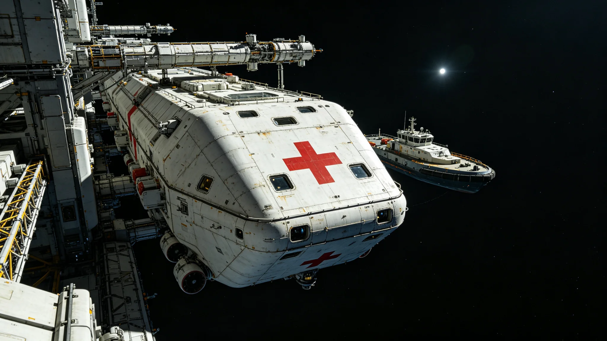

# 深空应急救援网第一代组网与救援船前出部署公报

**发布机构**：联合体安全协调委员会深空救援处
**发布日期**：3416年3月10日
**文件等级**：跨星系公开

## 一、组网背景

跨星系航道自护航常态化（见GS-3342-01）以来，货运与客运量持续上升。3400年四百年评估（见GS-3400-01）指出：现有救援力量依附于护航编队，无独立跨系救援网。3404年调度AI误判事件（见GS-3404-01）与3412年爬升车摩擦热事件（见GS-3412-01）虽无伤亡，但暴露跨系救援响应空白。安全协调委员会提请组建深空应急救援网第一代。

## 二、组网架构

| 节点 | 位置 | 救援船数 | 人员 | 覆盖范围 |
|---|---|---|---|---|
| 第一救援母港 | 第三中继港 | 4 | 120 | 三恒星系内圈 |
| 第二救援母港 | 第四恒星系晨昏带 | 3 | 90 | 第四恒星系方向 |
| 第三救援母港 | 第五恒星系方向前哨 | 2 | 60 | 第五恒星系方向 |
| 机动救援组 | 随护航编队 | 2 | 40 | 跨系航道机动 |
| 合计 | — | 11 | 310 | 全跨星系航道 |

## 三、救援船规格

第一代深空应急救援船（见GS-3435-01整舱测试）：

| 项目 | 参数 |
|---|---|
| 全长 | 42米 |
| 加压舱段 | 全封闭金属船体，分三段 |
| 舷窗 | 多小方形舷窗，非单一大圆窗 |
| 推进器 | 尾部主推进器+侧部RCS喷口 |
| 生命维持 | 第七代闭环（见GS-3375-01） |
| 急救舱 | 可同时容纳8名重伤员 |
| 冬眠舱 | 4个，用于长航程转运 |
| 设计续航 | 90天 |

## 四、响应分级

| 级别 | 定义 | 响应时间 |
|---|---|---|
| 一级 | 人员遇险、舱体破损 | 30分钟内出动 |
| 二级 | 货柜漂移、设备故障 | 2小时内出动 |
| 三级 | 疑似遇险、待核实 | 12小时内核实 |

## 五、与护航编队关系

- 救援网独立于护航编队，救援船不承担武装护航任务；
- 救援船可搭载轻武器用于自保，不得用于主动攻击；
- 遇袭场景由护航编队按GS-3408-01协同，救援网负责人员撤离。

## 六、部署进度

| 节点 | 完成时间 | 状态 |
|---|---|---|
| 第一救援母港 | 3415-12-01 | 已运行 |
| 第二救援母港 | 3416-02-15 | 已运行 |
| 第三救援母港 | 3416-06-30 | 在建 |
| 机动救援组 | 3416-09-01 | 计划 |

## 七、与既有正典咬合

- 远援-07行动：GS-3240-01；
- 护航常态化：GS-3342-01；
- 护航调度协同：GS-3408-01；
- 救援船生保测试：GS-3435-01；
- 归舟-12实战：GS-3424-01。

## 八、附则

本公报自3416年3月10日起施行。救援网第一代组网不代表跨系救援已完善，仅代表从无到有。安全协调委员会注明：有船有人，不等于能救；能救不等于救得回。这一步先迈出去。

## 七、救援船人员编制

| 岗位 | 人数 | 职责 |
|---|---|---|
| 船长 | 1 | 指挥 |
| 驾驶员 | 2 | 驾驶 |
| 机械师 | 2 | 维修 |
| 医官 | 1 | 急救 |
| 搜救员 | 4 | 出舱对接 |
| 合计 | 10 | — |

每艘救援船满编10人，第三救援母港2艘船共20人，另配10名轮换人员。

## 八、救援母港设施

| 设施 | 数量 |
|---|---|
| 救援船泊位 | 4 |
| 维修坞 | 1 |
| 急救舱演练室 | 2 |
| 冬眠舱测试间 | 1 |
| 人员宿舍 | 30床位 |

## 九、与护航编队的物理隔离

救援船与护航巡逻舰（见GS-3369-01）停靠不同泊位，救援母港不设武器库。救援船可搭载轻武器用于自保，但不装备重武器。安全协调委员会注明：救援船是救人的，不是打架的。

## 九、救援网编制总表

| 母港 | 救援船 | 人员 | 覆盖 |
|---|---|---|---|
| 第三中继港 | 4艘 | 120 | 三系内圈 |
| 第四方向 | 3艘 | 90 | 第四方向 |
| 第五方向 | 2艘 | 60 | 第五方向 |
| 机动 | 2艘 | 40 | 跨系 |
| 合计 | 11艘 | 310 | 全跨系 |

## 十、救援网与护航编队的关系

救援网独立于护航编队，救援船不承担武装护航。遇袭场景由护航编队按GS-3408-01协同，救援网负责人员撤离。安全协调委员会注明：护航是打架，救援是救人。两件事，两拨人，别混。

## 十一、救援船人员编制

每艘救援船满编十人：船长一、驾驶员二、机械师二、医官一、搜救员四。第三救援母港两船共二十人，另配十名轮换人员。

## 十二、救援网的历史意义

救援网第一代组网标志着跨系救援从依附护航编队变为独立体系。安全协调委员会注明：以前出事找护航，现在出事找救援。两个单位，两拨人，两回事。

## 十三、救援网编制的社会影响

救援网第一代组网后，跨系货运保险投保率上升。货主因有救援兜底，发运意愿增强。安全协调委员会注明：救援网不是成本，是底气。有了它，船才敢出远海。

## 十四、救援船前出部署的细节

救援船部署于第三中继港D区泊位，距主对接口四公里。遇警后出动时间：备勤船十五分钟，值班船五分钟。船载生保可独立运行九十天，种子库可支持长期自循环。

## 十五、救援船与民用船的外观区别

救援船船身涂白，船首涂红十字标识，民用船不涂。救援船不得用于商业货运，不得搭载无关人员。安全协调委员会注明：涂白不是好看，是让遇险的人一眼看见。在漆黑的深空里，白色比任何颜色都亮。

## 十六、救援网的历史地位

安全协调委员会注明：以前出事找护航，现在出事找救援。两个单位，两拨人，两回事。救援网是独立体系，不依附护航编队。

## 十七、救援网的编制细节

| 母港 | 船数 | 人员 | 覆盖方向 |
|---|---|---|---|
| 第三中继港 | 4 | 120 | 三系内圈 |
| 第四方向 | 3 | 90 | 第四方向 |
| 第五方向 | 2 | 60 | 第五方向 |
| 机动 | 2 | 40 | 跨系 |

## 十八、救援网执行监督与归档

本公报施行后，深空救援处每半年发布一次救援响应统计，内容包括各级别响应出动时间、实际救援次数、人员获救率，报送安全协调委员会备查。统计归档号MIL-3416-005，跨星系公开，保留期二十年。若连续两次半年统计中一级响应平均出动时间超过三十五分钟，安全协调委员会须启动专项审查。第三救援母港3416年6月建成后另文发布验收公报。

---

**签发**：安全协调委员会深空救援处处长
**日期**：3416年3月10日
