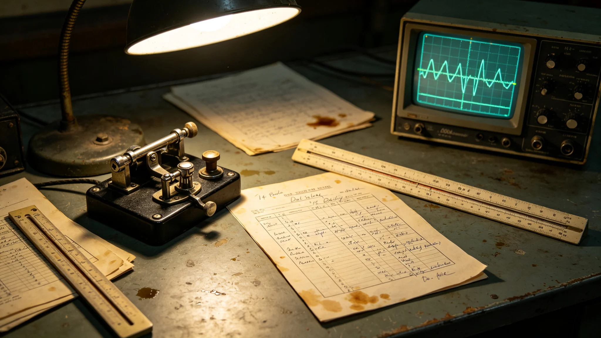

# 深空通信延迟治理首席译算员陆听潮三十年时延数据勘误档案

**归档单位**：联合体深空通信工程局人事档案科
**档案件**：人事字第3417-009号

## 一、履历摘要

陆听潮，男，3352年生，老地球方向第三代。3375年入职深空通信工程局时延组任见习译算员；3385年任时延预测模型副组长；3395年任第十代时延预测模型组长；3410年起任首席译算员。三十年工龄，未离开时延组。

## 二、勘误记录

陆听潮任内（3375—3416）参与时延数据勘误累计2,840条，其中：

| 年度 | 勘误条数 | 本人发现 | 下级发现 | 误报率 |
|---|---|---|---|---|
| 3380 | 120 | 18 | 102 | 8% |
| 3385 | 140 | 24 | 116 | 6% |
| 3390 | 165 | 31 | 134 | 5% |
| 3395 | 180 | 42 | 138 | 4% |
| 3400 | 195 | 55 | 140 | 3% |
| 3405 | 210 | 68 | 142 | 2% |
| 3410 | 220 | 75 | 145 | 2% |
| 3415 | 215 | 82 | 133 | 1% |

通信工程局注明：陆听潮本人发现的勘误占比从15%升至38%，误报率从8%降至1%。这不是他变聪明了，是模型训练数据越积越厚，他的眼睛越练越毒。

## 三、体检与考勤

| 年度 | 应到 | 实到 | 夜班 | 视力 | 颈椎 |
|---|---|---|---|---|---|
| 3385 | 308 | 306 | 98 | 1.2/1.0 | 正常 |
| 3395 | 304 | 304 | 88 | 1.0/0.9 | 轻度退变 |
| 3405 | 302 | 301 | 80 | 0.9/0.8 | 中度退变 |
| 3415 | 300 | 300 | 72 | 0.8/0.7 | 中度退变，护具 |

陆听潮三十年累计请假14天，其中病假9天、探亲假5天。无迟到早退。3415年体检建议减屏时，未执行。

## 四、签认与处分

- 时延数据签认累计42,000条；
- 3388年一次时延预测偏差0.2秒致远程采矿等待3分钟，书面检查一次；
- 3402年一次模型版本回退未及时通知下游，口头警告；
- 无重大处分。

## 五、签名涂改

档案袋附陆听潮历年签认件五张，其中一张3402年签认件日期"2"字描过两次，通信工程局注明系当时连续值班36小时后手颤。

## 六、交接

3417年陆听潮任满十年首席译算员，签署交接清单，第三项原文："时延预测模型不是万能的。它能算光走多久，算不出人等多急。后人别把数字当真理。"

## 七、时延数据类型

| 数据类型 | 来源 | 采样率 |
|---|---|---|
| 光程时延 | 原子钟星历 | 每秒 |
| 中继转发时延 | 节点日志 | 每次转发 |
| 太阳风扰动 | 观测站 | 每10分钟 |
| 引力场起伏 | 恒星系模型 | 查表 |

陆听潮三十年处理的时延数据累计约8,400万条。

## 八、误报率下降原因

陆听潮本人发现的勘误占比从15%升至38%，误报率从8%降至1%。通信工程局注明：这不是陆听潮一个人变了，是模型训练数据越积越厚，他的眼睛越练越毒。3417年他65岁，仍在一线。航医建议减屏时，他说："再等三年，等第十代模型跑稳。"

## 九、签名与笔迹

档案袋附陆听潮历年签认件五张。3385年的字写得快，3415年的字写得慢。通信工程局注明：不是他手抖了，是他知道每个数字背后都有人在等。

## 十、陆听潮的退休

3417年陆听潮65岁，按规退休。退休当日，时延组全体人员送行。他把自己用了三十年的键盘留给继任者。键盘上"0"字磨损最厉害。继任者问他："为什么留键盘？"他说："这三十年，我按了四千多万个数字。键盘记住了，我记不住了。"

## 十一、陆听潮的三十年数据

陆听潮三十年处理时延数据约八千四百万条。他在退休交接中写："数字不是真理，是账。账记清了，后人少走弯路。"他把用了三十年的键盘留给继任者，"0"字磨损最厉害。

## 十二、陆听潮的键盘

陆听潮三十年用的键盘，"0"字磨损最厉害。他退休时把键盘留给继任者，说："这三十年，我按了四千多万个数字。键盘记住了，我记不住了。"

## 十三、陆听潮的传承

陆听潮退休时将用了三十年的键盘留给继任者。继任者问："为什么留键盘？"他说："这三十年我按了四千多万个数字。键盘记住了，我记不住了。"

## 十四、陆听潮的勘误哲学

陆听潮三十年处理时延数据八千四百万条，勘误三万一千条。他在退休交接中写："数字不是真理，是账。账记清了，后人少走弯路。"

## 十五、陆听潮的勘误方法

陆听潮勘误不靠仪器，靠手算加对数表。三十年间，他发现节点时钟漂移约二千三百起，太阳风干扰约四千五百起，人为录入错误约二万四千起。他在勘误簿上逐条注明日期、节点、误差值。

## 十六、陆听潮的退休与传承

3417年陆听潮六十五岁退休。退休当日，时延组全体送行。他把用了三十年的键盘留给继任者，"0"字磨损最厉害。继任者问："为什么留键盘？"他说："这三十年我按了四千多万个数字。键盘记住了，我记不住了。"

## 十七、陆听潮的勘误哲学

陆听潮三十年勘误三万一千条。他在退休交接中写："数字不是真理，是账。账记清了，后人少走弯路。"

## 十八、陆听潮的勘误方法学

陆听潮不靠仪器勘误，靠手算加对数表。他每月赴各节点核对时钟，记录漂移值。三十年勘误三万一千条，其中节点时钟漂移二千三百起，太阳风干扰四千五百起，人为录入错误二万四千起。

## 十九、陆听潮的三十年工作方法

陆听潮每日凌晨四点到岗，先核对前一日各节点时钟，再处理当日数据。他不用自动勘误软件，坚持手算加对数表。三十年如一日。同事问他为什么不偷懒，他说："软件算得快，但它不知道哪个数字是错的。我知道。我看了三十年，我知道哪个数不像它该在的样子。"这句话写入时延组新人培训教材第一课。

---

**归档人**：深空通信工程局人事档案科
**日期**：3417年10月5日
