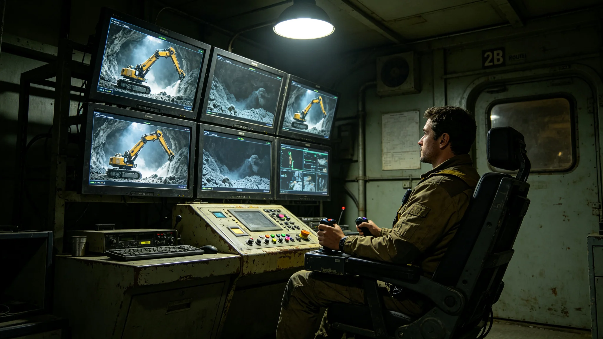

# 深空通信延迟下跨系远程操控采矿与远程手术权责划分制度公报

**发布机构**：联合体法律协调司与深空通信工程局
**发布日期**：3418年4月15日
**文件等级**：跨星系强制

## 一、制度背景

跨系通信延迟在三恒星系内圈为4—12光秒，第四恒星系方向为20—40光秒，第五恒星系方向为60—90光秒。3419年第十代时延预测模型（见GS-3419-01）将预测误差压缩至0.1秒以内，但延迟本身无法消除。在此条件下，跨系远程操控采矿船、远程手术的权责边界长期不清。3420年机械臂误动作事件（见GS-3420-01）后，法律协调司提请建立本制度。

## 二、适用范围

本制度适用于：

1. 跨系远程操控采矿船机械臂；
2. 跨系远程操控无人科考设备；
3. 跨系远程手术（仅限非急救、可择期手术）；
4. 跨系远程设备巡检与维护。

## 三、权责划分

**（一）远程操控员**

- 按时延预测模型给出的反馈延迟，在本地完成操控；
- 对操控指令本身的合理性负责；
- 不对延迟导致的物理偏差承担直接责任，但须在操控前确认延迟余量。

**（二）设备端自主安全**

- 被操控设备须具备本地自主安全限幅：当机械臂受力超限、温度超限、位置超限时，设备自动停机；
- 设备端自主安全系统不受远程操控员覆盖；
- 3420年机械臂误动作（见GS-3420-01）即因设备端自主安全未及时触发，本制度要求全部在役远程操控设备加装该系统。

**（三）医疗场景**

- 跨系远程手术仅限择期、低风险手术；
- 急救手术不得跨系远程进行，须由本地医师执行；
- 远程手术医师与本地助理医师双签，缺一人不得手术。

**（四）责任归属**

| 情形 | 责任方 |
|---|---|
| 操控指令本身错误 | 远程操控员 |
| 延迟预测错误致指令偏差 | 时延模型提供方 |
| 设备端自主安全未触发 | 设备制造商 |
| 本地未配合 | 本地执行方 |
| 多因混合 | 按比例分摊 |

## 四、与既有制度咬合

- AI人类最终责任：GS-3293-01；
- 时间同步第八代：GS-3347-01；
- 第十代时延预测：GS-3419-01；
- 机械臂误动作事件：GS-3420-01；
- 远程采矿误动作复盘：同批。

## 五、过渡期

3418年5月1日起施行。全部在役远程操控设备须在3418年12月31日前完成自主安全限幅加装，逾期不得跨系运行。

## 六、附则

本制度不消除延迟，只规定延迟出了事谁负责。法律协调司注明：光走多快是物理，人等多急是制度。物理管不了的部分，制度来管。

## 五、远程手术案例

3419年，第三中继港医官通过第十代时延预测（见GS-3419-01）为第四恒星系方向一名患者择期切除阑尾，光时延48秒。手术由远程医师主刀，本地助理医师配合，双签确认。手术耗时42分钟，无并发症。法律协调司注明：这是首例跨系择期手术，不代表急救手术可跨系。

## 六、远程采矿案例

3418年制度建立后，远程采矿船"矿-14"（见GS-3420-01）在加装机械臂受力自动停机后继续作业。至3420年事件前，远程采矿累计作业1,200小时，无事故。3420年误动作（见GS-3420-01）为加装前的旧船，未安装自动停机。

## 七、本地协助义务

本制度要求远程操控船作业半径500公里内设本地待命组。本地待命组由2人组成，驻在就近中继港，24小时待命。待命组费用由货主承担，计入远程操控服务费。

## 八、远程手术伦理

跨系远程手术仅限择期、低风险手术。急救手术不得跨系，须本地医师执行。法律协调司注明：光走48秒，人等不起。急救差一秒，就是一条命。择期手术可以等，急救不能。

## 九、远程手术的边界

跨系远程手术仅限择期、低风险。急救手术不得跨系。法律协调司注明：光走四十八秒，人等不起。择期手术可以等，急救不能。这是伦理，不是技术。

## 十、远程手术案例

3419年，第三中继港医官跨系为第四方向一名患者择期切除阑尾，光时延四十八秒。手术由远程医师主刀，本地助理医师配合，双签确认。手术耗时四十二分钟，无并发症。

## 十一、远程操控的伦理边界

跨系远程操控可用于采矿、科考、巡检，但急救手术不得跨系。法律协调司注明：光走四十八秒，人等不起。择期手术可以等，急救不能。这是伦理底线。

## 十二、远程操控制度的社会影响

制度建立后，跨系远程采矿量从年一点二亿吨增至三点八亿吨。法律协调司注明：远程采矿不是偷懒，是把人从危险岗位上撤下来。人在港上，机械臂在矿上。

## 十三、远程操控的技术配置

跨系远程操控通过专用带宽通道，延迟四十八秒。采矿机械臂加装受力传感器，超出阈值自动停机。远程操控员座椅配触觉反馈，机械臂受力时座椅震动。法律协调司注明：机器知道停，人知道停，双保险。

## 十四、远程操控权责执行监督与归档

本制度施行后，法律协调司与深空通信工程局每半年联合出具一次执行通报，内容包括远程操控设备自主安全限幅加装率、远程手术双签执行率、责任归属裁定案例数。通报归档号LAW-3418-004，跨星系公开，保留期二十年。若3418年底前加装率未达百分之百，逾期设备不得跨系运行。本地待命组费用分摊争议由法律协调司仲裁，不另行诉讼。

---

**签发**：法律协调司司长 沈默闻
**会签**：深空通信工程局局长
**日期**：3418年4月15日
