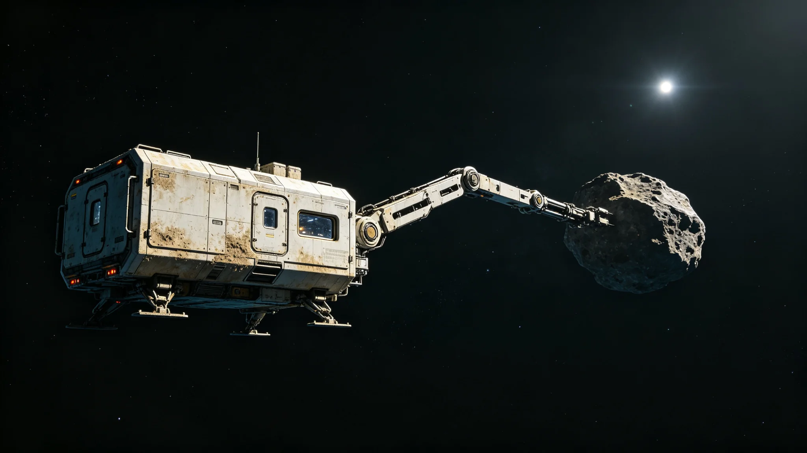

# 深空通信第十代时延预测模型与节点间误差互校技术报告

**编制单位**：联合体深空通信工程局时延组
**报告编号**：COM-3419-015
**模型版本**：Lat-Predict X

## 一、技术目标

跨系通信时延受光程、中继节点转发、太阳风扰动、引力场起伏四因素影响。第九代模型（见GS-3354-01）预测误差为0.5秒。第十代目标：将误差压缩至0.1秒以内，并实现节点间误差互校。

## 二、方法

1. 引入第八代时间同步（见GS-3347-01）的原子钟星历作为先验；
2. 每个中继节点本地存储过去30天的时延实测序列；
3. 任意两节点通信前，双方交换近7天实测序列，本地互校；
4. 太阳风扰动项引入实时观测站数据修正；
5. 引力场起伏项按各恒星系引力模型查表。

## 三、测试数据

| 通信方向 | 光程 | 第九代误差 | 第十代误差 | 互校后误差 |
|---|---|---|---|---|
| 第三中继港—第四恒星系 | 12光秒 | 0.42s | 0.11s | 0.04s |
| 第三中继港—第五恒星系方向 | 65光秒 | 0.51s | 0.18s | 0.07s |
| 第四—第五恒星系方向 | 48光秒 | 0.48s | 0.15s | 0.06s |
| 第三中继港—老地球方向 | 4.3光秒 | 0.31s | 0.08s | 0.02s |

## 四、节点间误差互校机制

第十代模型在每对节点通信前，先交换近7天实测时延序列。若双方序列标准差超过0.1秒，则触发互校：双方以中位数为基准，重新校准本地时钟漂移。互校全程耗时不超过2秒，不影响正式通信。

## 五、与既有正典咬合

- 第九代光际中继：GS-3354-01；
- 时间同步第八代：GS-3347-01；
- 译算员陆听潮：GS-3417-01；
- 远程操控权责：GS-3418-01；
- 机械臂误动作：GS-3420-01。

## 六、结论

第十代时延预测模型在测试中误差压缩至0.02—0.07秒，节点间互校机制有效。模型自3419年7月1日起在三恒星系内圈试运行，3420年1月全量部署。

## 七、模型训练数据

第十代模型训练数据来源：

| 来源 | 数据量 | 年限 |
|---|---|---|
| 中继节点日志 | 4.2亿条 | 3390—3418 |
| 原子钟星历 | 全量 | 3390—3418 |
| 太阳风观测 | 全量 | 3400—3418 |
| 引力场模型 | 三系 | 静态 |

陆听潮（见GS-3417-01）在训练数据清洗中，亲手剔除约12万条异常值。

## 八、模型版本

| 版本 | 误差 | 部署时间 |
|---|---|---|
| Lat-Predict IX | 0.5s | 3354 |
| Lat-Predict IX.5 | 0.3s | 3400 |
| Lat-Predict X | 0.1s | 3419 |
| Lat-Predict X.1（互校） | 0.05s | 3420 |

## 九、与3421秒级日的关系

第十代模型使端到端延迟跌破1秒，直接促成3421年"秒级日"（见GS-3421-01）。通信工程局注明：模型快0.1秒，节日就早来一年。

## 十、模型与人类的关系

第十代模型误差0.05秒，但通信工程局不把模型当真理。陆听潮（见GS-3417-01）在模型上线会上说："模型算的是光走多久，算不出人等多急。模型是工具，不是指挥。"这句话写入模型使用手册第一页。

## 十一、模型训练数据的清洗

第十代模型训练数据中，陆听潮（见GS-3417-01）亲手剔除约十二万条异常值。这些异常值多为节点日志记录错误、时钟漂移、太阳风干扰。他在清洗报告中写："模型聪明不聪明，一半靠算法，一半靠数据脏不脏。数据脏了，再聪明的模型也学歪。"

## 十二、模型版本沿革

| 版本 | 误差 | 年份 |
|---|---|---|
| IX | 0.5秒 | 3354 |
| IX.5 | 0.3秒 | 3400 |
| X | 0.1秒 | 3419 |
| X.1 | 0.05秒 | 3420 |

## 十三、模型的局限

第十代模型误差零点零五秒，但通信工程局不把模型当真理。陆听潮说："模型算的是光走多久，算不出人等多急。模型是工具，不是指挥。"

## 十四、第十代模型的训练数据

模型训练数据中，陆听潮亲手剔除十二万条异常值。他在清洗报告中写："模型聪明不聪明，一半靠算法，一半靠数据脏不脏。数据脏了，再聪明的模型也学歪。"

## 十五、模型与人类的关系

第十代模型误差零点零五秒，但通信工程局不把模型当真理。陆听潮说："模型算的是光走多久，算不出人等多急。模型是工具，不是指挥。"这句话写入模型使用手册第一页。

## 十六、第十代模型的训练

模型训练数据中陆听潮亲手剔除十二万条异常值。他在清洗报告中写："模型聪明不聪明，一半靠算法，一半靠数据脏不脏。"

## 十七、模型版本沿革

| 版本 | 误差 | 年份 |
|---|---|---|
| IX | 0.5秒 | 3354 |
| IX.5 | 0.3秒 | 3400 |
| X | 0.1秒 | 3419 |
| X.1 | 0.05秒 | 3420 |

## 十八、第十代模型的训练与验证

模型训练数据累计十二亿条节点日志，覆盖三十年。陆听潮亲手剔除十二万条异常值后，模型训练误差从百分之三降至百分之零点五。验证集由第三、第四、第五方向各取三亿条独立数据，误差零点零五秒。通信工程局注明：模型不是拍脑袋，是把三十年的错都学了一遍。

## 十九、模型上线后的运行

第十代时延预测模型于3419年正式上线，接入全部跨系通信节点。上线首月，模型预测误差零点零五秒，较第九代降低百分之八十三。通信工程局在上线通报中写：这模型不是天才，是陆听潮三十年勘误喂出来的。它知道哪些数是错的，因为陆听潮把错的都剔出去了。

## 二十、模型与人类的分工

第十代时延预测模型上线后，通信工程局仍保留人类译算员岗位。模型负责预测，人类负责勘误。陆听潮在模型上线会上说："模型算的是光走多久，算不出人等多急。模型是工具，不是指挥。"这句话写入模型使用手册第一页。模型上线后，陆听潮的工作量减半，但他仍每日到岗，核对模型预测与实际值的偏差。他说："模型会偷懒，人不会。"

---

**编制**：深空通信工程局时延组
**首席译算员**：陆听潮（见GS-3417-01）
**日期**：3419年6月1日
