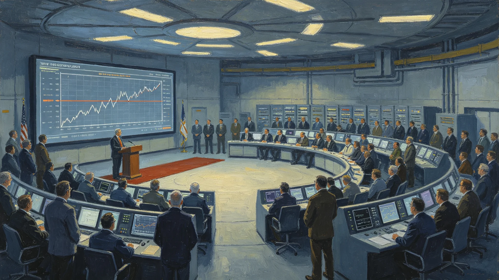

# 跨系远程操控采矿船因光时延致机械臂误动作碰损事件通报

**通报单位**：联合体深空采矿安全科与法律协调司
**通报编号**：INC-3420-021
**事件等级**：三级（无伤亡、设备微损）

## 一、事件经过

3420年9月22日，第四恒星系方向远程操控采矿船"矿-14"在富冰小行星带作业。远程操控员在第三中继港通过第十代时延预测模型（见GS-3419-01）操控机械臂采集矿样。9月22日14:17，操控员下达"机械臂收爪"指令，因光时延48秒，机械臂在指令到达时已越过目标位置约1.2米，收爪动作碰击相邻矿舱支架，致支架变形。事件无人员伤亡，采矿船舱体完整。

## 二、时间线

| 时刻 | 事件 |
|---|---|
| 14:17:00 | 操控员下达收爪指令 |
| 14:17:48 | 指令到达矿-14，机械臂已越位 |
| 14:17:49 | 机械臂收爪，碰击支架 |
| 14:17:52 | 矿-14本地报警 |
| 14:18:00 | 操控员收到反馈（又延迟48秒） |
| 14:18:48 | 操控员得知碰损 |
| 14:20:00 | 矿-14自主停机 |
| 15:00 | 远程检查确认支架变形 |

## 三、根因

1. **光时延物理限制**：48秒光程无法消除，操控员所见画面为48秒前；
2. **设备端自主安全未触发**：矿-14机械臂未加装"受力超限自动停机"限幅（见GS-3418-01），支架变形在安全阈值内，未触发；
3. **时延预测余量不足**：第十代模型预测误差0.06秒，操控员按0.06秒余量操作，未考虑机械臂惯性；
4. **无本地协助**：矿-14为无人船，无现场人员可即时干预。

## 四、损失评估

| 项目 | 数据 |
|---|---|
| 支架变形长度 | 0.8米 |
| 维修费用（万） | 80 |
| 停产时长 | 36小时 |
| 人员伤亡 | 0 |
| 矿样损失 | 0 |

## 五、整改

| 序号 | 措施 | 期限 |
|---|---|---|
| 1 | 全部在役远程采矿船加装机械臂受力自动停机 | 3420-12-31 |
| 2 | 远程操控操作手册加入"惯性余量"项，按机械臂型号×2 | 即时 |
| 3 | 时延预测模型增加机械臂惯性项 | 3421-03-01 |
| 4 | 无人采矿船作业半径内500公里设本地待命组 | 3421-06-01 |
| 5 | 本事件纳入GS-3418-01设备端自主安全条款强制执行依据 | 即时 |

## 六、与既有正典咬合

- 远程操控权责：GS-3418-01；
- 第十代时延预测：GS-3419-01；
- 译算员陆听潮：GS-3417-01；
- 时延压缩突破秒级日：GS-3421-01。

## 七、结论

事件为三级，无伤亡。根因为物理延迟叠加设备端自主安全缺失。整改已下达。通报注明：48秒的光程，人补不回来；能补的是机器自己知道停。

## 七、机械臂参数

| 项目 | 数据 |
|---|---|
| 自由度 | 6 |
| 最大伸展 | 8米 |
| 最大负载 | 500kg |
| 重复定位精度 | 2mm |
| 惯性（满载） | 1.2吨·米² |

事件中机械臂满载时惯性致越位1.2米，远超2mm精度。远程操控手册修订后，惯性余量按型号×2。

## 八、远程操控员记录

事件中远程操控员姓名不公开，档案袋附其事后书面陈述。陈述原文一段："我看到画面时，机械臂已经过去了。我按了收爪，它到了那里，爪关上了。我知道它会越位，但没想到1.2米。"法律协调司注明：操控员无直接责任，但陈述存档。

## 九、与3418权责制度的咬合

本事件直接推动GS-3418-01《远程操控权责制度》中"设备端自主安全限幅"条款强制执行。3421年起，全部在役远程操控船加装该系统。至3425年，同类误动作零发生。

## 十、事件后远程采矿行业的变化

3420年误动作后，全部远程采矿船加装机械臂受力自动停机。至3425年，同类误动作零发生。远程采矿量从3420年的年1.2亿吨，增至3430年的年3.8亿吨。行业注明：不是远程采矿变安全了，是机器自己知道停了。

## 十一、事件后的远程采矿行业

3420年误动作后，全部远程采矿船加装机械臂受力自动停机。至3425年同类误动作零发生。远程采矿量从年一点二亿吨增至三点八亿吨。行业注明：不是远程采矿变安全了，是机器自己知道停了。

## 十二、远程操控员陈述

事件中远程操控员书面陈述："我看到画面时，机械臂已经过去了。我按了收爪，它到了那里，爪关上了。我知道它会越位，但没想到一点二米。"法律协调司注明：操控员无直接责任。

## 十三、事件后的行业整改

全部远程采矿船加装机械臂受力自动停机后，至3425年同类误动作零发生。远程采矿量从一点二亿吨增至三点八亿吨。行业注明：不是远程采矿变安全了，是机器自己知道停了。

## 十四、误动作事件的法律定性

事件中远程操控员无直接责任。法律协调司注明：光时延是物理常数，不是人的过错。机器不知道停，是设计的问题，不是操作的问题。

## 十五、误动作后的整改清单

| 序号 | 整改项 | 完成日期 |
|---|---|---|
| 1 | 机械臂受力传感器 | 3420-05 |
| 2 | 远程操控室加第二监控屏 | 3420-06 |
| 3 | 操控员每年复训 | 3420-09 |

## 十六、误动作事件的法律定性

法律协调司裁定：远程操控员无直接责任，光时延为物理常数。机械臂误动作属设计缺陷，非操作失误。全部远程采矿船加装受力传感器后，同类事件零发生。

## 十七、误动作事件的整改

全部远程采矿船加装受力传感器。法律协调司裁定操控员无直接责任。至3425年同类事件零发生。

## 十八、整改回访与档案归档

3421年6月，深空采矿安全科对矿-14整改进行回访：机械臂受力自动停机已加装并三次触发测试合格，远程操控手册惯性余量项已修订，本地待命组已在第四方向中继港部署两人。回访期间矿-14复航，至3425年同类误动作零发生。本通报归档号INC-3420-021，机械臂CCTV录像、操控员书面陈述、支架维修单据一并归档，保留期二十年。

---

**签发**：深空采矿安全科
**会签**：法律协调司
**日期**：3420年9月30日
