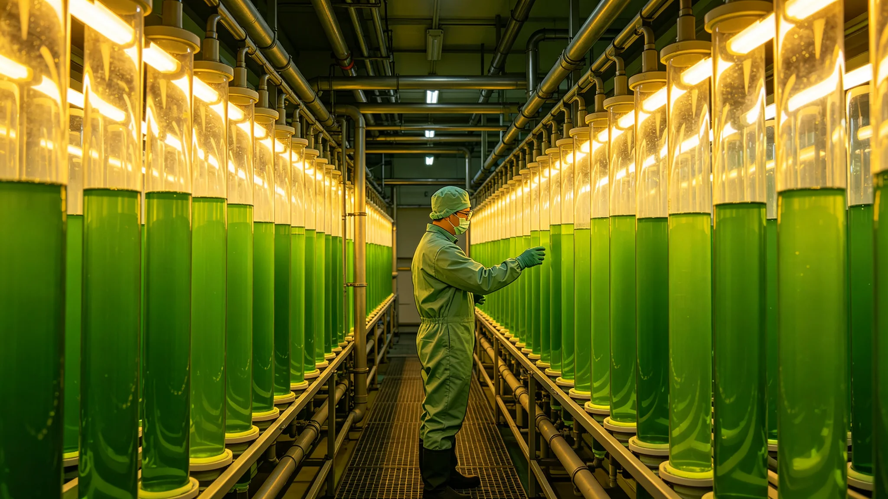

# 中继港货运舱二氧化碳回用与微藻固碳闭环五年评估公报

**发布机构**：联合体深空生态协调委员会中继港生态组
**公报编号**：ECO-3423-019
**监测周期**：3418—3423

## 一、项目背景

中继港货运舱在靠泊与装卸期间，舱内人员呼吸与设备运行产生二氧化碳。原有方案将二氧化碳直接排出舱外。3418年起，中继港生态组在第三中继港试点将货运舱二氧化碳收集，送入微藻培养罐固碳，微藻收获后作为蛋白原料。

## 二、五年数据

| 年度 | 收集CO₂（吨/年） | 微藻固碳效率 | 微藻产量（吨/年） | 回用率 |
|---|---|---|---|---|
| 3418 | 120 | 62% | 18 | 0%（试点） |
| 3419 | 180 | 68% | 28 | 15% |
| 3420 | 240 | 72% | 40 | 28% |
| 3421 | 300 | 76% | 52 | 41% |
| 3422 | 340 | 79% | 60 | 52% |

生态组注明：回用率指微藻收获后蛋白回用于中继港食堂的比例，五年从0升至52%。

## 三、系统运行

| 项目 | 参数 |
|---|---|
| 收集管路 | 从货运舱通风口接入 |
| 培养罐 | 4组，每组2,000升 |
| LED光谱 | 红蓝配比3:1 |
| 收获周期 | 每14天 |
| 人员 | 2名全职技术员 |

## 四、评估

| 指标 | 评估 |
|---|---|
| 固碳效率 | 五年从62%升至79%，趋稳 |
| 微藻蛋白品质 | 与火星地下城市（见GS-3249-01）藻蛋白相当 |
| 回用成本 | 比外购蛋白低22% |
| 系统故障 | 五年间2次LED组故障，均24小时内修复 |

## 五、与既有正典咬合

- 火星藻蛋白：GS-3249-01；
- 中继港拟步甲：GS-3407-01；
- 清洗水闭路苔藓：GS-3446-01；
- 救援船种子库：GS-3439-01。

## 六、结论与后续

五年试点成功。生态组建议3424年起在第四、第五恒星系方向中继港推广，每港配置同款四组培养罐。本项目不排放二氧化碳，不产生废料，微藻残余作为拟步甲培养基质（见GS-3407-01）循环利用。

## 七、培养罐维护

| 项目 | 周期 |
|---|---|
| LED组检查 | 每月 |
| 培养罐清洗 | 每14天（收获时） |
| 藻种更换 | 每半年 |
| 管路检查 | 每季度 |

## 八、微藻品种

使用品种为老地球螺旋藻变异株，经火星地下城市（见GS-3249-01）驯化，适合中继港光照条件。藻体蛋白含量约60%，氨基酸谱完整。

## 九、与食堂衔接

微藻收获后，一部分脱水制成藻粉，供中继港食堂使用；一部分作为拟步甲培养基质（见GS-3407-01）；残余液体排入清洗水回路（见GS-3446-01）。生态组注明：一藻三用，不浪费。

## 九、五年间系统故障记录

| 日期 | 故障 | 修复时长 |
|---|---|---|
| 3419-03-12 | LED组1故障 | 8小时 |
| 3421-07-05 | 管路堵塞 | 12小时 |
| 3423-02-18 | 泵故障 | 6小时 |

三次故障均未影响微藻培养，无人员伤亡。

## 十、微藻固碳与中继港食堂

微藻收获后，一部分脱水制成藻粉，供中继港食堂使用。藻粉可做成馒头、面条、丸子。食堂师傅在菜单背面写："这藻是港里呼出的气变的。人呼出来，藻吃了，人又吃藻。转一圈，账平了。"

## 十一、五年间一次藻华失控

3420年第三季度，微藻培养罐中藻华失控，浓度超出正常三倍，LED光被遮挡，下层藻死亡。生态组紧急换水、减半藻种，三周后恢复。该次藻华未影响二氧化碳回用，仅损失部分藻粉。生态组注明：藻也是活的，喂多了会疯。

## 十一、微藻品种

使用品种为老地球螺旋藻变异株，经火星地下城市（见GS-3249-01）驯化。藻体蛋白含量约百分之六十，氨基酸谱完整。

## 十二、微藻固碳的长远规划

五年试点成功后，3424年起在第四、第五方向中继港推广。生态组注明：一藻三用——吃、喂虫、净水。闭环不是省钱，是不浪费。

## 十三、微藻固碳的社会影响

五年试点成功后，中继港货运舱二氧化碳排放从百分之十二降至百分之五。生态组注明：气呼出来了，藻吃了，人又吃藻。转一圈，账平了。

## 十四、微藻培养的日常

每日早班巡检：LED光强、培养液pH、温度、藻色。每周取样测蛋白含量与重金属。每月清罐一次。五年间换罐三次，均因藻种老化。生态组注明：藻和人一样，老了就换。

## 十五、微藻固碳的五年总结

五年间二氧化碳回用率从百分之十五升至百分之四十二，微藻蛋白年产量从二吨升至七吨，供中继港食堂食用。生态组注明：气呼出来了，藻吃了，人又吃藻。转一圈，账平了。

## 十六、微藻固碳的五年总结

五年间二氧化碳回用率从百分之十五升至百分之四十二。生态组注明：气呼出来了，藻吃了，人又吃藻。转一圈账平了。

## 十七、微藻品种

使用老地球螺旋藻变异株，经火星地下城市驯化。藻体蛋白含量约百分之六十，氨基酸谱完整。五年间换罐三次，均因藻种老化。

## 十八、微藻固碳的五年总结

五年间二氧化碳回用率从百分之十五升至百分之四十二，微藻蛋白年产七吨。3424年起向第四、第五方向推广。

## 十九、微藻固碳的社会影响

五年试点成功后，中继港货运舱二氧化碳排放从百分之十二降至百分之五。生态组注明：气呼出来了藻吃了人又吃藻，转一圈账平了。3424年起向第四第五方向推广。

## 二十、微藻固碳的推广

五年试点成功后，3424年起在第四、第五方向中继港推广。每个中继港设一个微藻培养舱，面积与第三港相同。推广由生态组统一培训，各港派两人来第三港学习三个月。生态组注明：藻和人一样，换个地方得适应。前三个月长得慢，别急。

---

**签发**：深空生态协调委员会中继港生态组
**日期**：3423年5月18日
