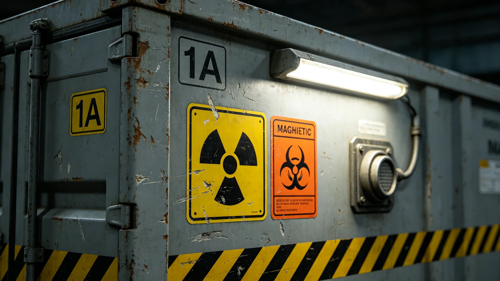

# 跨星系货运危险品分级与禁运品类第七次统一目录公报

**发布机构**：联合体物流标准化委员会与法律协调司
**发布日期**：3426年4月10日
**文件等级**：跨星系强制

## 一、修订背景

跨星系货运危险品分级目录自第一代以来已修订六次。3410年第七代标准货柜（见GS-3410-01）投入使用后，货柜载重提升至32吨，原目录按28吨载重设计的分级已不适用。3404年调度AI误判（见GS-3404-01）涉及冷冻胚胎，也暴露生物样本分级不清。标准化委员会提请第七次修订。

## 二、分级

| 级别 | 类别 | 典型货物 | 运输要求 |
|---|---|---|---|
| 甲 | 爆炸物、强辐射 | 核燃料组件、放射性同位素 | 专用舱、双人押运、禁靠泊载人港 |
| 乙 | 易燃、高压 | 液氢、液氧、高压气瓶 | 第七代货柜专用隔舱、温度监控 |
| 丙 | 生物样本 | 胚胎、菌种、病毒株 | 第四级隔离（见GS-3302-01）、双标签 |
| 丁 | 腐蚀、有毒 | 强酸、重金属废液 | 防泄漏衬层 |
| 戊 | 一般危险品 | 锂电池、压缩气体 | 常规标准货柜、警示标签 |

## 三、禁运品类

第七次目录新增禁运三项：

1. 未经灭活的第五恒星系方向原生生物组织（见GS-3341-01）；
2. 超过50年设计寿命的旧型碳复材货柜（见GS-3391-01）；
3. 未贴RFID标签的第七代货柜（见GS-3410-01）。

## 四、与既有目录衔接

| 旧级 | 新级 | 变化 |
|---|---|---|
| 甲（爆炸物） | 甲 | 不变 |
| 乙（易燃） | 乙 | 液氢液氧单列 |
| 丙（生物） | 丙 | 胚胎从丁升丙，因3404误判 |
| 丁（腐蚀） | 丁 | 不变 |
| 戊（一般） | 戊 | 锂电池单列 |

## 五、过渡期

3426年5月1日起施行。各货主须在3426年12月31日前按新目录重新申报货物分级。旧申报自动失效。

## 六、附则

本目录由物流标准化委员会解释。任何对分级的争议提交法律协调司裁定。

## 七、危险品标签示例

| 级别 | 标签色 | 标识 |
|---|---|---|
| 甲 | 红底白字 | 骷髅 |
| 乙 | 橙底黑字 | 火焰 |
| 丙 | 黄底黑字 | 生物危害 |
| 丁 | 蓝底白字 | 腐蚀 |
| 戊 | 绿底黑字 | 一般 |

第七次修订后，丙级生物样本标签强制采用差异化字形，"CRYO-EMB"与"CRYO-EMG"不再使用相似字体。

## 八、3404年误判与本目录的关系

3404年调度AI误判（见GS-3404-01）中，胚胎被误读为急救器官。本目录修订后，胚胎从丁级升至丙级，标签采用差异化字形，AI标签识别模型加入对抗样本（见GS-3404-01整改）。

## 九、过渡期违规

3426年5月1日施行后，至12月31日过渡期内，共查获3起未按新目录申报事件，均为货主未及时更新。三起均无实际危害，补报后放行。

## 十、危险品违规案例

3426年至3430年，共查获危险品违规12起，其中：

| 类型 | 起数 | 处置 |
|---|---|---|
| 未申报危险品 | 5 | 扣货补报 |
| 标签错误 | 4 | 换标签放行 |
| 禁运品类 | 2 | 没收 |
| 超量 | 1 | 分舱 |

12起均无实际危害。

## 十一、危险品目录的执行

第七次目录施行后，各港对申报货物逐柜核对标签。3426年至3430年共查获违规十二起，均无实际危害。标准化委员会注明：目录不是吓唬人，是让人知道什么能装、什么不能装。

## 十一、违规案例

3426年至3430年共查获危险品违规十二起，其中未申报五起、标签错误四起、禁运两起、超量一起。均无实际危害。

## 十二、危险品目录的执行效果

第七次目录施行后，危险品违规从年均三起降至年均二点四起。无一起实际危害。标准化委员会注明：目录不是吓唬人，是让人知道什么能装。

## 十三、危险品目录的社会意义

第七次目录统一后，各港对危险品标签互认。货主不再因跨系而重复申报。标准化委员会注明：目录统一了，货才敢跨系。

## 十四、危险品分级

| 级 | 类别 | 示例 |
|---|---|---|
| 一 | 爆炸 | 弹药 |
| 二 | 剧毒 | 氰化物 |
| 三 | 腐蚀 | 强酸 |
| 四 | 易燃 | 油料 |
| 五 | 放射 | 核燃料 |

## 十五、危险品目录的执行效果

第七次目录施行后，危险品违规从年均三起降至年均二点四起。无一起实际危害。标准化委员会注明：目录不是吓唬人，是让人知道什么能装、什么不能装。

## 十六、危险品目录的执行

第七次目录施行后违规从年均三起降至二点四起。无一起实际危害。标准化委员会注明：目录不是吓唬人，是让人知道什么能装。

## 十七、违规案例

3426至3430年共查获十二起：未申报五起、标签错误四起、禁运两起、超量一起。均无实际危害。

## 十八、危险品目录的社会意义

第七次目录统一后各港互认。货主不再因跨系重复申报。违规从年均三起降至二点四起。

## 十九、危险品目录的社会影响

第七次目录统一后各港互认。货主不再因跨系重复申报。违规从年均三起降至二点四起，无一起实际危害。

## 二十、危险品目录的执行

第七次目录施行后各港对申报货物逐柜核对标签。3426至3430年共查获十二起违规均无实际危害。标准化委员会注明：目录不是吓唬人，是让人知道什么能装什么不能装。

## 二十一、危险品目录执行监督与归档

本目录施行后，物流标准化委员会每半年发布一次危险品违规统计通报，内容包括未申报、标签错误、禁运、超量四类起数，报送法律协调司备查。通报归档号STD-3426-012，跨星系公开，保留期三十年。过渡期内三起未按新目录申报事件均补报放行，无实际危害。丙级生物样本差异化字形自3426年5月1日起强制执行，旧字形标签六个月内换完。

---

**签发**：物流标准化委员会主任 程守恒（见GS-3425-01）
**日期**：3426年4月10日
