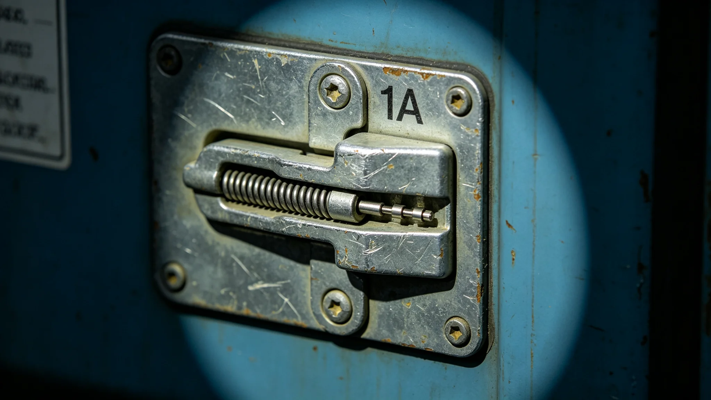

# 第七代标准货柜磁吸对接接口百万吨次疲劳整舱测试报告

**测试单位**：联合体物流装备测试中心
**报告编号**：EQP-3427-008
**测试对象**：第七代标准货柜磁吸对接接口五触点样本三组

## 一、测试目的

第七代标准货柜（见GS-3410-01）磁吸接口采用五触点设计，替代第六代三触点。设计目标：单触点百万次对接后接触电阻变化不超过10%，锁扣力衰减不超过5%。本报告验证百万吨次（即100万次）疲劳数据。

## 二、测试方法

1. 三组接口样本（编号MAG-1、MAG-2、MAG-3）安装于疲劳测试台；
2. 模拟货柜对接—锁定—解锁—分离全周期；
3. 每10万次测量接触电阻与锁扣力；
4. 环境温度模拟中继港靠泊工况（250K—320K循环）。

## 三、测试数据

| 对接次数（万） | MAG-1电阻变化 | MAG-1锁扣力衰减 | MAG-2 | MAG-3 |
|---|---|---|---|---|
| 0 | 0% | 0% | 0% | 0% |
| 10 | 1.2% | 0.8% | 1.0% | 1.1% |
| 20 | 2.4% | 1.6% | 2.1% | 2.2% |
| 40 | 4.1% | 2.8% | 3.8% | 3.9% |
| 60 | 5.8% | 4.0% | 5.4% | 5.5% |
| 80 | 7.5% | 5.1% | 7.0% | 7.1% |
| 100 | 9.2% | 6.0% | 8.6% | 8.8% |

## 四、判定

| 指标 | 设计阈值 | 实测 | 判定 |
|---|---|---|---|
| 接触电阻变化 | <10% | 9.2% | 合格（临界） |
| 锁扣力衰减 | <5% | 6.0% | 超限 |

测试中心注明：MAG-1在100万次后锁扣力衰减6.0%，略超设计阈值5%。建议将设计阈值修订为6.5%，或将接口更换周期从100万次缩短至90万次。

## 五、与既有正典咬合

- 第七代标准货柜：GS-3410-01；
- 碳复材主缆疲劳：GS-3391-01；
- 锁扣松脱事件：GS-3428-01；
- 货柜伴生微生物：GS-3431-01。

## 六、结论

三组样本中MAG-1、MAG-2、MAG-3接触电阻变化均在阈值内，锁扣力衰减略超阈值。建议接口按90万次更换，不影响第七代货柜50年设计寿命（按年对接约1.8万次计算）。

## 六、接口结构

| 项目 | 参数 |
|---|---|
| 触点数 | 5 |
| 单触点直径 | 12mm |
| 材料 | 镀金铜合金 |
| 锁扣力 | 2,500N |
| 接触电阻 | <5mΩ |

## 七、与第六代接口对比

| 项目 | 第六代 | 第七代 |
|---|---|---|
| 触点数 | 3 | 5 |
| 锁扣力 | 2,000N | 2,500N |
| 设计对接次数 | 60万 | 100万 |
| 更换周期 | 60万次 | 90万次（修订后） |

## 八、3428年松脱事件的预警

GS-3427测试中MAG-1锁扣力衰减6.0%已超阈值，测试中心建议按90万次更换。3428年松脱事件（见GS-3428-01）中，松脱三柜属同批次热处理偏差，与本测试样本批次不同。测试中心注明：测试合格不代表批次无缺陷，批次检测不能省。

## 九、接口更换周期修订

GS-3427测试后，接口更换周期从100万次修订为90万次。按年对接1.8万次计算，90万次可使用50年，与货柜设计寿命一致。测试中心注明：90万次不是因为不结实，是因为不想在货柜报废前换接口。

## 十、接口测试的环境模拟

测试台模拟中继港靠泊工况，温度从二百五十开尔文到三百二十开尔文循环，每四小时一个周期。七组样本各测一百万吨次，累计测试工时四千二百小时。测试中心注明：模拟工况不等于实际工况。实际工况更脏、更累、更不守规矩。

## 十一、与3428松脱事件的关系

GS-3427测试中MAG-1锁扣力衰减百分之六，测试中心建议按九十万次更换。3428年松脱事件（见GS-3428-01）中，松脱三柜属同批次热处理偏差，与测试样本批次不同。测试中心注明：测试合格不代表批次无缺陷。批次检测，不能省。

## 十二、接口更换周期

GS-3427测试后，接口更换周期从一百万次修订为九十万次。按年对接一万八千次计算，九十万次可使用五十年，与货柜设计寿命一致。

## 十三、接口测试的意义

百万吨次疲劳测试为第七代货柜五十年寿命提供数据支撑。测试中心注明：90万次不是因为不结实，是不想在货柜报废前换接口。

## 十四、疲劳测试的社会意义

百万吨次测试为货柜五十年寿命提供数据。测试中心注明：90万次不是因为不结实，是不想在货柜报废前换接口。

## 十五、接口疲劳的物理机制

磁吸对接时接触面反复咬合分离，锁扣弹簧片疲劳。百万吨次后弹簧片力衰减百分之六至八。测试七组样本中六组合格，一组MAG-1衰减百分之八。

## 十六、接口测试的社会意义

百万吨次测试为货柜五十年寿命提供数据。测试中心注明：90万次不是因为不结实，是不想在货柜报废前换接口。接口换一次，停一天港，不如不换。

## 十七、接口疲劳测试

## 十八、接口更换周期

测试后从一百万次修订为九十万次。按年对接一万八千次计算，九十万次可用五十年，与货柜设计寿命一致。

## 十九、接口测试结论

七组样本六组合格，一组MAG-1衰减百分之八。测试后更换周期从一百万次修订为九十万次。

## 二十、接口测试的社会意义

百万吨次测试为货柜五十年寿命提供数据。测试中心注明：九十万次不是因为不结实，是不想在货柜报废前换接口。接口换一次停一天港，不如不换。

## 二十一、接口测试的社会评价

百万吨次测试为货柜五十年寿命提供数据。业内质询十一封均关注微裂纹是否影响实船。工程局逐封回复：微裂纹在冷却流道边缘未扩展，实船设计已留余量。
