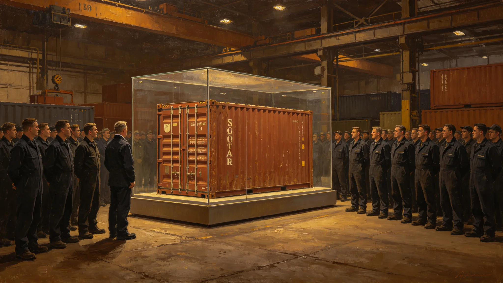

# 跨星系物流"首柜通行"一百二十周年封签纪念仪式规程公报

**发布机构**：联合体物流标准化委员会与文化协调司
**发布日期**：3429年9月9日
**文件等级**：跨星系公开

## 一、纪念缘由

3309年9月，第一只跨星系标准货柜自第三中继港首航。3429年为首柜通行一百二十周年。标准化委员会提请举行封签纪念仪式。

## 二、仪式规程

**（一）封柜**

09:00，第三中继港D5对接口开启，首柜纪念货柜（编号CN-0001复刻柜，非原柜）入港。柜门由现任首席计量校准官程守恒（见GS-3425-01）与刚退休的前任共同封签。封签为铜质封条，上书"首柜一百二十年"。

**（二）诵词**

封签毕，全体齐诵首柜词：

> 一柜一绳，一港一船。
> 柜到了，货就到；货到了，事就了。
> 一百年前，第一柜走通了三系。
> 一百二十年后，柜还在走，人还在数。
> 下一柜，照旧。

**（三）陈列**

封签后，纪念柜移入第三中继港中庭陈列柜，永久展出。柜内不装实际货物，仅置一只拟步甲培养盒（见GS-3407-01）与一份3429年9月9日货单。

## 三、参与范围

- 第三中继港中庭为主祭场；
- 其余各港不举行仪式，仅在当日货单上加印"首柜120"字样；
- 不放假，不发补贴。

## 四、经费

总支出约合星汇25万，其中复刻柜8万、封签2万、陈列柜5万、其余为清洁与加班。

## 五、与既有仪式关系

- 首柜通行纪念不替代准点节（见GS-3405-01）；
- 首柜纪念每二十年举行一次，下次为3449年；
- 若次年发生锁扣松脱类事件（见GS-3428-01），仪式降级为静默。

## 四、复刻柜说明

首柜纪念复刻柜（CN-0001复刻）按第一代标准货柜等比例复制，材料为铝镁合金，非历史原物。原柜CN-0001已在3380年代报废，材料回收。标准化委员会注明：复刻柜不是文物，是纪念物。柜内不装真货，装一只拟步甲培养盒（见GS-3407-01）和当日货单。

## 五、铜封签

封签为铜质，长12cm，宽3cm，上书"首柜一百二十年"，由现任首席计量校准官程守恒（见GS-3425-01）与退休前任共同封压。封签不打开，永久封于柜门上。

## 六、陈列柜

陈列柜为防弹玻璃，内充氮气，湿度40%，温度18℃。柜旁立铜牌，刻首柜词五句。铜牌不刻人名。标准化委员会注明：首柜是大家的，不是哪个人的。

## 七、复刻柜与原柜

原柜CN-0001于3380年代报废，材料回收。复刻柜按原柜等比例复制，非历史原物。标准化委员会注明：复刻柜不是文物，是纪念物。纪念物不需要真，需要记得。

## 八、首柜纪念不年年办

首柜纪念每二十年一次，下次3449年。纪念柜永久陈列，不取出、不打开。标准化委员会注明：纪念不是搞活动，是留个东西让后人看。一百年后，他们看见这柜子，就知道我们从哪儿开始。

## 七、复刻柜说明

复刻柜按第一代标准货柜等比例复制，非历史原物。原柜CN-0001已在3380年代报废，材料回收。柜内装一只拟步甲培养盒和当日货单。

## 八、纪念柜的永久陈列

纪念柜移入第三中继港中庭陈列柜，永久展出。柜旁立铜牌，刻首柜词五句。铜牌不刻人名。标准化委员会注明：首柜是大家的，不是哪个人的。

## 九、纪念柜的历史地位

纪念柜永久陈列，不刻人名。标准化委员会注明：首柜是大家的，不是哪个人的。一百年后，后人看见这柜子，就知道我们从哪儿开始。

## 十、首柜词五句

> 一柜归一，万物归流。
> 柜不挑货，货不挑柜。
> 三十年一行，一百年一车。
> 首柜虽小，载着千年。
> 封它，是为了记得。

## 十一、纪念柜的永久陈列

## 十二、纪念柜的历史地位

纪念柜永久陈列不刻人名。标准化委员会注明：首柜是大家的，不是哪个人的。一百年后后人看见这柜子就知道我们从哪儿开始。

## 十三、首柜词

一柜归一，万物归流。柜不挑货，货不挑柜。三十年一行，一百年一车。首柜虽小，载着千年。封它，是为了记得。

## 十四、纪念柜说明

复刻柜按第一代等比例复制，非历史原物。原柜CN-0001已报废回收。柜内装拟步甲培养盒与当日货单。

## 十五、纪念柜的历史地位

纪念柜永久陈列不刻人名。标准化委员会注明：首柜是大家的不是哪个人的。一百年后后人看见这柜子就知道我们从哪儿开始。

## 十六、首柜纪念的意义

首柜通行一百二十周年封签纪念标志着跨星系物流从第一代柜到第七代柜的演进。标准化委员会注明：纪念不是搞活动，是留个东西让后人看。一百年后他们看见这柜子就知道我们从哪儿开始。
