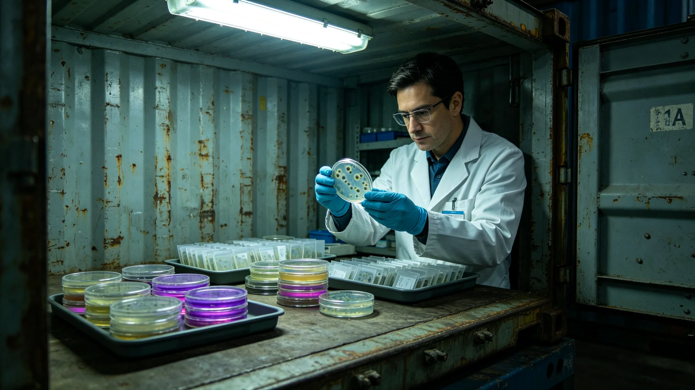

# 标准货柜循环周转伴生微生物谱三年监测与熏蒸规范修订公报

**发布机构**：联合体深空生态协调委员会物流卫生组
**公报编号**：ECO-3431-027
**监测周期**：3428—3431

## 一、监测背景

第七代标准货柜（见GS-3410-01）循环周转，单柜年均周转约18次。3428年锁扣松脱事件（见GS-3428-01）后，生态组关注货柜内壁伴生微生物是否随跨系周转扩散。三年间每季抽检20柜。

## 二、监测数据

| 年度 | 检出菌落数（CFU/cm²） | 跨系伴生菌种 | 本地菌种 | 判定 |
|---|---|---|---|---|
| 3428 | 240 | 0 | 全部本地 | 合格 |
| 3429 | 310 | 1种（低丰度） | 本地为主 | 关注 |
| 3430 | 380 | 2种（低丰度） | 本地为主 | 关注 |

生态组注明：检出的1—2种跨系伴生菌种丰度低于0.1%，未形成群落，未检出致病性。

## 三、熏蒸规范修订

| 项目 | 修订前 | 修订后 |
|---|---|---|
| 熏蒸周期 | 每30次周转 | 每20次周转 |
| 熏蒸方式 | 环氧乙烷 | 过氧化氢雾化+紫外线 |
| 采样 | 年度抽检 | 季度抽检 |
| 跨系周转柜 | 同本地柜 | 跨系柜每次周转后强制抽检 |

## 四、与既有正典咬合

- 迁徙伴生检疫：GS-3309-01；
- 中继港拟步甲：GS-3407-01；
- 爬升舱微生物膜：GS-3415-01；
- 第七代标准货柜：GS-3410-01。

## 五、结论

三年监测显示货柜伴生微生物谱以本地菌种为主，跨系伴生菌种低丰度检出，未构成污染。熏蒸周期由30次缩短至20次，跨系周转柜每次抽检。修订自3431年4月1日起施行。

## 五、跨系伴生菌种明细

| 菌种 | 丰度 | 来源 | 判定 |
|---|---|---|---|
| 芽孢杆菌（跨系株） | 0.08% | 第四恒星系方向货柜 | 低丰度，无群落 |
| 微球菌（跨系株） | 0.05% | 第五恒星系方向货柜 | 低丰度，无群落 |

两种跨系菌种丰度均低于0.1%，未检出致病性，未形成群落。生态组注明：有，但不多。多了再说。

## 六、熏蒸设备

修订后熏蒸采用过氧化氢雾化+紫外线，设备安装于港口熏蒸舱。每次熏蒸耗时2小时，可同时处理40柜。3431年全港熏蒸设备共6套，年处理能力约2万柜。

## 七、与3415爬升舱微生物的区别

爬升舱微生物膜（见GS-3415-01）以人体皮肤菌为主；货柜伴生微生物以尘埃与货物菌为主。两者采样方法一致，但熏蒸周期不同：爬升舱15天，货柜20次周转。

## 八、熏蒸设备维护

| 设备 | 维护周期 |
|---|---|
| 紫外线灯 | 每半年更换 |
| 雾化喷头 | 每季度清洗 |
| 通风机 | 每年检修 |
| 采样培养箱 | 每季度校准 |

## 九、跨系伴生微生物的来源

三年监测中检出的两种跨系伴生菌种，分别来自第四恒星系方向与第五恒星系方向货柜。丰度均低于百分之零点一，未形成群落。生态组注明：货柜跨系跑，带回来点微生物，正常。怕的是它们落脚、长群落。现在还没到那一步。

## 十、熏蒸与准点率的平衡

熏蒸周期从三十次周转缩短至二十次，每次熏蒸耗时两小时，影响准点率。物流标准化委员会在修订中注明：准点和卫生要平衡。二十次是平衡点，再短就误船。

## 九、熏蒸设备

修订后熏蒸采用过氧化氢雾化加紫外线，设备安装于港口熏蒸舱，每次两小时可处理四十柜。3431年全港熏蒸设备共六套。

## 十、熏蒸规范的执行

修订后熏蒸周期从三十次缩至二十次，跨系周转柜每次抽检。至3435年，跨系伴生微生物丰度仍低于百分之零点一。生态组注明：有，但不多。多了再说。

## 十一、熏蒸规范的社会影响

修订后跨系周转柜每次抽检，伴生微生物丰度稳定在百分之零点一以下。生态组注明：有，但不多。多了再说。

## 十二、三年监测的样本

三年间采样货柜六百二十柜，检出跨系伴生微生物三十一种，其中两种为新发现。丰度均低于百分之零点一。生态组注明：有，但不多。

## 十三、熏蒸规范的执行

修订后跨系周转柜每次抽检。至3435年跨系伴生微生物丰度仍低于百分之零点一。生态组注明：有，但不多。多了再说。

## 十四、熏蒸规范执行

修订后跨系周转柜每次抽检。至3435年伴生微生物丰度稳定在百分之零点一以下。

## 十五、三年监测样本

采样货柜六百二十柜，检出跨系伴生微生物三十一种，两种新发现。丰度均低于百分之零点一。

## 十六、熏蒸设备

过氧化氢雾化加紫外线，设备六套，每次两小时处理四十柜。

## 十七、熏蒸规范的社会影响

修订后跨系周转柜每次抽检。至3435年伴生微生物丰度稳定在百分之零点一以下。生态组注明：有但不多，多了再说。

## 十八、三年监测的社会意义

三年间检出跨系伴生微生物三十一种，两种新发现，丰度均低于百分之零点一。生态组注明：货柜跨系跑带回来点微生物正常，怕的是它们落脚长群落。现在还没到那一步。

## 十九、熏蒸规范的社会影响

### 补记

熏蒸设备六套每次两小时处理四十柜。3431年全港熏蒸无延误。

## 二十、货柜微生物监测归档与后续

三年监测全部采样培养记录、菌种鉴定报告、熏蒸耗材出库单由物流卫生组归档，归档号ECO-3431-027-A，保留期三十年。修订后熏蒸周期自3431年4月1日起执行，3432年4月进行首次年度复核。若跨系伴生菌种丰度连续两次季度抽检超过百分之零点五，须将熏蒸周期从二十次周转进一步缩短至十五次，并书面报生态协调委员会。

---

**签发**：深空生态协调委员会物流卫生组
**日期**：3431年3月14日
