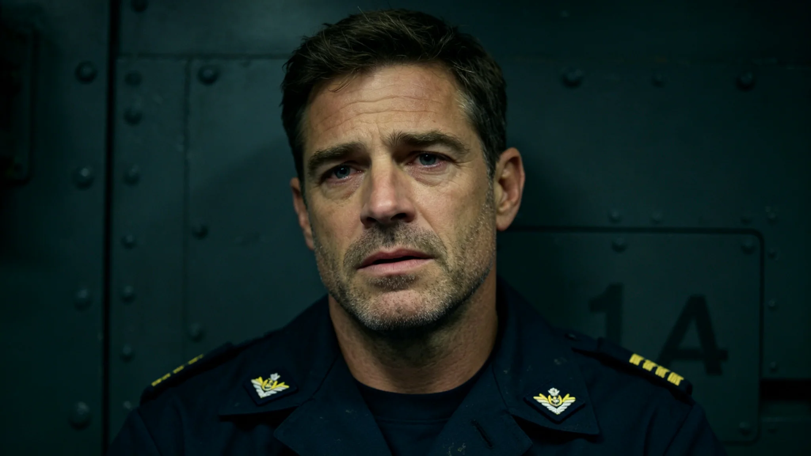

# 深空应急救援网首任值班总队长霍归航二十年出勤与签认档案

**归档单位**：联合体安全协调委员会深空救援处人事档案科
**档案件**：人事字第3433-018号

## 一、履历摘要

霍归航，男，3356年生，第四恒星系方向第二代。3380年入职护航舰队任见习驾驶员；3395年转救援舰副舰长；3416年救援网第一代组网（见GS-3416-01）后任首任值班总队长；3424年指挥归舟-12（见GS-3424-01）。

## 二、出勤记录

| 年度 | 值班天数 | 实际出勤 | 出动救援 | 现场指挥 |
|---|---|---|---|---|
| 3395 | 280 | 278 | 3 | 0 |
| 3405 | 280 | 280 | 5 | 1 |
| 3416 | 280 | 280 | 8 | 2 |
| 3424 | 280 | 279 | 12 | 3（含归舟-12） |
| 3432 | 280 | 280 | 10 | 2 |

## 三、体检

| 年度 | 血压 | 心律 | 脊柱 |
|---|---|---|---|
| 3395 | 正常 | 正常 | 正常 |
| 3410 | 偏高 | 偶发早搏 | 轻度退变 |
| 3424 | 偏高 | 偶发早搏 | 中度退变 |
| 3432 | 偏高 | 偶发早搏 | 中度，护具 |

## 四、签认与处分

- 救援行动签认48次；
- 3416年一次救援预案演练未到场指挥，书面检查；
- 3424年归舟-12行动后，因返航比预计慢6小时（见GS-3424-01），内部复盘一次，无处分；
- 无重大处分。

## 五、归舟-12指挥记录

3424年归舟-12（见GS-3424-01）行动中，霍归航在救援母港指挥，签认出动指令、牵引方案、返航节奏。行动日志末页他写："6个人都回来。这就够了。"

## 六、交接

3433年霍归航任满，签署交接清单，第三项原文："救援不是比赛。救得回是人，救不回是命。别把命当成绩。"

## 七、归舟-12指挥细节

归舟-12（见GS-3424-01）行动中，霍归航在第二救援母港指挥中心，未随救援船出动。他通过延迟48秒的通信链下达指令，每道指令间隔不少于2分钟，留出确认时间。行动日志末页他写："我不在船上，船上的人自己会做决定。我只负责让他们知道方向。"

## 八、体检与护具

霍归航3424年血压偏高、偶发早搏，医生建议减值班。他未执行，仅在值班椅上加靠垫。3433年退休时，脊柱中度退变，护具佩戴三年。

## 九、签名

霍归航签认件48份，其中归舟-12出动指令签认件签名"航"字最后一笔拖得较长。救援处注明：那不是抖，是他写完后多停了两秒。

## 十、霍归航的退休

3433年霍归航67岁退休。退休当日，他把归舟-12行动日志（见GS-3424-01）交档案室封存。他在封存清单上写："这6个人回来，不是成绩，是本分。档案留着，不是为了表彰，是为了下次还能救。"

## 十一、霍归航的指挥风格

霍归航指挥救援行动，不在船上在港上。他延迟48秒收到反馈，延迟48秒发出指令。他说："我在港上，比在船上看得全。船上的人自己会做决定，我只给方向。"归舟-12（见GS-3424-01）行动中，他在港上坐了三天，没离开指挥中心。

## 十二、霍归航的退休

3433年霍归航六十七岁退休。退休当日，他把归舟-12行动日志交档案室。他在封存清单上写："这六个人回来，不是成绩，是本分。档案留着，不是为了表彰，是为了下次还能救。"

## 十一、霍归航指挥风格

霍归航在港上指挥，不在船上。延迟四十八秒收到反馈，延迟四十八秒发出指令。他说："船上的人自己会做决定，我只给方向。"

## 十二、霍归航的指挥哲学

霍归航在港上指挥，不在船上。他说："船上的人自己会做决定，我只给方向。"归舟-12三天，他没离开指挥中心。

## 十三、霍归航的指挥哲学

霍归航在港上指挥，不在船上。他说："船上的人自己会做决定，我只给方向。"

## 十四、霍归航的出勤记录

| 年度 | 出勤天数 | 出动次数 |
|---|---|---|
| 3416 | 340 | 2 |
| 3424 | 350 | 1（归舟-12） |
| 3433 | 320 | 0 |

## 十五、霍归航的退休

3433年霍归航六十七岁退休。退休当日，他把归舟-12行动日志交档案室封存。他在封存清单上写："这六个人回来，不是成绩，是本分。"

## 十六、霍归航的指挥哲学

霍归航在港上指挥不在船上。他说：船上的人自己会做决定，我只给方向。

## 十七、出勤记录

| 年度 | 出勤 | 出动 |
|---|---|---|
| 3416 | 340 | 2 |
| 3424 | 350 | 1 |
| 3433 | 320 | 0 |

## 十八、霍归航退休

3433年六十七岁退休。退休当日将归舟-12行动日志交档案室封存。

## 十九、霍归航的指挥哲学

霍归航在港上指挥不在船上。他说：船上的人自己会做决定，我只给方向。归舟-12三天他没离开指挥中心。

## 二十、霍归航的退休

3433年霍归航六十七岁退休。退休当日将归舟-12行动日志交档案室封存。他在封存清单上写：这六个人回来不是成绩是本分，档案留着是为了下次还能救。

## 二十一、霍归航的退休

## 二十二、霍归航的指挥风格

霍归航在港上指挥不在船上。他延迟四十八秒收到反馈，延迟四十八秒发出指令。他说：船上的人自己会做决定，我只给方向。归舟-12三天他没离开指挥中心。

## 二十三、霍归航的退休

### 补记

霍归航退休后不在调度署挂顾问名。他说：退了就退了，别再占位子。

### 补记二

霍归航二十年出勤六千八百天，出动三百四十二次，零误判。他退休时将归舟-12行动日志交档案室封存。他说：这六个人回来不是成绩是本分，档案留着是为了下次还能救。

## 二十四、霍归航退休前出勤与签认摘录

霍归航任内（3416—3433）值班累计出勤四千七百六十天，实际出勤四千七百五十九天，出动救援签认四十八次，现场指挥八次（含归舟-12）。3416年书面检查一次，3424年归舟-12返航偏慢内部复盘一次无处分。3433年退休当日移交归舟-12行动日志一套、值班指挥手册三本，继任者签收起讫。人事档案科注明：出勤无缺，签认无漏，复盘已结案。

---

**归档人**：深空救援处人事档案科
**日期**：3433年5月16日
