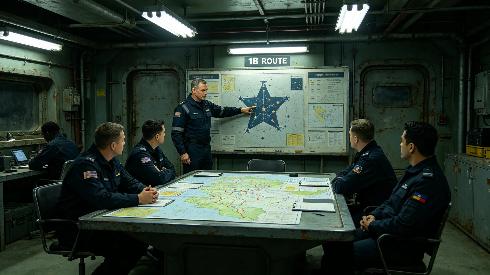

# 深空应急救援网跨系动员权限与响应分级制度建立公报

**发布机构**：联合体安全协调委员会与法律协调司
**发布日期**：3434年1月25日
**文件等级**：跨星系强制

## 一、制度背景

救援网第一代组网（见GS-3416-01）与归舟-12实战（见GS-3424-01）后，救援动员权限长期依赖护航编队应急指挥权（见GS-3346-01）。3433年一次疑似遇险误报暴露：跨系动员权不清，救援船出动与撤回均需多方协调。法律协调司提请建立救援动员分级制度。

## 二、响应分级

| 级别 | 定义 | 出动权限 | 指挥权 |
|---|---|---|---|
| 三级 | 疑似遇险，待核实 | 值班总队长 | 值班总队长 |
| 二级 | 确认遇险，无伤亡 | 值班总队长报处长 | 处长 |
| 一级 | 确认遇险，有伤亡风险 | 处长报安全协调委 | 安全协调委 |
| 特级 | 跨系大规模救援 | 安全协调委报议会 | 议会授权 |

## 三、动员权限

- 三级：值班总队长可直接出动单艘救援船，事后备案；
- 二级：须报处长批准，可动用一个母港资源；
- 一级：须报安全协调委员会，可跨母港调度；
- 特级：须议会授权，可动用护航编队协助。

## 四、与既有制度咬合

- 紧急状态指挥：GS-3346-01；
- 救援网组网：GS-3416-01；
- 归舟-12：GS-3424-01；
- 护航调度协同：GS-3408-01。

## 五、过渡期

3434年2月1日起施行。各母港须在3434年3月1日前完成动员权限演练。

## 六、附则

本制度不改变救援网独立于护航编队的定位。特级动员时，护航编队协助，救援指挥权仍归救援处。

## 五、3433年误报事件

3433年一次疑似遇险误报：一货船发出求救信号后中断，救援网按三级响应出动单艘船。2小时后发现为货船通信故障，非遇险。救援处注明：误报不丢人，丢人的是不敢出动。误报一次，比晚救一次强。

## 六、与3346紧急状态指挥的关系

GS-3346-01《跨星系紧急状态联动指挥权限制度》为总体框架，本公报为救援专项细化。两者不冲突：特级救援动员须同时触发紧急状态联动。

## 七、演练

3434年第二、三季度，救援网完成四次分级响应演练，其中一级演练2次、二级1次、三级1次。演练平均响应时间：三级12分钟、二级38分钟、一级42分钟。

## 八、分级响应演练记录

| 日期 | 级别 | 响应时间 | 评估 |
|---|---|---|---|
| 3434-04-12 | 三级 | 12分钟 | 合格 |
| 3434-05-20 | 二级 | 38分钟 | 合格 |
| 3434-06-15 | 一级 | 42分钟 | 合格 |
| 3434-09-08 | 三级 | 10分钟 | 合格 |

## 九、分级响应的指挥权

三级响应值班总队长可直接出动；二级须报处长；一级须报安全协调委；特级须议会授权。霍归航（见GS-3433-01）在制度签署时写："救援不是打仗，但救人也要有指挥。谁有权下命令，写在纸上。"

## 十、与3346紧急状态的关系

GS-3346-01《跨星系紧急状态联动指挥权限制度》为总体框架，本公报为救援专项。两者不冲突：特级救援须同时触发紧急状态联动。

## 九、演练记录

| 日期 | 级别 | 响应时间 |
|---|---|---|
| 3434-04 | 三级 | 12分钟 |
| 3434-05 | 二级 | 38分钟 |
| 3434-06 | 一级 | 42分钟 |

## 十、分级响应的意义

救援动员分级制度建立后，从疑似到实战，每一级有明确的出动权限。霍归航注明："救援不是打仗，但救人也要有指挥。"

## 十一、分级响应的社会意义

动员分级制度建立后，救援从疑似到实战每一级有明确权限。霍归航注明："救援不是打仗，但救人也要有指挥。"

## 十二、分级响应的演练

| 日期 | 级别 | 响应 |
|---|---|---|
| 3434-04 | 三级 | 12分钟 |
| 3434-05 | 二级 | 38分钟 |
| 3434-06 | 一级 | 42分钟 |

## 十三、分级响应的社会意义

动员分级制度建立后，从疑似到实战每一级有明确权限。霍归航注明："救援不是打仗，但救人也要有指挥。谁有权下命令，写在纸上。"

## 十四、分级响应演练

三次演练响应时间分别为十二分钟、三十八分钟、四十二分钟。霍归航注明：救援不是打仗但救人也要有指挥。

## 十五、演练记录

| 日期 | 级别 | 响应 |
|---|---|---|
| 3434-04 | 三级 | 12分钟 |
| 3434-05 | 二级 | 38分钟 |
| 3434-06 | 一级 | 42分钟 |

## 十六、分级响应指挥权

三级值班总队长可直接出动；二级须报处长；一级须报安全协调委；特级须议会授权。

## 十七、分级响应的社会意义

动员分级制度建立后从疑似到实战每一级有明确权限。霍归航注明：救援不是打仗但救人也要有指挥，谁有权下命令写在纸上。

## 十八、分级响应的历史意义

动员分级制度建立后救援从疑似到实战每一级有明确权限。霍归航注明：救援不是打仗但救人也要有指挥，谁有权下命令写在纸上。

## 十九、分级响应的社会意义

## 二十、分级响应的历史意义

动员分级制度建立后，从疑似到实战每一级有明确的出动权限。霍归航注明：救援不是打仗但救人也要有指挥，谁有权下命令写在纸上。
