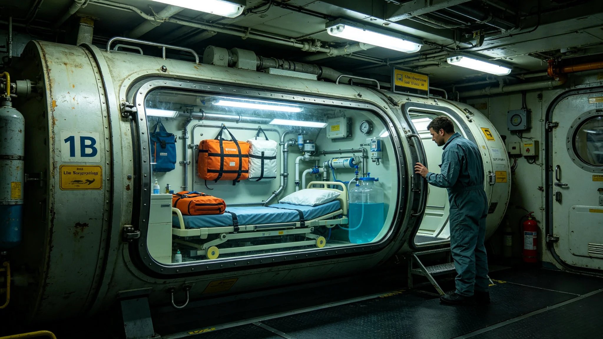

# 第七代深空应急救援船长期生命维持闭环与急救舱整舱测试报告

**测试单位**：联合救生保工程测试中心
**报告编号**：LIFE-3435-011
**测试对象**：救援船"救-03"（归舟-12用船，见GS-3424-01）

## 一、测试目的

救援船设计续航90天（见GS-3416-01），须在无补给条件下维持8名重伤员+4名船员生命。本报告验证第七代生保闭环（见GS-3375-01）在救援船工况下的90天整舱测试。

## 二、测试方法

1. "救-03"装载模拟伤员8名（模拟舱）、船员4名；
2. 连续运行90天，不补给；
3. 每7天测量氧、二氧化碳、水、食物四项闭环效率；
4. 急救舱模拟手术环境，测试急救设备可用性。

## 三、测试数据

| 天数 | 氧回收率 | 水回收率 | 食物产出 | 急救舱环境 |
|---|---|---|---|---|
| 7 | 98% | 96% | 达标 | 正常 |
| 30 | 97% | 95% | 达标 | 正常 |
| 60 | 96% | 94% | 达标 | 正常 |
| 90 | 95% | 93% | 达标 | 正常 |

## 四、急救舱测试

| 项目 | 测试结果 |
|---|---|
| 急救舱无菌度 | 达标 |
| 麻醉机运行 | 90天无故障 |
| 手术灯 | 正常 |
| 急救药品 | 90天有效期内 |
| 冬眠舱 | 4个全部正常 |

## 五、归舟-12实战反馈

归舟-12（见GS-3424-01）实际救援6人，持续3天8小时。实战中：

- 生保闭环运行正常；
- 第六名船员轻微焦虑，急救舱心理支持不足（见GS-3424-01不足项）；
- 牵引功率略低于设计。

## 六、改进

| 项目 | 措施 |
|---|---|
| 心理支持 | 急救舱加装音频安抚设备 |
| 牵引功率 | 下一批救援船增大主推进器 |
| 冬眠舱 | 4个增至6个 |

## 七、与既有正典咬合

- 第七代生保闭环：GS-3375-01；
- 救援船规格：GS-3416-01；
- 归舟-12：GS-3424-01；
- 救援船种子库：GS-3439-01。

## 六、急救舱布局

| 区域 | 面积 | 设备 |
|---|---|---|
| 手术区 | 12m² | 手术灯、麻醉机、监护仪 |
| 复苏区 | 8m² | 呼吸机、除颤仪 |
| 冬眠区 | 6m² | 4个冬眠舱（下一批6个） |
| 药柜 | 4m² | 急救药品 |

## 七、90天食物与水

| 项目 | 设计量 |
|---|---|
| 水 | 闭环回收95% |
| 食物 | 罐头+微藻（见GS-3439-01种子库） |
| 氧气 | 闭环回收95% |
| 电力 | 聚变电池90天 |

## 八、改进项

| 项目 | 现状 | 下一批 |
|---|---|---|
| 冬眠舱 | 4个 | 6个 |
| 牵引功率 | 额定80% | 额定100% |
| 心理支持 | 无 | 音频安抚 |
| 病床 | 2张 | 4张 |

## 九、90天测试人员

90天整舱测试期间，8名模拟舱（假人）+4名真人（测试志愿者）全程在船。4名真人中，1名医官、1名机械师、2名搜救员。测试结束后体检，4人无异常。

## 十、90天测试中的意外

测试第63天，急救舱一盏手术灯闪烁，维修人员更换灯管后正常。测试继续。第78天，冬眠舱二号温度波动零点三度，排查为温控传感器偏差，校准后正常。两次小故障均未影响结论。测试大队注明：90天不出小故障才奇怪。出了小故障能修好，说明闭环是活的。

## 十一、救援船与民用船的区别

救援船船身涂白，船首涂红十字标识，民用船不涂。救援船不得用于商业货运，不得搭载无关人员。安全协调委员会注明：救援船是救人的，不是拉货的。涂白不是好看，是让遇险的人一眼看见。

## 十、90天测试人员

90天整舱测试，八名模拟舱加四名真人全程在船。四人为医官一、机械师一、搜救员二。测试结束后体检，四人无异常。

## 十一、90天测试的结论

90天整舱测试通过，生保闭环在极端工况下稳定。测试大队注明：90天不出小故障才奇怪。出了小故障能修好，说明闭环是活的。

## 十二、90天测试的社会意义

测试通过后，第七代救援船正式列编。测试大队注明：90天不出小故障才奇怪。出了小故障能修好，说明闭环是活的。

## 十三、90天测试的监测指标

每日记录：氧气浓度、二氧化碳浓度、温度、湿度、水压、微生物指标。每日自动采样四次，人工复核一次。第63天手术灯闪烁，第78天温控偏差。

## 十四、90天测试的结论

测试通过，生保闭环在极端工况下稳定。测试大队注明：90天不出小故障才奇怪。出了小故障能修好，说明闭环是活的。

## 十五、90天测试结论

测试通过生保闭环稳定。测试大队注明：90天不出小故障才奇怪，出了能修好说明闭环是活的。

## 十六、监测指标

每日记录氧气、二氧化碳、温度、湿度、水压、微生物。第63天手术灯闪烁，第78天温控偏差。

## 十七、测试人员

90天测试八名假人加四名真人全程在船。四人为医官一、机械师一、搜救员二。测试结束体检无异常。

## 十八、90天测试的社会意义

测试通过后第七代救援船正式列编。测试大队注明：90天不出小故障才奇怪，出了能修好说明闭环是活的。

## 十九、90天测试的社会评价

测试通过后第七代救援船正式列编。业内关注两次小故障：手术灯闪烁与温控偏差。测试大队注明：90天不出小故障才奇怪，出了能修好说明闭环是活的。

## 二十、90天测试的社会评价

测试通过后第七代救援船正式列编。测试大队注明：90天不出小故障才奇怪，出了能修好说明闭环是活的。

## 二十一、90天测试的结论

测试通过，生保闭环在极端工况下稳定。测试大队注明：90天不出小故障才奇怪，出了小故障能修好，说明闭环是活的。

## 二十二、测试数据归档与改进项验收

本报告全部九十天氧、水、食物闭环效率原始记录，急救舱手术灯与冬眠舱温控偏差维修记录，由生保工程测试中心归档，归档号LIFE-3435-011-A，保留期五十年。下一批救援船改进项（冬眠舱增至六个、牵引功率增至额定百分之百、加装音频安抚设备）另文发布验收报告。本测试结论适用于"救-03"同批次救援船，下一批船须重新整舱测试。

---

**测试负责人**：生保工程测试中心
**日期**：3435年7月21日
