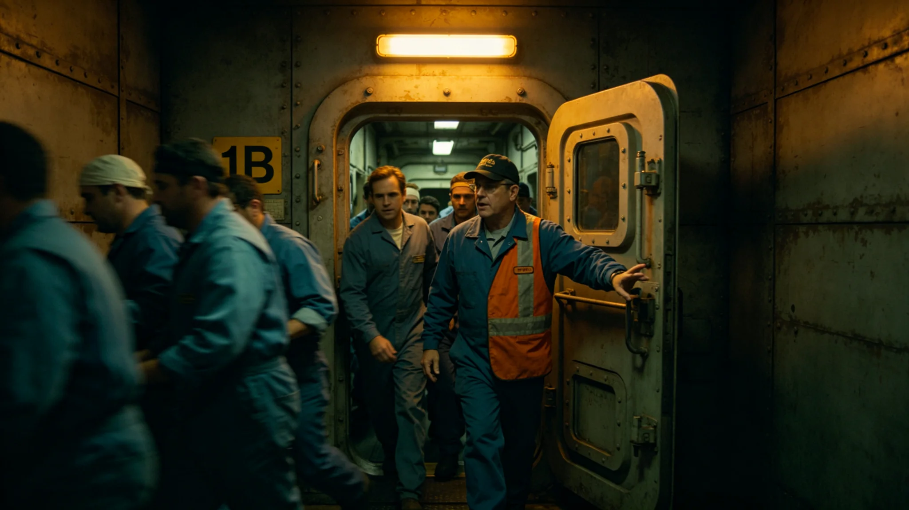

# 某中继港环控过滤床堵塞致全员限时撤离十二小时事件通报

**通报单位**：联合体深空基础设施维护总队安全科
**通报编号**：INC-3436-038
**事件等级**：三级（无伤亡、限时撤离、环控恢复）

## 一、事件经过

3436年9月12日，第四恒星系方向第二中继港环控主过滤床压差报警，读数超阈值3倍。港务AI判定为过滤床微生物膜堵塞（见GS-3415-01同类），二氧化碳浓度在40分钟内升至1.2%。港务长下令全员限时撤离至备用环控舱，撤离于45分钟内完成，共280人。12小时后过滤床更换完成，环控恢复，人员返回。

## 二、时间线

| 时刻 | 事件 |
|---|---|
| 08:12 | 过滤床压差报警 |
| 08:15 | 二氧化碳浓度0.8% |
| 08:30 | 港务长下令撤离 |
| 08:45 | 全员280人撤离至备用舱 |
| 09:00 | 主过滤床关闭，备用过滤床启动 |
| 12:00 | 更换过滤床 |
| 20:30 | 环控恢复，二氧化碳回落至0.4% |
| 20:45 | 人员返回 |

## 三、根因

1. **过滤床超期服役**：主过滤床自上次更换已运行420天，超过规程360天；
2. **巡检漏检**：月度巡检未测压差趋势，仅测绝对值；
3. **撤离演练**：本港半年内未演练撤离，实际撤离45分钟，比演练慢10分钟。

## 四、影响

| 项目 | 数据 |
|---|---|
| 撤离人数 | 280 |
| 撤离时长 | 45分钟 |
| 主港停摆 | 12小时 |
| 货柜滞留 | 42柜 |
| 人员伤亡 | 0 |
| 直接损失（万） | 180 |

## 五、整改

| 序号 | 措施 | 期限 |
|---|---|---|
| 1 | 全部中继港过滤床更换周期从360天缩短至300天 | 3436-10-01 |
| 2 | 巡检增加压差趋势项 | 即时 |
| 3 | 撤离演练每季度一次 | 3436-10-01 |
| 4 | 本港港务长书面检查 | 3436-09-25 |

## 六、与既有正典咬合

- 中继港扩容：GS-3403-01；
- 爬升舱微生物膜：GS-3415-01；
- 救援网：GS-3416-01；
- 桁架焊缝微裂：GS-3443-01。

## 五、撤离路线

| 路线 | 人数 | 时长 |
|---|---|---|
| 主气闸通道 | 180人 | 25分钟 |
| 备用通道 | 100人 | 20分钟 |
| 合计 | 280人 | 45分钟 |

## 六、环控系统

| 项目 | 参数 |
|---|---|
| 主过滤床 | 2台，一用一备 |
| 备用过滤床 | 1台 |
| 二氧化碳浓度报警阈值 | 1.0% |
| 人员撤离阈值 | 1.2% |

事件中二氧化碳浓度在40分钟内从0.4%升至1.2%，触发撤离。

## 七、与3443焊缝微裂的对比

3436年环控撤离（本批）为内部设施故障；3443年焊缝微裂（见GS-3443-01）为外部结构故障。两起事件根因不同，但都暴露巡检盲区。维护总队注明：港是个系统，里面外面都得看。

## 八、过滤床更换

事件后主过滤床更换为新型号，寿命从360天延长至420天。新过滤床在3437年第一季度装机，至3442年五年间无堵塞事件。维护总队注明：换个床，比修个床便宜。

## 九、撤离后的港务

环控恢复后，港务人员用四小时检查全部过滤床、通风管、监测仪。确认无残留风险后，才允许人员返回。280人在备用舱等待十二小时，期间备用舱维持基本饮食与氧气，无一人不适。维护总队注明：备用舱不是摆设，十二小时救了二百八十人。

## 十、过滤床更换

事件后主过滤床更换为新型号，寿命从三百六十天延长至四百二十天。新过滤床在3437年装机，至3442年五年间无堵塞。维护总队注明：换个床，比修个床便宜。

## 九、撤离路线

主气闸通道一百八十人，二十五分钟；备用通道一百人，二十分钟。合计二百八十人，四十五分钟。

## 十、撤离的教训

事件中撤离用时四十五分钟，比演练慢十分钟。维护总队注明：演练和真事不一样。真事，人会慌。下次演练，要按真事练。

## 十一、撤离事件的社会影响

事件后备用舱维持十二小时正常运转，280人无不适。维护总队注明：备用舱不是摆设，十二小时救了二百八十人。

## 十二、撤离后的恢复

环控恢复后，港务人员用四小时检查全部过滤床、通风管、监测仪。确认无残留风险后，280人返回。备用舱维持十二小时，无一人不适。

## 十三、撤离事件的教训

撤离用时四十五分钟，比演练慢十分钟。维护总队注明：演练和真事不一样。真事人会慌。下次演练要按真事练。

## 十四、撤离事件教训

撤离用时四十五分钟比演练慢十分钟。维护总队注明：演练和真事不一样，真事人会慌。

## 十五、恢复流程

环控恢复后四小时检查全部过滤床、通风管、监测仪。确认无残留风险后280人返回。

## 十六、撤离路线

主气闸通道一百八十人二十五分钟；备用通道一百人二十分钟。合计二百八十人四十五分钟。

## 十七、撤离事件的社会影响

## 十八、撤离事件的教训

撤离用时四十五分钟比演练慢十分钟。维护总队注明：演练和真事不一样，真事人会慌。下次演练要按真事练。

## 十九、撤离事件的教训

撤离用时四十五分钟比演练慢十分钟。维护总队注明：演练和真事不一样，真事人会慌，下次演练要按真事练。

## 二十、撤离后的港务

环控恢复后港务人员用四小时检查全部过滤床通风管监测仪。确认无残留风险后280人返回。备用舱维持十二小时无一人不适。

## 二十一、整改回访与档案归档

3437年3月，维护总队安全科对环控撤离事件整改进行回访：全部中继港过滤床更换周期已从三百六十天缩短至三百天，巡检增加压差趋势项，撤离演练每季度一次已完成两轮，本港港务长书面检查已归入个人绩效档案。回访期间第二中继港未再发生过滤床堵塞。本通报归档号INC-3436-038，撤离路线CCTV录像、二氧化碳浓度曲线、备用舱运转记录一并归档，保留期二十年。

---

**签发**：深空基础设施维护总队安全科
**日期**：3436年9月18日
