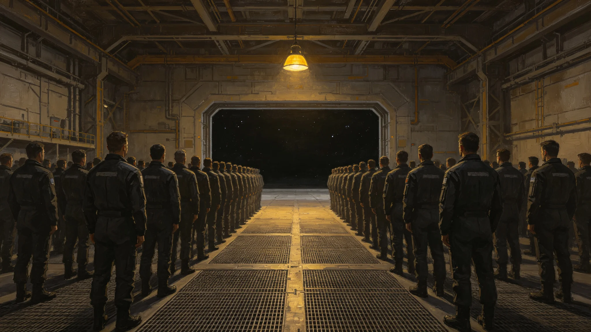

# 深空应急救援"归灯节"——遇险者获救周年遥祝仪式规程公报

**发布机构**：联合体安全协调委员会深空救援处与文化协调司
**发布日期**：3437年6月30日
**文件等级**：跨星系公开

## 一、设立缘由

3424年归舟-12（见GS-3424-01）6人全部生还。救援处提请将每年8月2日（归舟-12返港日）定为"归灯节"，遥祝历年被救者。

## 二、节日时间

每年8月2日。首个归灯节为3425年8月2日，已举行首祭。

## 三、仪式规程

**（一）点灯**

8月2日20:00，各救援母港桅杆上点亮一盏灯，灯光色为暖黄。点灯由当日值班救援员执行。

**（二）遥祝**

点灯毕，全体在场人员静默一分钟，遥祝历年被救者。不诵词，不讲话。

**（三）名册**

静默后，救援处公布本年度获救者名册（姓名、船名、救援编号），由当值值班总队长（见GS-3433-01）宣读。名册不公开，仅在仪式现场宣读。

## 四、参与范围

- 各救援母港为主祭场；
- 被救者自愿参加，不邀请；
- 不放假，不发补贴。

## 五、经费

首祭总支出约合星汇18万，其中灯具4万、名册刻印1万、其余为清洁。救援处注明：一个节花18万，比一次空驶（见GS-3408-01）便宜。

## 六、与既有节日关系

- 归灯节不替代复航节（见GS-3335-01）；
- 归灯节为救援行业节日，与准点节（调度）、缆道点灯（电梯）、秒级日（通信）并列。

## 四、名册宣读

归灯节静默后宣读的名册，包括归舟-12（见GS-3424-01）6人、3416—3436年间其他救援行动12人，共18人。名册不公开，仅在仪式现场宣读。霍归航（见GS-3433-01）在首祭上宣读时，语速比平时慢一倍。

## 五、灯光

归灯节灯光色为暖黄，功率40瓦，安装于各救援母港桅杆。灯光常亮至次日06:00，之后熄灭。不频闪、不闪烁。救援处注明：灯是给人看的，不是给星星看的。

## 六、与3335复航节的区别

复航节（见GS-3335-01）纪念警戒解除、航道恢复；归灯节纪念被救者生还。两个节日不合并、不替代。

## 七、归灯节灯光规格

| 项目 | 参数 |
|---|---|
| 灯光色 | 暖黄 |
| 功率 | 40瓦 |
| 位置 | 各救援母港桅杆 |
| 亮灯时间 | 20:00—次日06:00 |
| 频率 | 每年一次，8月2日 |

## 八、归灯节不诵词

与准点节（见GS-3405-01）、秒级日（见GS-3421-01）不同，归灯节不诵词、不讲话，只静默一分钟。救援处注明：获救的人不需要被歌颂。静默一分钟，够了。说多了，反而轻。

## 九、归灯节的灯光不灭

归灯节灯光亮至次日06:00。若次日有新的救援行动，灯光保持常亮至救援结束。3437年首祭后，3438年一次救援行动中，归灯节灯光提前亮起，救援处注明：灯不是节日的，是人的。

## 八、名册宣读

归灯节静默后宣读名册，包括归舟-12六人及历年救援十二人，共十八人。名册不公开，仅在仪式现场宣读。

## 九、归灯节的静默

归灯节不诵词、不讲话，只静默一分钟。救援处注明：获救的人不需要被歌颂。静默一分钟，够了。说多了反而轻。

## 十、归灯节的延续

归灯节自3437年首祭后，每年8月2日举行。若当年无新救援行动，灯光仍亮。救援处注明：灯不是节日的，是人的。

## 十一、归灯节的灯光

| 项目 | 参数 |
|---|---|
| 色 | 暖黄 |
| 功率 | 40瓦 |
| 亮灯 | 20:00—06:00 |
| 频率 | 每年8月2日 |

## 十二、归灯节的静默

归灯节不诵词不讲话，只静默一分钟。救援处注明：获救的人不需要被歌颂。静默一分钟，够了。说多了反而轻。

## 十三、归灯节的静默

不诵词不讲话只静默一分钟。救援处注明：获救的人不需要被歌颂，静默一分钟够了。

## 十四、灯光参数

| 项目 | 参数 |
|---|---|
| 色 | 暖黄 |
| 功率 | 40瓦 |
| 时间 | 20:00—06:00 |

## 十五、名册宣读

静默后宣读名册，包括归舟-12六人及历年救援十二人，共十八人。名册不公开。

## 十六、归灯节的静默

不诵词不讲话只静默一分钟。救援处注明：获救的人不需要被歌颂，静默一分钟够了，说多了反而轻。

## 十七、归灯节的延续

归灯节自3437年首祭后每年8月2日举行。若当年有新救援行动灯光保持常亮至救援结束。救援处注明：灯不是节日的是人的。

## 十八、归灯节的延续

## 十九、归灯节的静默

归灯节不诵词不讲话只静默一分钟。救援处注明：获救的人不需要被歌颂，静默一分钟够了，说多了反而轻。

## 二十、归灯节的延续

归灯节自3437年首祭后每年8月2日举行。若当年无新救援行动灯光仍亮。救援处注明：灯不是节日的是人的。

## 二十一、归灯节的灯光

| 项目 | 参数 |
|---|---|
| 色 | 暖黄 |
| 功率 | 40瓦 |
| 亮灯 | 20:00—06:00 |
| 频率 | 每年8月2日 |

救援处注明：灯光不亮不暗，正好让人在漆黑的深空里看见。

## 二十二、归灯节的名册

静默后宣读名册，包括归舟-12六人及历年救援十二人，共十八人。名册不公开，仅在仪式现场宣读。救援处注明：名字不刻碑，在人心里。
