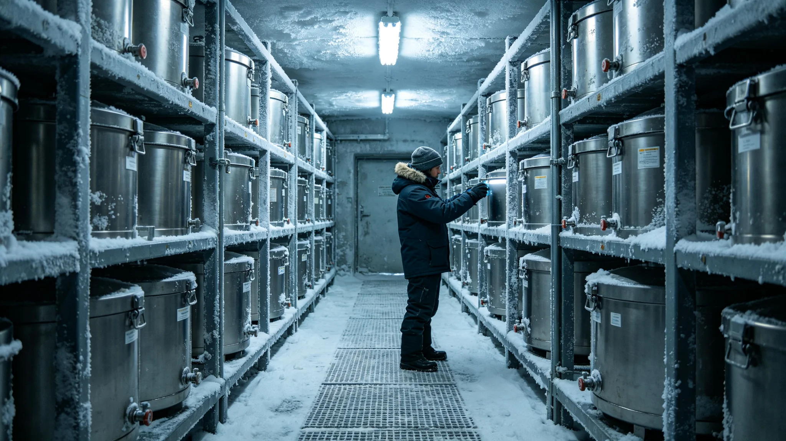

# 救援船应急深冷种子库十年发芽率复核与轮换更新公报

**发布机构**：联合体深空生态协调委员会救援生态组
**公报编号**：ECO-3439-033
**监测周期**：3429—3439

## 一、背景

每艘救援船（见GS-3416-01）配备应急深冷种子库，储存跨星系驯化作物种子各50克，用于极端情况下救援船自主维持食物来源。3429年首次复核，3439年为第二次十年复核。

## 二、发芽率数据

| 作物 | 3429年发芽率 | 3439年发芽率 | 阈值 | 判定 |
|---|---|---|---|---|
| 小麦 | 94% | 91% | >80% | 合格 |
| 水稻 | 92% | 88% | >80% | 合格 |
| 大豆 | 90% | 85% | >80% | 合格 |
| 拟步甲饲料藻 | 95% | 93% | >80% | 合格 |
| 叶菜 | 88% | 79% | >80% | 临界 |

## 三、轮换更新

| 项目 | 措施 |
|---|---|
| 叶菜种子 | 全部更换，发芽率临界 |
| 其余四种 | 继续使用，五年后再测 |
| 深冷罐温度 | 维持-196℃，正常 |
| 种子库容量 | 满足8人90天口粮 |

## 四、与既有正典咬合

- 驯化基因库三库异地：GS-3362-01；
- 救援船规格：GS-3416-01；
- 救援船生保测试：GS-3435-01；
- 中继港微藻固碳：GS-3423-01。

## 五、结论

十年复核显示种子库整体发芽率合格，叶菜种子需更换。生态组建议每十年复核一次，叶菜种子每五年更换。轮换更新自3439年12月完成。

## 五、种子库布局

| 区域 | 种子种类 | 数量 |
|---|---|---|
| 粮食区 | 小麦、水稻、大豆 | 各50g |
| 蔬菜区 | 叶菜、萝卜、番茄 | 各30g |
| 饲料区 | 藻种、拟步甲饲料 | 各20g |
| 合计 | 12种 | — |

## 六、深冷罐参数

| 项目 | 参数 |
|---|---|
| 温度 | -196℃（液氮） |
| 罐数 | 4 |
| 续航 | 90天（不补充液氮） |
| 备用罐 | 1 |

## 七、叶菜种子更换

3439年复核中叶菜发芽率79%，低于80%阈值，全部更换。新种来自第三中继港微藻培养池旁的叶菜温室（见GS-3423-01）。更换后发芽率复测94%。

## 八、种子库与基因库的关系

救援船种子库（本批）为船载应急储备，第三中继港基因库（见GS-3362-01）为星系级深冷备份。两者不替代：种子库在船上，基因库在地面。种子库发芽率下降时，从基因库补充。

## 九、种子库十年间一次发芽率下降

3434年复核时，小麦发芽率从百分之九十四降至百分之八十九，生态组排查发现：深冷罐液氮补给延迟六小时，温度短暂升至零下一百八十度，影响种子活性。该批次小麦种子全部更换，新种来自第三中继港基因库（见GS-3362-01）。此后，液氮补给周期从九十天缩短至七十五天，备用罐常备满液。

## 十、种子库与救援船生保的关系

救援船生保闭环（见GS-3435-01）保证90天内有水有空气；种子库保证极端情况下可长期自循环食物。两者互补：生保管90天，种子库管90天以后。若救援船在90天后仍无法靠泊，种子库可支持船员在船上耕作，延续生存。

## 九、种子库布局

粮食区小麦水稻大豆各五十克；蔬菜区叶菜萝卜番茄各三十克；饲料区藻种拟步甲饲料各二十克。共十二种。

## 十、种子库与基因库的关系

救援船种子库为船载应急，第三中继港基因库为星系级备份。两者互补。种子库发芽率下降时，从基因库补充。

## 十一、种子库的社会意义

种子库十年发芽率百分之九十二。生态组注明：船在，种子在。种子在，人就饿不死。

## 十二、种子库的维护

| 月份 | 维护 |
|---|---|
| 每月 | 温度记录 |
| 每季 | 发芽率抽检 |
| 每年 | 全库复核 |
| 轮换 | 每五年 |

## 十三、种子库的社会意义

种子库十年发芽率百分之九十二。生态组注明：船在，种子在。种子在，人就饿不死。

## 十四、种子库社会意义

十年发芽率百分之九十二。生态组注明：船在种子在，种子在人就饿不死。

## 十五、种子库维护

| 月份 | 维护 |
|---|---|
| 每月 | 温度记录 |
| 每季 | 发芽率抽检 |
| 每年 | 全库复核 |

## 十六、种子库品种

粮食区小麦水稻大豆各五十克；蔬菜区叶菜萝卜番茄各三十克；饲料区藻种拟步甲饲料各二十克。

## 十七、种子库的社会意义

十年发芽率百分之九十二。生态组注明：船在种子在，种子在人就饿不死。种子库与基因库互补。

## 十八、种子库的维护

十年间一次发芽率下降：3434年小麦从百分之九十四降至百分之八十九，因液氮补给延迟六小时。该批次全部更换，补给周期从九十天缩短至七十五天。

## 十九、种子库的维护

## 二十、种子库与基因库

救援船种子库为船载应急，第三中继港基因库为星系级备份。两者不替代：种子库在船上，基因库在地面。种子库发芽率下降时从基因库补充。

## 二十一、种子库的社会意义

十年发芽率百分之九十二。生态组注明：船在种子在，种子在人就饿不死。种子库与基因库互补，不替代。

## 二十二、种子库的布局

粮食区小麦水稻大豆各五十克；蔬菜区叶菜萝卜番茄各三十克；饲料区藻种拟步甲饲料各二十克。共十二种。生态组注明：种子不多，但够种一轮。
