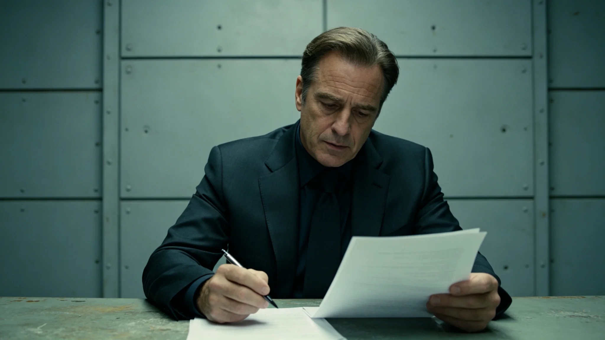

# 跨星系货运调度AI伦理审查首任人类签批员柯守正考勤与驳回记录档案

**归档单位**：联合体航道调度总署伦理审查科人事档案科
**档案件**：人事字第3440-022号

## 一、履历摘要

柯守正，男，3359年生，第三恒星系方向第二代。3382年入职调度总署任见习调度员；3395年转调度AI算法组；3404年误判事件（见GS-3404-01）后，调度总署设伦理审查人类签批员岗，柯守正为首任。

## 二、考勤记录

| 年度 | 应到 | 实到 | 夜班 | 驳回件数 |
|---|---|---|---|---|
| 3404 | 308 | 308 | 60 | 12 |
| 3410 | 304 | 304 | 48 | 28 |
| 3420 | 302 | 302 | 36 | 35 |
| 3430 | 300 | 300 | 24 | 41 |
| 3439 | 300 | 299 | 18 | 38 |

## 三、驳回记录

柯守正任内（3404—3439）累计审查调度AI"衡陆"建议14,200条，其中：

| 类别 | 条数 | 占比 |
|---|---|---|
| 正常通过 | 13,890 | 97.8% |
| 驳回后AI修改再通过 | 285 | 2.0% |
| 驳回后人工改判 | 25 | 0.2% |

## 四、典型驳回

- 3405-04-11：AI将一柜危险品（见GS-3426-01）错挂戊级，柯守正驳回，改判丙级；
- 3412-09-02：AI建议爬升车（见GS-3412-01）降速后立即复航，柯守正驳回，要求先查摩擦衬块；
- 3428-12-05：AI对锁扣松脱（见GS-3428-01）建议仅回收不通报，柯守正驳回，要求全批次检查。

## 五、体检与处分

| 年度 | 视力 | 颈椎 |
|---|---|---|
| 3410 | 1.0/0.9 | 正常 |
| 3420 | 0.9/0.8 | 轻度 |
| 3430 | 0.8/0.7 | 中度 |

柯守正任内无处分。3404—3439年累计请假8天，无迟到早退。

## 六、签名

档案袋附柯守正签批件五张，均无涂改。调度总署注明：他签得慢，但签得稳。

## 七、交接

3440年柯守正任满，签署交接清单，第三项原文："AI不会认错。人替它认错。人也别替它甩锅。"

## 五、3404年误判与柯守正的关系

3404年调度AI误判（见GS-3404-01）中，当班值班主任签认流于形式。事件后，调度总署设伦理审查人类签批员岗，柯守正为首任。他的工作不是"批准AI"，而是"在AI出错前看见它"。

## 六、签批流程

| 步骤 | 内容 | 时限 |
|---|---|---|
| 1 | AI提交建议 | — |
| 2 | 柯守正审查原始标签与偏差概率 | 15分钟 |
| 3 | 通过或驳回 | — |
| 4 | 记录签批理由 | 书面 |

## 七、3450年旺季压港的遗憾

3450年旺季压港（见GS-3450-01）前，柯守正在10月20日审查时未对旺季预测偏差提出异议。事后他在交接清单中写："AI按均值预测，我按习惯签字。这一次，我没拦住。"这是他三十年间唯一一次"该拦未拦"。

## 八、柯守正的三十年

柯守正3404—3440年任伦理签批员，共36年。他签批AI建议14,200条，驳回285条。他在退休交接清单中写："AI不会认错。人替它认错。人也别替它甩锅。"

## 九、柯守正的签批哲学

柯守正在签批AI建议时，不看数字看原图。他要求C级以上建议必须附货柜原始标签截图。他在培训中说："AI给你看的结论，是它想让你看的。原图是货柜自己说的。看图，别看AI。"

## 十、3450年压港的遗憾

3450年旺季压港（见GS-3450-01）前，柯守正在10月20日审查时未对旺季预测偏差提出异议。事后他在交接清单中写："AI按均值预测，我按习惯签字。这一次，我没拦住。"这是他三十六年签批生涯中唯一一次"该拦未拦"。

## 九、签批流程

| 步骤 | 内容 | 时限 |
|---|---|---|
| 1 | AI提交建议 | — |
| 2 | 审查原图与偏差概率 | 15分钟 |
| 3 | 通过或驳回 | — |
| 4 | 记录理由 | 书面 |

## 十、柯守正的签批哲学

柯守正不看数字看原图。他说："AI给你看的结论是它想让你看的。原图是货柜自己说的。看图，别看AI。"

## 十一、柯守正的签批哲学

柯守正不看数字看原图。他说："AI给你看的结论是它想让你看的。原图是货柜自己说的。看图，别看AI。"

## 十二、柯守正的驳回记录

36年签批一万四千二百条，驳回二百八十五条。驳回原因：原图不清、偏差概率超阈值、优先级存疑。

## 十三、柯守正的签批哲学

柯守正不看数字看原图。他说："AI给你看的结论是它想让你看的。原图是货柜自己说的。看图，别看AI。"

## 十四、柯守正签批哲学

柯守正不看数字看原图。他说：AI给你看的结论是它想让你看的，原图是货柜自己说的。

## 十五、驳回原因

驳回二百八十五条，原因：原图不清、偏差概率超阈值、优先级存疑。柯守正不看数字看原图。

## 十六、签批流程

| 步骤 | 内容 |
|---|---|
| 1 | AI提交 |
| 2 | 审查原图 |
| 3 | 通过或驳回 |
| 4 | 记录理由 |

## 十七、柯守正的签批哲学

柯守正不看数字看原图。他说：AI给你看的结论是它想让你看的，原图是货柜自己说的。看图别看AI。

## 十八、柯守正的三十年

柯守正3404至3440年任签批员共三十六年。签批AI建议一万四千二百条，驳回二百八十五条。他在退休交接清单中写：AI不会认错，人替它认错，人也别替它甩锅。

## 十九、柯守正的三十年

## 二十、柯守正的签批哲学

柯守正不看数字看原图。他说：AI给你看的结论是它想让你看的，原图是货柜自己说的。看图别看AI。36年签批一万四千二百条驳回二百八十五条。

## 二十一、柯守正的三十年

36年签批一万四千二百条驳回二百八十五条。他在退休交接清单中写：AI不会认错，人替它认错，人也别替它甩锅。
