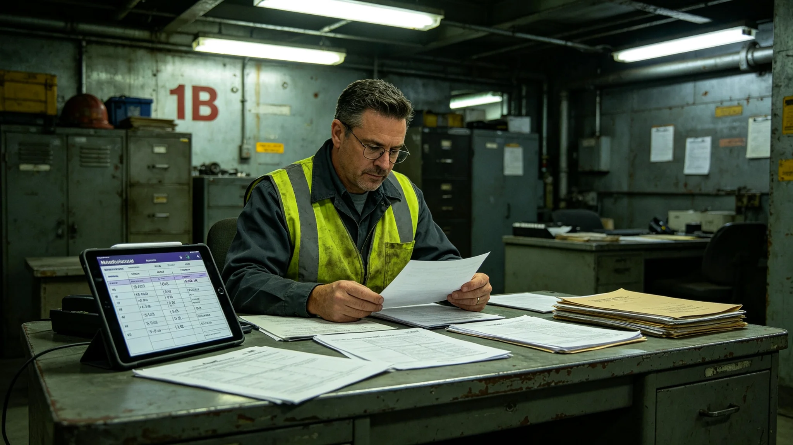

# 第三代基础设施维护外包与跨系维保责任连带制度修订公报

**发布机构**：联合体法律协调司与深空基础设施维护总队
**发布日期**：3441年5月30日
**文件等级**：跨星系强制

## 一、修订背景

第三代基础设施（中继港第三代扩容，见GS-3403-01；轨道电梯第三条缆道，见GS-3413-01；救援网，见GS-3416-01）运行十年来，维护工作部分外包给第三方服务商。3428年货柜锁扣松脱（见GS-3428-01）与3436年环控撤离（见GS-3436-01）两起事件后，外包责任划分不清暴露。法律协调司提请修订。

## 二、责任划分

| 维护类型 | 责任方 | 连带 |
|---|---|---|
| 主结构（桁架、缆道、对接口） | 总队自有维护段 | 无外包 |
| 次结构（过滤床、灯具、管线） | 外包服务商 | 总队监督，服务商连带 |
| 设备（调度AI、救援船、货柜） | 制造商+服务商 | 双方连带 |
| 紧急维修 | 总队自有队 | 服务商协助，不连带 |

## 三、连带条款

- 外包服务商须购买维保责任险，保额不低于单次事故预估损失；
- 事故发生后，总队与服务商在30日内完成责任划分，争议提交法律协调司；
- 服务商资质每年复审一次，不合格者出局。

## 四、与既有制度咬合

- 自复制产能调配：GS-3290-01；
- 中继港扩容：GS-3403-01；
- 锁扣松脱：GS-3428-01；
- 环控撤离：GS-3436-01；
- 桁架焊缝微裂：GS-3443-01。

## 五、过渡期

3441年6月15日起施行。全部外包合同须在3441年12月31日前按新责任划分重签。

## 五、外包服务商资质

| 资质要求 | 标准 |
|---|---|
| 维保责任险 | 保额≥单次事故预估损失 |
| 技术人员持证率 | 100% |
| 历史事故率 | <年均0.5起 |
| 数据保密协议 | 签署 |

## 六、争议处理流程

| 步骤 | 时限 |
|---|---|
| 事故后总队与服务商协商 | 30天 |
| 争议提交法律协调司 | 60天 |
| 法律协调司终裁 | 90天 |

## 七、与3428锁扣松脱的关系

3428年锁扣松脱（见GS-3428-01）中，货柜制造商与外包维保服务商责任划分争议三个月。本制度修订后，此类争议须在30天内协商，90天内终裁。

## 八、外包与自有队的边界

主结构（桁架、缆道、对接口）由总队自有队维护，不外包。次结构（过滤床、灯具、管线）可外包。紧急维修由自有队执行，服务商协助。维护总队注明：关键的自己干，次要的别人干，出事了自己先上。

## 九、外包与自有队的成本对比

| 项目 | 自有队 | 外包 |
|---|---|---|
| 人工成本 | 基准 | 降20% |
| 事故率 | 0.3起/年 | 0.8起/年 |
| 响应时间 | 2小时 | 8小时 |

主结构用自有队，次结构用外包。维护总队注明：省钱的地方省，要命的地方不能省。

## 九、外包与自有成本

| 项目 | 自有 | 外包 |
|---|---|---|
| 人工 | 基准 | 降20% |
| 事故率 | 0.3起/年 | 0.8起/年 |
| 响应 | 2小时 | 8小时 |

## 十、外包责任的意义

维保责任连带制度建立后，外包商须买责任险。法律协调司注明：外包不是甩锅，是分担。出事了，谁的锅谁背。

## 十一、外包责任的社会影响

维保责任连带制度建立后，外包商须买责任险。法律协调司注明：外包不是甩锅，是分担。出事了谁的锅谁背。

## 十二、外包合同要点

| 条款 | 内容 |
|---|---|
| 责任连带 | 外包商与总队连带 |
| 责任险 | 必购 |
| 响应 | 主结构2小时 |
| 考核 | 年度 |

## 十三、外包责任的社会影响

维保责任连带制度建立后，外包商须买责任险。法律协调司注明：外包不是甩锅，是分担。出事了谁的锅谁背。

## 十四、外包责任社会影响

外包商须买责任险。法律协调司注明：外包不是甩锅是分担，出事了谁的锅谁背。

## 十五、外包条款

| 条款 | 内容 |
|---|---|
| 责任连带 | 外包商与总队连带 |
| 责任险 | 必购 |
| 响应 | 主结构2小时 |

## 十六、主结构不外包

主结构桁架缆道对接口由总队自有队维护不外包。次结构可外包。紧急维修由自有队执行。

## 十七、外包责任的社会影响

维保责任连带制度建立后外包商须买责任险。法律协调司注明：外包不是甩锅是分担，出事了谁的锅谁背。

## 十八、外包责任的执行

维保责任连带制度建立后外包商须买责任险。主结构用自有队，次结构用外包。紧急维修由自有队执行，服务商协助。维护总队注明：关键的自己干，次要的别人干，出事了自己先上。

## 十九、外包责任的执行

维保责任连带制度建立后外包商须买责任险。主结构用自有队次结构用外包。紧急维修由自有队执行服务商协助。维护总队注明：关键的自己干，次要的别人干，出事了自己先上。

## 二十、外包责任的社会影响

维保责任连带制度建立后外包商须买责任险。法律协调司注明：外包不是甩锅是分担，出事了谁的锅谁背。

## 二十一、外包责任的执行

主结构用自有队，次结构可外包。紧急维修由自有队执行。维护总队注明：关键的自己干，次要的别人干，出事了自己先上。

## 二十二、外包与自有成本对比

| 项目 | 自有 | 外包 |
|---|---|---|
| 人工 | 基准 | 降20% |
| 事故率 | 0.3起/年 | 0.8起/年 |
| 响应 | 2小时 | 8小时 |

## 二十三、维保责任制度执行监督与归档

本制度施行后，法律协调司与维护总队每半年联合出具一次外包责任执行通报，内容包括外包商责任险投保率、事故责任划分平均天数、服务商资质复审合格率，报送安全协调委员会备查。通报归档号LAW-3441-006，跨星系公开，保留期二十年。若某外包商连续两次半年复审中事故率超过年均零点五起，出局。全部外包合同重签须在3441年底前完成，逾期未重签者暂停维保。

---

**签发**：法律协调司司长
**会签**：深空基础设施维护总队长
**日期**：3441年5月30日
