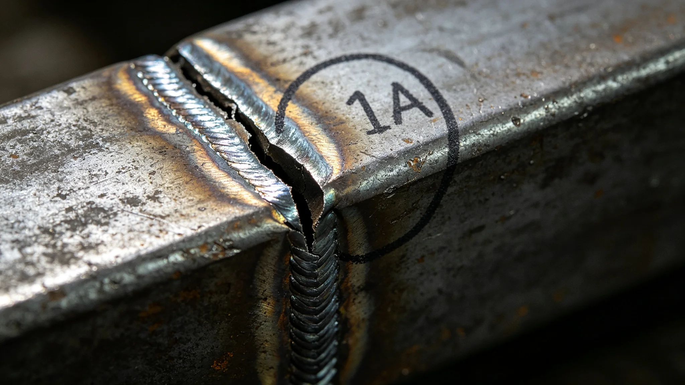

# 某中继港外部桁架焊缝微裂触发限航与就近转移货柜事件通报

**通报单位**：联合体深空基础设施维护总队安全科
**通报编号**：INC-3443-045
**事件等级**：四级（无伤亡、限航、货柜转移）

## 一、事件经过

3443年10月20日，第三中继港外部桁架例行巡检中，巡检员在主桁架东侧悬臂B-17节点发现一条焊缝微裂，长2.3毫米。3442年复测（见GS-3442-01）中该节点未列入重点监测。维护总队接报后，立即下令B-17节点附近两组对接口（D11、D12，见GS-3403-01）限航，将在泊货柜就近转移至D8、D9。10月22日完成货柜转移，10月25日完成焊缝补焊，限航解除。

## 二、时间线

| 时刻 | 事件 |
|---|---|
| 10-20 09:14 | 巡检发现微裂2.3mm |
| 10-20 09:30 | 下令D11、D12限航 |
| 10-20 10:00 | 货柜转移开始 |
| 10-22 18:00 | 28柜全部转移至D8、D9 |
| 10-23 08:00 | 焊缝补焊 |
| 10-25 16:00 | 补焊完成，探伤合格 |
| 10-25 18:00 | 限航解除 |

## 三、根因

1. **微裂漏检**：3442年复测（见GS-3442-01）抽检20节点未含B-17；
2. **焊接残余应力**：该节点3403年扩容焊接时温降曲线偏差（见GS-3403-01），残余应力偏高；
3. **巡检周期**：例行巡检每年一次，微裂在一年内扩展至2.3mm。

## 四、影响

| 项目 | 数据 |
|---|---|
| 限航对接口 | D11、D12 |
| 转移货柜 | 28柜 |
| 停摆时长 | 5天 |
| 人员伤亡 | 0 |
| 直接损失（万） | 90 |

## 五、整改

| 序号 | 措施 | 期限 |
|---|---|---|
| 1 | 全部桁架节点纳入年度抽检，不再抽样 | 3444-01-01 |
| 2 | B-17类节点每月巡检一次 | 即时 |
| 3 | 焊接残余应力普查 | 3444-06-30 |
| 4 | 本港巡检员书面检查 | 3443-11-05 |

## 六、与既有正典咬合

- 中继港扩容：GS-3403-01；
- 桁架疲劳复测：GS-3442-01；
- 维保责任：GS-3441-01；
- 环控撤离：GS-3436-01。

## 五、补焊工艺

| 项目 | 参数 |
|---|---|
| 焊条 | 镍基合金 |
| 层间温度 | <200℃ |
| 焊后热处理 | 300℃保温4小时 |
| 探伤 | 超声+渗透 |

## 六、限航期间货柜流向

| 原对接口 | 货柜数 | 转移至 |
|---|---|---|
| D11 | 14柜 | D8 |
| D12 | 14柜 | D9 |
| 合计 | 28柜 | — |

## 七、与3403公差测试的关系

D11、D12对接口在3403年公差测试（见GS-3403-01）中已因超限校正。3443年限航事件中，同一组对接口因桁架焊缝微裂再次限航。维护总队注明：这组对接口不省心。

## 八、事件后的巡检改革

事件后，全部桁架节点从"抽样20个"改为"全查"。巡检员从4人增至12人。巡检周期从年度改为半年度。维护总队注明：B-17漏检一次，代价是5天限航、180万。下次不漏。

## 九、B-17节点的前世今生

B-17节点位于主桁架东侧悬臂，3240年代焊接，3403年扩容时曾受一次微流星擦击（见GS-3403-01），当时未标记。3442年复测中，B-17焊缝裂纹率百分之一点二，判为合格。3443年巡检发现微裂二点三毫米。维护总队注明：一个节点，三次事件——擦击、复测合格、微裂限航。它不是突然坏的，是一点点坏的。

## 十、事件对巡检制度的改变

事件后，巡检员从四人增至十二人，巡检周期从年度改为半年度。巡检员出舱时间从每年四千小时增至每年一万二千小时。维护总队注明：人多了，贵了，但比一次限航便宜。

## 九、补焊工艺

焊条镍基合金，层间温度低于二百摄氏度，焊后三百摄氏度保温四小时，超声加渗透探伤。

## 十、事件后的巡检改革

巡检员从四人增至十二人，周期从年度改为半年度。维护总队注明：人多了贵了，但比一次限航便宜。

## 十一、焊缝微裂的教训

B-17节点从擦击到微裂，历时六十年。维护总队注明：它不是突然坏的，是一点点坏的。巡检就是盯着那"一点点"。

## 十二、补焊工艺

焊条镍基合金，层间温度低于二百摄氏度，焊后三百摄氏度保温四小时，超声加渗透探伤。补焊后复检合格。

## 十三、焊缝微裂的教训

B-17从擦击到微裂历时六十年。维护总队注明：它不是突然坏的，是一点点坏的。巡检就是盯着那一点点。

## 十四、焊缝微裂教训

B-17从擦击到微裂历时六十年。维护总队注明：它不是突然坏的是一点点坏的，巡检就是盯着那一点点。

## 十五、补焊工艺

焊条镍基合金，层间温度低于二百摄氏度，焊后三百摄氏度保温四小时，超声加渗透探伤。

## 十六、事件后巡检改革

巡检员从四人增至十二人，周期从年度改为半年度。出舱时间从四千小时增至一万二千小时。

## 十七、焊缝微裂的教训

B-17从擦击到微裂历时六十年。维护总队注明：它不是突然坏的是一点点坏的，巡检就是盯着那一点点。

## 十八、事件后的巡检改革

巡检员从四人增至十二人，周期从年度改为半年度，出舱时间从四千小时增至一万二千小时。维护总队注明：人多了贵了，但比一次限航便宜。

## 十九、事件后的巡检改革

## 二十、焊缝微裂的教训

B-17从擦击到微裂历时六十年。维护总队注明：它不是突然坏的是一点点坏的，巡检就是盯着那一点点。

## 二十一、事件后的巡检改革

巡检员从四人增至十二人，周期从年度改为半年度。维护总队注明：人多了贵了，但比一次限航便宜。

### 补记

补焊工艺：焊条镍基合金，层间温度低于二百摄氏度，焊后保温四小时，超声加渗透探伤。

## 二十二、整改回访与档案归档

3444年6月，维护总队安全科对焊缝微裂事件整改进行回访：全部桁架节点已从抽样改为全查，巡检员从四人增至十二人，B-17类节点每月巡检一次已完成两轮，焊接残余应力普查完成。回访期间未再发现新微裂。本通报归档号INC-3443-045，B-17节点焊缝补焊前后探伤照片、巡检员书面检查、货柜转移记录一并归档，保留期二十年。

---

**签发**：深空基础设施维护总队安全科
**日期**：3443年10月30日
