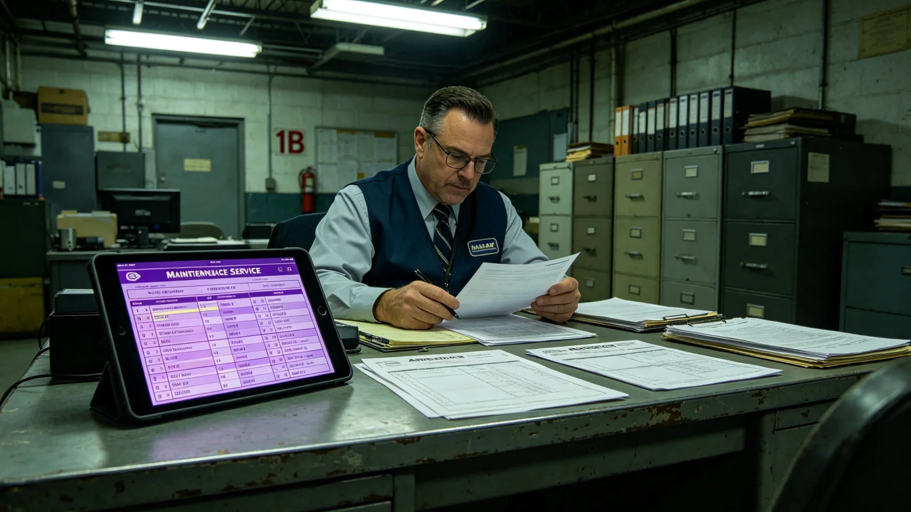

# 第三代基础设施全寿命维护服务产业链年度决算报告

**编制单位**：联合体经济协调司基础设施产业科
**报告编号**：ECO-3445-073
**结算周期**：3444年7月—3445年6月

## 一、产业范围

第三代基础设施全寿命维护产业，指为中继港、轨道电梯、救援船、光际通信网提供定期巡检、故障维修、部件更换、寿命评估的市场服务。

## 二、交易总额

| 项目 | 金额（万） | 占比 |
|---|---|---|
| 中继港维护 | 4,200 | 38% |
| 轨道电梯维护 | 2,800 | 25% |
| 救援船维护 | 1,500 | 14% |
| 光际通信网维护 | 1,200 | 11% |
| 货柜与接口维护 | 800 | 7% |
| 其他 | 600 | 5% |
| 合计 | 11,100 | 100% |

## 三、成本与利润

| 项目 | 金额（万） |
|---|---|
| 总营收 | 11,100 |
| 人工 | 4,200 |
| 备件 | 2,800 |
| 设备折旧 | 1,200 |
| 总利润 | 2,900 |
| 利润率 | 26% |

## 四、主要服务商

| 服务商 | 市占率 | 主营方向 | 年营收（万） |
|---|---|---|---|
| 衡陆维保 | 24% | 中继港主结构巡检 | 2,664 |
| 闻氏缆道 | 18% | 轨道电梯缆道与爬升车 | 1,998 |
| 远禾救船 | 12% | 救援船生保与急救舱 | 1,332 |
| 听澜通信 | 9% | 光际通信网节点 | 999 |
| 其余十一家 | 37% | 综合 | 4,107 |
| 合计 | 100% | — | 11,100 |

## 五、人员与岗位

| 岗位 | 人数 | 年均薪酬（万） |
|---|---|---|
| 巡检工程师 | 1,200 | 4.8 |
| 维修技工 | 1,800 | 3.6 |
| 出舱作业员 | 420 | 6.2 |
| 检测与数据 | 680 | 4.2 |
| 项目管理 | 320 | 5.4 |
| 合计 | 4,420 | — |

## 六、与上年对比

| 指标 | 3443—3444 | 3444—3445 |
|---|---|---|
| 总营收（万） | 9,800 | 11,100 |
| 中继港维护占比 | 40% | 38% |
| 轨道电梯维护占比 | 23% | 25% |
| 利润率 | 24% | 26% |
| 出舱作业时数 | 42,000 | 48,000 |

## 七、风险与提示

经济协调司在决算末注明三项风险：

1. 中继港主桁架（见GS-3442-01）两百年复测后延寿至3500年代，维护需求将长期稳定；
2. 焊缝微裂事件（见GS-3443-01）后，全部桁架节点纳入年度抽检，人工成本上升约8%；
3. 维保外包责任连带（见GS-3441-01）后，服务商须购买责任险，保费计入成本，利润率短期承压。

## 八、与既有正典咬合

- 二期投资决算：GS-3366-01；
- 维保责任制度：GS-3441-01；
- 桁架疲劳复测：GS-3442-01；
- 焊缝微裂：GS-3443-01；
- 清洗水苔藓：GS-3446-01。

## 九、维保产业的就业结构变化

| 岗位 | 3435 | 3445 |
|---|---|---|
| 巡检工程师 | 1,000 | 1,200 |
| 维修技工 | 2,000 | 1,800 |
| 出舱作业员 | 380 | 420 |
| 数据检测 | 500 | 680 |
| 合计 | 3,880 | 4,100 |

## 十、维保产业的利润趋势

| 年度 | 总营收（万） | 利润率 |
|---|---|---|
| 3440 | 8,600 | 22% |
| 3442 | 9,800 | 24% |
| 3445 | 11,100 | 26% |

利润率逐年微升，因维保技术成熟、人工效率提高。经济协调司注明：维保是慢生意，利润率不会大起大落，也不会一夜暴富。这行赚的是耐心钱。

## 十一、与货柜租赁产业的边界

货柜租赁（见GS-3414-01）管柜，维保产业管港。柜坏了找租赁，港坏了找维保。两家公司有时同属一个服务商，但账目分开。经济协调司注明：柜是柜，港是港，别混在一张表里。

## 十、利润趋势

| 年度 | 营收（万） | 利润率 |
|---|---|---|
| 3440 | 8600 | 22% |
| 3442 | 9800 | 24% |
| 3445 | 11100 | 26% |

## 十一、维保产业的社会意义

维保产业是慢生意，利润率不会大起大落。经济协调司注明：这行赚的是耐心钱。港在人在，人在事就在。

## 十二、维保产业的社会影响

维保产业年营收一万一千一百万，利润率百分之二十六。经济协调司注明：这行赚的是耐心钱。港在人在，人在事就在。

## 十三、维保产业的客户

| 客户 | 占比 |
|---|---|
| 中继港 | 60% |
| 轨道电梯 | 25% |
| 货运船 | 10% |
| 其他 | 5% |

## 十四、维保产业的社会影响

## 十五、维保产业社会影响

年营收一万一千一百万利润率百分之二十六。经济协调司注明：这行赚的是耐心钱，港在人在人在事就在。

## 十六、客户结构

| 客户 | 占比 |
|---|---|
| 中继港 | 60% |
| 轨道电梯 | 25% |
| 货运船 | 10% |
| 其他 | 5% |

## 十七、就业结构

| 岗位 | 3435 | 3445 |
|---|---|---|
| 巡检 | 1000 | 1200 |
| 维修 | 2000 | 1800 |
| 出舱 | 380 | 420 |
| 数据 | 500 | 680 |

## 十八、维保产业的社会影响

年营收一万一千一百万利润率百分之二十六。经济协调司注明：这行赚的是耐心钱，港在人在人在事就在。

## 十九、维保产业的就业结构

| 岗位 | 3435 | 3445 |
|---|---|---|
| 巡检工程师 | 1000 | 1200 |
| 维修技工 | 2000 | 1800 |
| 出舱作业员 | 380 | 420 |
| 数据检测 | 500 | 680 |

## 二十、维保产业的社会影响

维保产业年营收一万一千一百万，利润率百分之二十六。经济协调司注明：这行赚的是耐心钱，港在人在人在事就在。维保不是快生意，是慢生意，慢生意要有人熬。

## 二十一、维保产业的社会影响

维保产业是慢生意，利润率不会大起大落也不会一夜暴富。经济协调司注明：这行赚的是耐心钱。港在人在，人在事就在。维保不是快生意，是慢生意，慢生意要有人熬。熬得住的人，港才守得住。

## 二十二、维保产业的客户

| 客户 | 占比 |
|---|---|
| 中继港 | 60% |
| 轨道电梯 | 25% |
| 货运船 | 10% |
| 其他 | 5% |

经济协调司注明：维保产业不是快生意，是慢生意。慢生意要有人熬，熬得住的人港才守得住。

## 二十三、维保产业的十年展望

经济协调司预计，随着第三代基础设施进入全寿命中期，维保需求将持续增长。至3455年，维保产业年营收预计达一万五千万。经济协调司在决算报告末页写：港老了，维保就忙了。忙是好事，说明港还在用。

## 二十四、维保产业的利润趋势

| 年度 | 营收（万） | 利润率 |
|---|---|---|
| 3440 | 8600 | 22% |
| 3442 | 9800 | 24% |
| 3445 | 11100 | 26% |

经济协调司注明：维保是慢生意，利润率不会大起大落。这行赚的是耐心钱。
