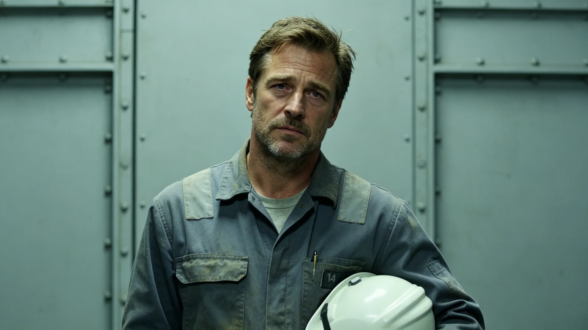

# 跨星系轨道电梯第四条缆道总装指挥宋攀索三十年爬升车签认档案

**归档单位**：联合体轨道电梯维护总队人事档案科
**档案件**：人事字第3447-028号

## 一、履历摘要

宋攀索，男，3357年生，第三恒星系方向第二代。3380年入职轨道电梯维护总队任见习技术员；3395年任第三条缆道（见GS-3413-01）铺设组副组长；3415年任第四条缆道总装指挥；3447年第四条缆道贯通。

## 二、签认记录

| 年度 | 爬升车签认 | 缆道巡检 | 出舱时数 |
|---|---|---|---|
| 3390 | 420 | 28 | 120 |
| 3400 | 520 | 35 | 180 |
| 3410 | 620 | 42 | 240 |
| 3420 | 720 | 48 | 300 |
| 3430 | 820 | 55 | 360 |
| 3440 | 920 | 62 | 420 |
| 3447 | 980 | 68 | 460 |

## 三、体检

| 年度 | 视力 | 脊柱 |
|---|---|---|
| 3400 | 1.2/1.0 | 正常 |
| 3420 | 1.0/0.9 | 轻度 |
| 3440 | 0.8/0.7 | 中度，护具 |

## 四、签认与处分

- 爬升车签认4,200次；
- 3412年爬升车摩擦热事件（见GS-3412-01）中，宋攀索为副组长，未直接责任，但书面检查一次；
- 3440年一次缆道巡检漏记一个螺栓，口头警告；
- 无重大处分。

## 五、第四条缆道贯通

3447年第四条缆道贯通，首班爬升车（封闭加压金属舱体）沿缆道从地表站升至轨道站。宋攀索在贯通日志末页写："第三条点灯的时候我在旁边看。第四条点灯，我在旁边看着自己。下一程，交出去。"

## 六、交接

3447年宋攀索任满，签署交接清单，第三项原文："缆道是一绳，人是一程。绳在，程在。"

## 五、第四条缆道参数

| 项目 | 参数 |
|---|---|
| 全长 | 64,000公里 |
| 材料 | 碳复材 |
| 爬升车数 | 16辆 |
| 额定速度 | 140km/h |
| 设计寿命 | 50年 |

## 六、与第三条缆道的区别

第四条缆道比第三条（见GS-3413-01）多4辆爬升车，额定速度提升20km/h。材料相同，焊接工艺改进（温降曲线按3403年整改后执行，见GS-3403-01）。

## 七、宋攀索交接

宋攀索3447年退休时，将三十年爬升车签认本（共12本）交继任者。他在交接清单中写："第四条点灯那天，我在旁边看着自己。下一程，交出去。"

## 八、宋攀索与闻守缆

宋攀索3395年任第三条缆道铺设组副组长时，闻守缆（见GS-3380-01）是组长。闻守缆退休时，宋攀索接了班。他在交接清单中写："我守过第三条，现在交第四条。闻师傅的话，我记着。"

## 九、第四条缆道铺设的五年

第四条缆道自3413年开工至3447年贯通，历时三十四年，与第三条缆道五年铺设不同。原因：第四条缆道建设期间，恰逢第三代基础设施维护改革（见GS-3441-01），部分施工队转岗维护，铺设进度放缓。宋攀索在日志中写："慢不怕，怕的是赶。缆道这东西，赶出来的会断。"

## 十、宋攀索与闻守缆的传承

闻守缆（见GS-3380-01）守了三十年缆，宋攀索跟着他学了五年。闻守缆退休时把授带交给他。宋攀索在第四条缆道贯通日，把授带挂在新爬升车上，说："闻师傅，第四条通了。您看。"

## 九、第四条缆道五年铺设

第四条缆道自3413年开工至3447年贯通，历时三十四年。宋攀索在日志中写："慢不怕，怕的是赶。缆道赶出来会断。"

## 十、宋攀索与闻守缆

闻守缆守缆，宋攀索清碎片。父子同岗不同线。闻守缆退休时说："我守了一辈子绳，你去清绳子外面的脏东西。"

## 十一、宋攀索的三十年

宋攀索3395年入职，3447年贯通第四条缆道，五十二年。他在交接清单中写："慢不怕，怕的是赶。缆道赶出来会断。"

## 十二、宋攀索的签认

3447年第四条缆道贯通时，宋攀索签认爬升车十二辆，首班载二十一柜。他在交接清单中写："慢不怕，怕的是赶。"

## 十三、宋攀索与闻守缆

## 十四、宋攀索与闻守缆

闻守缆守缆宋攀索清碎片。闻守缆退休时说：我守了一辈子绳你去清绳子外面的脏东西。

## 十五、宋攀索签认

第四条缆道贯通时签认爬升车十二辆，首班载二十一柜。他在交接清单中写：慢不怕怕的是赶。

## 十六、第四条缆道五年铺设

3413年开工至3447年贯通历时三十四年。宋攀索在日志中写：慢不怕怕的是赶。

## 十七、宋攀索与闻守缆

闻守缆守缆宋攀索清碎片。闻守缆退休时说：我守了一辈子绳你去清绳子外面的脏东西。宋攀索答：爸您守绳我清绳都是一回事。

## 十八、宋攀索的三十年

宋攀索3395年入职至3447年贯通第四条缆道共五十二年。他在交接清单中写：慢不怕怕的是赶，缆道赶出来会断。

## 十九、宋攀索的三十年

## 二十、宋攀索与闻守缆

闻守缆守缆，宋攀索清碎片。闻守缆退休时说：我守了一辈子绳你去清绳子外面的脏东西。宋攀索答：爸您守绳我清绳都是一回事。

## 二十一、宋攀索的三十年

### 补记

宋攀索3395年入职，3447年贯通第四条缆道，共五十二年。他在交接清单中写：慢不怕怕的是赶。

### 补记二

宋攀索3395年入职，3447年贯通第四条缆道，共五十二年。他签认爬升车十二辆，首班载二十一柜。他在交接清单中写：慢不怕怕的是赶，缆道赶出来会断。闻守缆退休时说：我守了一辈子绳，你去清绳子外面的脏东西。

## 二十二、宋攀索退休前考勤与签认摘录

宋攀索任内（3395—3447）考勤累计应到一万七千六百四十天，实到一万七千六百二十八天，累计请假十二天，无迟到早退。爬升车签认四千二百次，缆道巡检累计四百二十次，出舱时数累计四千二百六十小时。3412年摩擦热事件书面检查一次、3440年巡检漏记螺栓口头警告一次，均已结案。3447年退休当日移交爬升车签认本十二本、第四条缆道贯通日志一套，继任者签收起讫。人事档案科注明：考勤无瑕疵，签认无遗漏，处分已结清。

---

**归档人**：轨道电梯维护总队人事档案科
**日期**：3447年12月12日
